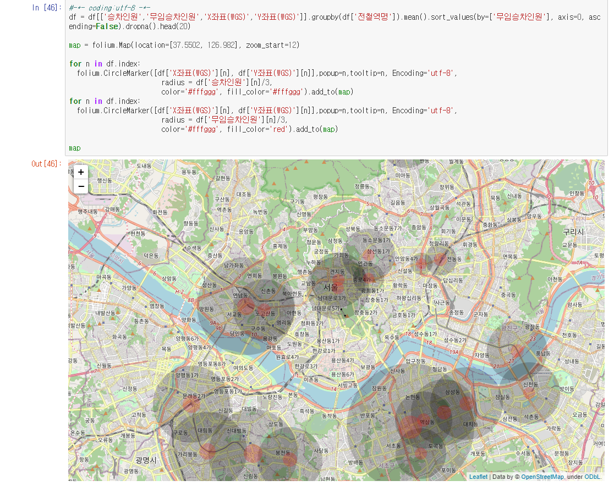

# Visualization
 Visualization of Big Data analysis results using public data.
 
 ---
 
## 지하철 무임승하차 현황 분석 시각화

* 데이터 출처 : [서울시 열린 데이터 광장](http://data.seoul.go.kr)

* 서울시 지하철 호선별 역별 유무임 승하차 인원정보.csv
  - 43687 건의 데이터
  - 8개의 변수
  - 기간 : 2015년1월 ~ 2020년4월
  - 수도권 도시철도 무임승차 대상자 : 만 65세 이상 경로우대자, 장애인, 유공자 중 주민등록 기준 서울시에 거주하는 자
  
* 서울시 역코드로 지하철역 위치 조회.csv
  - 929개의 전철역코드와 위도, 경도 정보

---

* 시각화 라이브러리 : matplotlib, seaborn, folium
* plot 종류 : barplot, lineplot, swarmplot, heatmap, histplot, pairplot 등

---

* 코드의 제일 마지막에 위치한 folium 을 통한 구글 맵 시각화는 [subway_final.html](https://github.com/yesl-c/project01_Visualization/blob/master/source/subway_final.html) 을 다운받아서 실행하면 아래와 같이 확인할 수 있다.

