```python
import pandas as pd
import matplotlib.pyplot as plt
import seaborn as sns
```

## 서울시 지하철 호선별 역별 유무임 승하차 인원정보.csv

### Data Loading


```python
subway = pd.read_csv('subway.csv', encoding='CP949')
```

### Data Pre-processing & Feature Engineering


```python
# 작업일자 제외
subway = subway.iloc[:,0:7]
```


```python
# 중복데이터 제거
subway = subway.drop_duplicates(['사용월','호선명','지하철역','유임승차인원','무임승차인원','유임하차인원','무임하차인원'])
```


```python
# 연도, 월 분리
subway["연도"] = subway["사용월"].astype(str).str[:4]
subway["월"] = subway["사용월"].astype(str).str[4:]
```


```python
# 9호선2~3단계, 9호선2단계 >> 9호선 으로 변경
subway.loc[subway['호선명'] == '9호선2~3단계','호선명'] = '9호선'
subway.loc[subway['호선명'] == '9호선2단계','호선명'] = '9호선'
```


```python
# 삼성, 삼성(무역센터) >> 삼성 으로 통합
subway.loc[subway['지하철역'] == '삼성(무역센터)','지하철역'] = '삼성'
```


```python
# 1호선 ~ 9호선 데이터만 선택

sub1 = subway[subway['호선명'] == '1호선']
sub2 = subway[subway['호선명'] == '2호선']
sub3 = subway[subway['호선명'] == '3호선']
sub4 = subway[subway['호선명'] == '4호선']
sub5 = subway[subway['호선명'] == '5호선']
sub6 = subway[subway['호선명'] == '6호선']
sub7 = subway[subway['호선명'] == '7호선']
sub8 = subway[subway['호선명'] == '8호선']
sub9 = subway[subway['호선명'] == '9호선']

sub = pd.concat([sub1,sub2,sub3,sub4,sub5,sub6,sub7,sub8,sub9]).reset_index(drop=True)

sub.호선명.values
```


    array(['1호선', '1호선', '1호선', ..., '9호선', '9호선', '9호선'], dtype=object)


```python
sub.info()
```

    <class 'pandas.core.frame.DataFrame'>
    RangeIndex: 19779 entries, 0 to 19778
    Data columns (total 9 columns):
     #   Column  Non-Null Count  Dtype 
    ---  ------  --------------  ----- 
     0   사용월     19779 non-null  int64 
     1   호선명     19779 non-null  object
     2   지하철역    19779 non-null  object
     3   유임승차인원  19779 non-null  int64 
     4   무임승차인원  19779 non-null  int64 
     5   유임하차인원  19779 non-null  int64 
     6   무임하차인원  19779 non-null  int64 
     7   연도      19779 non-null  object
     8   월       19779 non-null  object
    dtypes: int64(5), object(4)
    memory usage: 1.4+ MB
    


```python
# 만 명 단위로 변경
col_list = ['유임승차인원','무임승차인원','유임하차인원','무임하차인원']
sub[col_list] = sub[col_list]/10000
```


```python
# 유임승하차인원, 무임승하차인원, 승하차인원 추가
sub.loc[:,'유임승하차인원'] = (sub['유임승차인원']+sub['유임하차인원'])
sub.loc[:,'무임승하차인원'] = (sub['무임승차인원']+sub['무임하차인원'])
sub.loc[:,'승하차인원'] = (sub['유임승하차인원']+sub['무임승하차인원'])
```


```python
# 승차인원, 하차인원 추가
sub.loc[:,'승차인원'] = (sub['유임승차인원']+sub['무임승차인원'])
sub.loc[:,'하차인원'] = (sub['유임하차인원']+sub['무임하차인원'])
```


```python
# 유,무임하차율 추가
sub.loc[:,'유임하차율'] = sub['유임하차인원']/sub['하차인원']*100
sub.loc[:,'무임하차율'] = sub['무임하차인원']/sub['하차인원']*100
```


```python
# 유,무임승하차율 추가
sub.loc[:,'유임승하차율'] = sub['유임승하차인원']/sub['승하차인원']*100
sub.loc[:,'무임승하차율'] = sub['무임승하차인원']/sub['승하차인원']*100
```


```python
sub.head()
```


<div>
<style scoped>
    .dataframe tbody tr th:only-of-type {
        vertical-align: middle;
    }

    .dataframe tbody tr th {
        vertical-align: top;
    }

    .dataframe thead th {
        text-align: right;
    }
</style>
<table border="1" class="dataframe">
  <thead>
    <tr style="text-align: right;">
      <th></th>
      <th>사용월</th>
      <th>호선명</th>
      <th>지하철역</th>
      <th>유임승차인원</th>
      <th>무임승차인원</th>
      <th>유임하차인원</th>
      <th>무임하차인원</th>
      <th>연도</th>
      <th>월</th>
      <th>유임승하차인원</th>
      <th>무임승하차인원</th>
      <th>승하차인원</th>
      <th>승차인원</th>
      <th>하차인원</th>
      <th>유임하차율</th>
      <th>무임하차율</th>
      <th>유임승하차율</th>
      <th>무임승하차율</th>
    </tr>
  </thead>
  <tbody>
    <tr>
      <th>0</th>
      <td>202004</td>
      <td>1호선</td>
      <td>서울역</td>
      <td>77.5859</td>
      <td>13.9595</td>
      <td>74.8330</td>
      <td>13.0554</td>
      <td>2020</td>
      <td>04</td>
      <td>152.4189</td>
      <td>27.0149</td>
      <td>179.4338</td>
      <td>91.5454</td>
      <td>87.8884</td>
      <td>85.145480</td>
      <td>14.854520</td>
      <td>84.944364</td>
      <td>15.055636</td>
    </tr>
    <tr>
      <th>1</th>
      <td>202004</td>
      <td>1호선</td>
      <td>종각</td>
      <td>70.6082</td>
      <td>9.6784</td>
      <td>68.7093</td>
      <td>9.0826</td>
      <td>2020</td>
      <td>04</td>
      <td>139.3175</td>
      <td>18.7610</td>
      <td>158.0785</td>
      <td>80.2866</td>
      <td>77.7919</td>
      <td>88.324491</td>
      <td>11.675509</td>
      <td>88.131846</td>
      <td>11.868154</td>
    </tr>
    <tr>
      <th>2</th>
      <td>202004</td>
      <td>1호선</td>
      <td>종로3가</td>
      <td>38.8837</td>
      <td>23.1829</td>
      <td>36.8220</td>
      <td>22.0625</td>
      <td>2020</td>
      <td>04</td>
      <td>75.7057</td>
      <td>45.2454</td>
      <td>120.9511</td>
      <td>62.0666</td>
      <td>58.8845</td>
      <td>62.532585</td>
      <td>37.467415</td>
      <td>62.591990</td>
      <td>37.408010</td>
    </tr>
    <tr>
      <th>3</th>
      <td>202004</td>
      <td>1호선</td>
      <td>신설동</td>
      <td>24.0865</td>
      <td>9.0729</td>
      <td>23.9399</td>
      <td>8.6446</td>
      <td>2020</td>
      <td>04</td>
      <td>48.0264</td>
      <td>17.7175</td>
      <td>65.7439</td>
      <td>33.1594</td>
      <td>32.5845</td>
      <td>73.470208</td>
      <td>26.529792</td>
      <td>73.050732</td>
      <td>26.949268</td>
    </tr>
    <tr>
      <th>4</th>
      <td>202004</td>
      <td>1호선</td>
      <td>시청</td>
      <td>38.1606</td>
      <td>5.2670</td>
      <td>38.4171</td>
      <td>5.0782</td>
      <td>2020</td>
      <td>04</td>
      <td>76.5777</td>
      <td>10.3452</td>
      <td>86.9229</td>
      <td>43.4276</td>
      <td>43.4953</td>
      <td>88.324716</td>
      <td>11.675284</td>
      <td>88.098418</td>
      <td>11.901582</td>
    </tr>
  </tbody>
</table>
</div>


### 연도별 호선별  총 승하차인원


```python
plt.rcParams['font.family'] = 'Malgun Gothic'
pal = ['navy','seagreen','orangered','dodgerblue','darkviolet','saddlebrown','darkolivegreen','magenta','goldenrod']
plt.figure(figsize=(15,7))
sns.barplot(x='연도', y='승하차인원', hue='호선명', data=sub, palette=pal, ci=False)
```


    <matplotlib.axes._subplots.AxesSubplot at 0x27773fa0898>


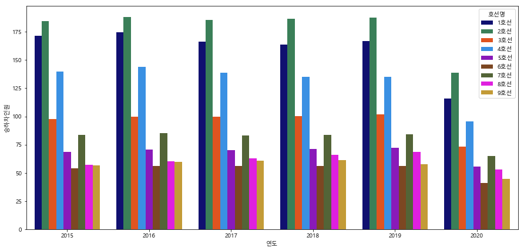


### 연도별 호선별  무임승하차인원


```python
plt.rcParams['font.family'] = 'Malgun Gothic'
pal = ['navy','seagreen','orangered','dodgerblue','darkviolet','saddlebrown','darkolivegreen','magenta','goldenrod']
plt.figure(figsize=(15,7))
sns.barplot(x='연도', y='무임승하차인원', hue='호선명', data=sub, palette=pal, ci=False)
```


    <matplotlib.axes._subplots.AxesSubplot at 0x27775769048>


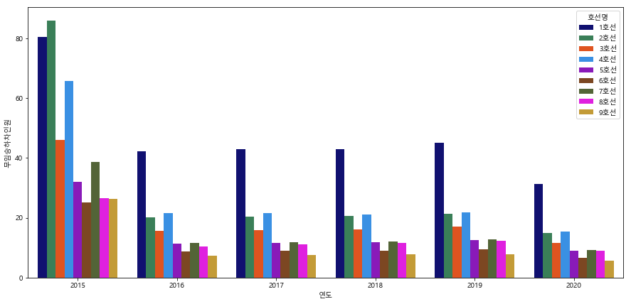


### 연도별 호선별  무임승하차율


```python
plt.rcParams['font.family'] = 'Malgun Gothic'
pal = ['navy','seagreen','orangered','dodgerblue','darkviolet','saddlebrown','darkolivegreen','magenta','goldenrod']
plt.figure(figsize=(15,7))
sns.barplot(x='연도', y='무임승하차율', hue='호선명', data=sub, palette=pal, ci=False)
```

    C:\Users\Seoul IT\Anaconda3\lib\site-packages\scipy\stats\stats.py:1713: FutureWarning: Using a non-tuple sequence for multidimensional indexing is deprecated; use `arr[tuple(seq)]` instead of `arr[seq]`. In the future this will be interpreted as an array index, `arr[np.array(seq)]`, which will result either in an error or a different result.
      return np.add.reduce(sorted[indexer] * weights, axis=axis) / sumval
    


    <matplotlib.axes._subplots.AxesSubplot at 0x2213e97da58>


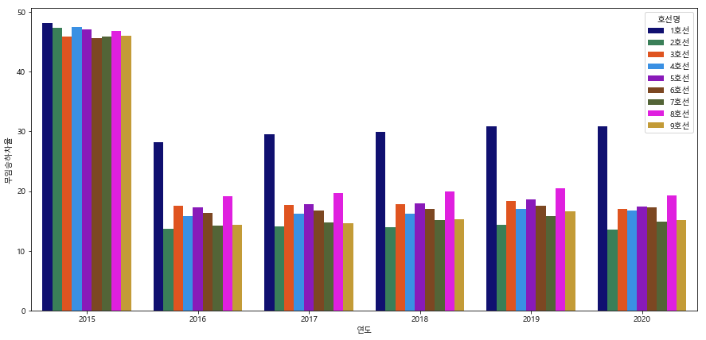


### 호선별 무임승하차인원


```python
plt.figure(figsize=(12,10))
plt.rcParams['font.family'] = 'Malgun Gothic'
plt.title('호선별 무임승하차인원', size=20, position=(0.5, 1.0+0.03))
pal = ['navy','seagreen','orangered','dodgerblue','darkviolet','saddlebrown','darkolivegreen','magenta','goldenrod']

sns.barplot(x='호선명', y='무임승하차인원', data=sub, ci=False, palette=pal);
```


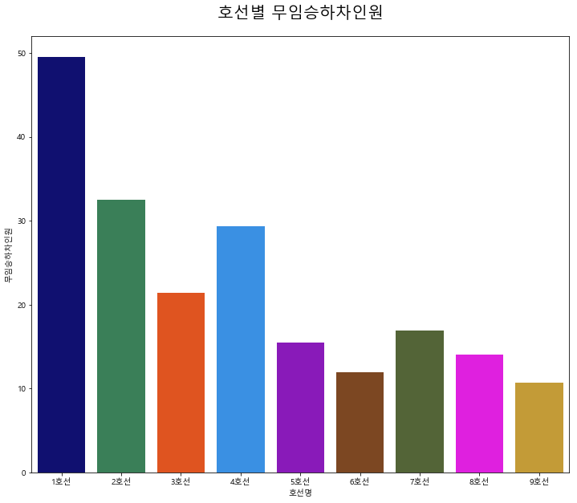


### 호선별 무임하차율


```python
plt.figure(figsize=(12,10))
plt.rcParams['font.family'] = 'Malgun Gothic'
plt.title('호선별 무임하차율', size=20, position=(0.5, 1.0+0.03))

# 호선별 색상 파레트 설정
pal = ['navy','seagreen','orangered','dodgerblue','darkviolet','saddlebrown','darkolivegreen','magenta','goldenrod']

sns.barplot(x='호선명', y='무임하차율', data=sub, ci=False, palette=pal)
```


    <matplotlib.axes._subplots.AxesSubplot at 0x27772f79ac8>


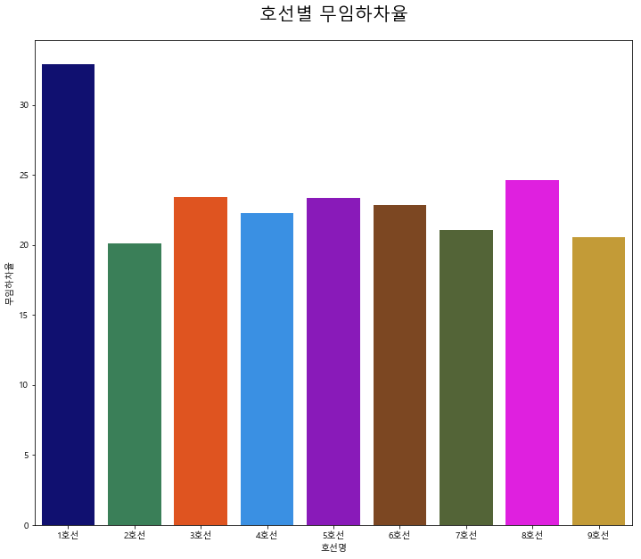


### 연도별 호선별 승하차인원 (line plot)


```python
plt.rcParams['font.family'] = 'Malgun Gothic'
plt.figure(figsize=(15,7))
pal = ['navy','seagreen','orangered','dodgerblue','darkviolet','saddlebrown','darkolivegreen','magenta','goldenrod']

sns.lineplot(x='연도', y="승하차인원", hue='호선명', palette=pal, data=sub)
```


    <matplotlib.axes._subplots.AxesSubplot at 0x27775d19550>


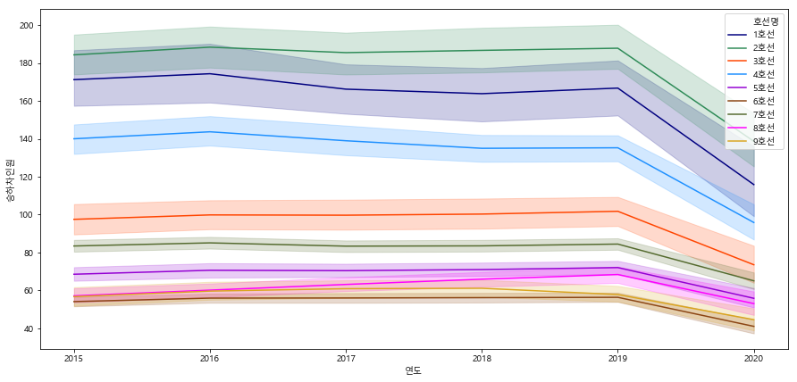


### 연도별 호선별  무임승하차율 (line plot)


```python
plt.rcParams['font.family'] = 'Malgun Gothic'
plt.figure(figsize=(15,7))
pal = ['navy','seagreen','orangered','dodgerblue','darkviolet','saddlebrown','darkolivegreen','magenta','goldenrod']

sns.lineplot(x='연도', y="무임승하차율", hue='호선명', palette=pal, data=sub)
```


    <matplotlib.axes._subplots.AxesSubplot at 0x2213edf37b8>


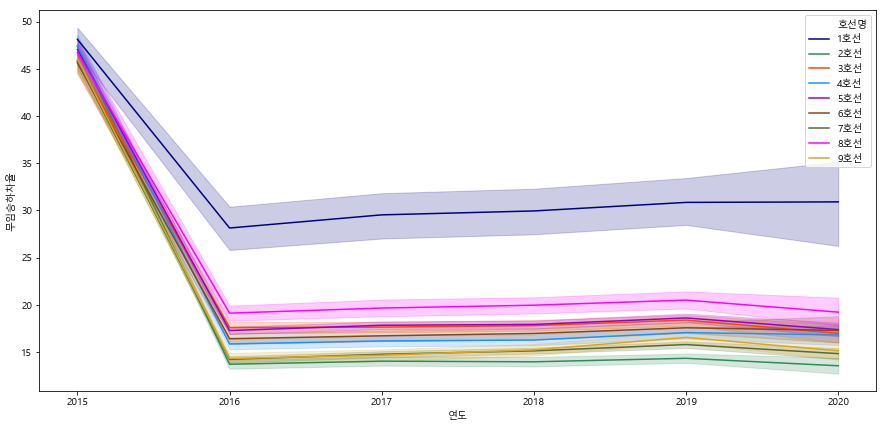


### 연도별 호선별  유임승하차율 (line plot)


```python
plt.rcParams['font.family'] = 'Malgun Gothic'
plt.figure(figsize=(15,7))
pal = ['navy','seagreen','orangered','dodgerblue','darkviolet','saddlebrown','darkolivegreen','magenta','goldenrod']

sns.lineplot(x='연도', y="유임승하차율", hue='호선명', palette=pal, data=sub)
```


    <matplotlib.axes._subplots.AxesSubplot at 0x2213f0ed438>


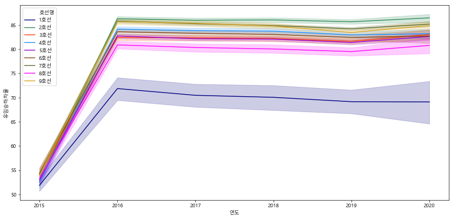


### 연도별 승하차인원 변동 추이 swarmplot


```python
plt.figure(figsize=(20,6))
plt.rcParams['font.family'] = 'Malgun Gothic'

plt.subplot(1,3,1)
plt.xticks(ticks=[0,1,2,3,4], labels=['2015','2016','2017','2018','2019'])
plt.title('연도별 승하차인원     (단위: 만 명)', size=15, position=(0.5, 1.0+0.03))
sns.swarmplot(x='연도', y='승하차인원', data=sub[sub['연도'] != '2020'], palette="Blues_d")

plt.subplot(1,3,2)
plt.xticks(ticks=[0,1,2,3,4], labels=['2015','2016','2017','2018','2019'])
plt.title('연도별 유임승하차인원     (단위: 만 명)', size=15, position=(0.5, 1.0+0.03))
sns.swarmplot(x='연도', y='유임승하차인원', data=sub[sub['연도'] != '2020'], palette="Blues_d")

plt.subplot(1,3,3)
plt.xticks(ticks=[0,1,2,3,4], labels=['2015','2016','2017','2018','2019'])
plt.title('연도별 무임승하차인원     (단위: 만 명)', size=15, position=(0.5, 1.0+0.03))
sns.swarmplot(x='연도', y='무임승하차인원', data=sub[sub['연도'] != '2020'], palette="Blues_d")
```


    <matplotlib.axes._subplots.AxesSubplot at 0x2777369ea58>


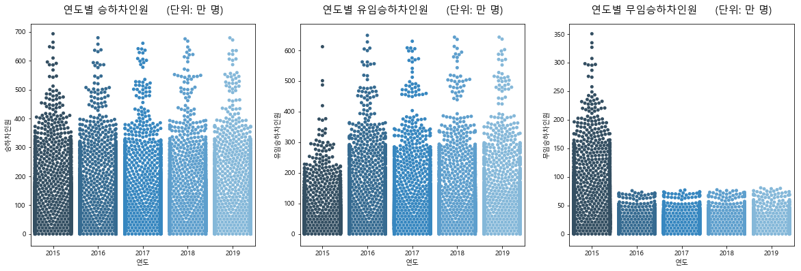


### 연도별 호선별  승하차인원 heatmap


```python
sub_h = sub[sub['연도'] != '2020']

plt.figure(figsize=(20,6))
plt.rcParams['font.family'] = 'Malgun Gothic'

plt.subplot(1,3,1)
plt.title('승하차인원', size=15, position=(0.55, 1.0+0.03))
pivot1 = sub_h.pivot_table(index='연도', columns='호선명', values='승하차인원')
sns.heatmap(pivot1, annot = True, annot_kws = {"size" : 11}, cmap=plt.cm.PuBu)

plt.subplot(1,3,2)
plt.title('유임승하차인원', size=15, position=(0.55, 1.0+0.03))
pivot2 = sub_h.pivot_table(index='연도', columns='호선명', values='유임승하차인원')
sns.heatmap(pivot2, annot = True, annot_kws = {"size" : 11}, cmap=plt.cm.PuBu)

plt.subplot(1,3,3)
plt.title('무임승하차인원', size=15, position=(0.55, 1.0+0.03))
pivot3 = sub_h.pivot_table(index='연도', columns='호선명', values='무임승하차인원')
sns.heatmap(pivot3, annot = True, annot_kws = {"size" : 11}, cmap=plt.cm.PuBu)
```


    <matplotlib.axes._subplots.AxesSubplot at 0x27773ec3080>


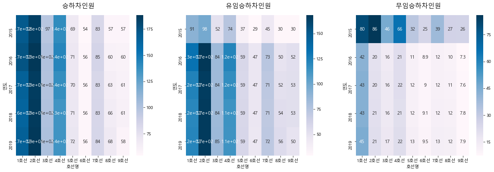


### 총 승하차인원, 유,무임 승하차인원의 누적분포


```python
f, ax = plt.subplots(figsize=(10, 6))

sns.distplot(sub['무임승하차인원'], hist=False, label="무임승하차인원")
sns.distplot(sub['유임승하차인원'], hist=False, label="유임승하차인원")
sns.distplot(sub['승하차인원'], hist=False, label="승하차인원")

ax.legend(ncol=1, loc="upper right", frameon=True)
ax.set_title('누적분포')
ax.set_xlabel("인원")
ax.set_ylabel("")
```


    Text(0, 0.5, '')


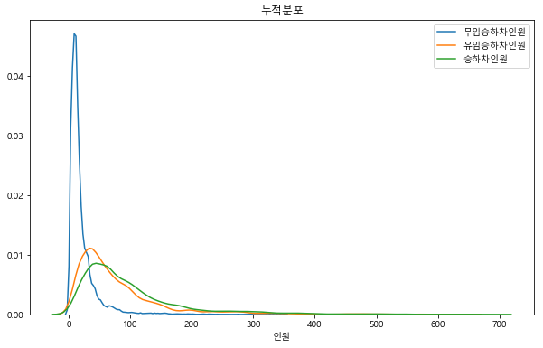


### 유임승하차인원, 무임승하차인원, 총 승하차인원 세 변수의 pairplot


```python
sns.pairplot(sub.iloc[:, [1,9,10,11]], hue='호선명', palette=pal);
```

    C:\Users\Seoul IT\Anaconda3\lib\site-packages\scipy\stats\stats.py:1713: FutureWarning: Using a non-tuple sequence for multidimensional indexing is deprecated; use `arr[tuple(seq)]` instead of `arr[seq]`. In the future this will be interpreted as an array index, `arr[np.array(seq)]`, which will result either in an error or a different result.
      return np.add.reduce(sorted[indexer] * weights, axis=axis) / sumval
    


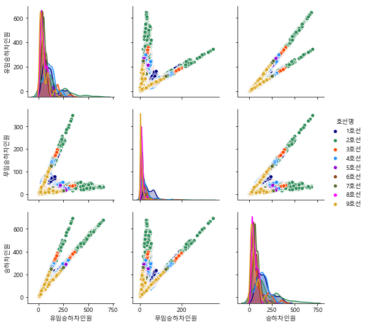


### 총 승하차인원 대비 무임승하차인원


```python
sub['연도'] = sub['연도'].astype('category')

f, ax = plt.subplots(figsize=(10, 6))
sns.set_color_codes("pastel")
sns.barplot(x="승하차인원", y='연도', data=sub, label="Total", color="b", ci=False)

sort = sub.sort_values("승하차인원", ascending=False)
sns.set_color_codes("muted")
sns.barplot(x="무임승하차인원", y="연도", data=sort, label="free", color="b", ci=False)
plt.title("총승하차대비 무임승하차인원")

ax.legend(ncol=2, loc="lower right", frameon=True)
sns.despine(left=True, bottom=True)
```


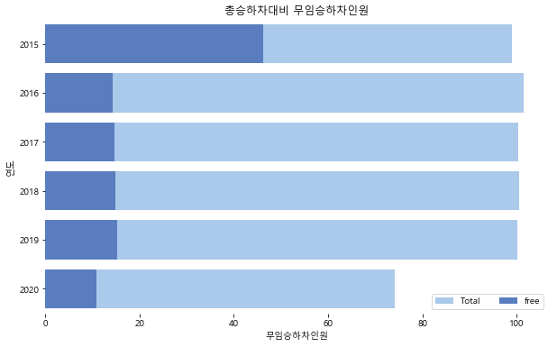


### 연도별 무임하차율 top10


```python
sub_15 = sub[sub.연도 == '2015'].reset_index(drop=True)
sub_16 = sub[sub.연도 == '2016'].reset_index(drop=True)
sub_17 = sub[sub.연도 == '2017'].reset_index(drop=True)
sub_18 = sub[sub.연도 == '2018'].reset_index(drop=True)
sub_19 = sub[sub.연도 == '2019'].reset_index(drop=True)

station = sub_15['지하철역'].unique()
get_off = []
for st in station:
    num = sub_15[sub_15['지하철역']==st]['무임하차인원'].sum()
    den = sub_15[sub_15['지하철역']==st]['하차인원'].sum()
    get_off.append(num/den*100)
    
sub_15_get_off = pd.DataFrame({'지하철역':station, '무임하차율':get_off})
sub_15_get_off = sub_15_get_off.sort_values(['무임하차율'], ascending=[False]).reset_index(drop=True)[:10]


station = sub_16['지하철역'].unique()
get_off = []
for st in station:
    num = sub_16[sub_16['지하철역']==st]['무임하차인원'].sum()
    den = sub_16[sub_16['지하철역']==st]['하차인원'].sum()
    get_off.append(num/den*100)
    
sub_16_get_off = pd.DataFrame({'지하철역':station, '무임하차율':get_off})
sub_16_get_off = sub_16_get_off.sort_values(['무임하차율'], ascending=[False]).reset_index(drop=True)[:10]


station = sub_17['지하철역'].unique()
get_off = []
for st in station:
    num = sub_17[sub_17['지하철역']==st]['무임하차인원'].sum()
    den = sub_17[sub_17['지하철역']==st]['하차인원'].sum()
    get_off.append(num/den*100)
    
sub_17_get_off = pd.DataFrame({'지하철역':station, '무임하차율':get_off})
sub_17_get_off = sub_17_get_off.sort_values(['무임하차율'], ascending=[False]).reset_index(drop=True)[:10]


station = sub_18['지하철역'].unique()
get_off = []
for st in station:
    num = sub_18[sub_18['지하철역']==st]['무임하차인원'].sum()
    den = sub_18[sub_18['지하철역']==st]['하차인원'].sum()
    get_off.append(num/den*100)
    
sub_18_get_off = pd.DataFrame({'지하철역':station, '무임하차율':get_off})
sub_18_get_off = sub_18_get_off.sort_values(['무임하차율'], ascending=[False]).reset_index(drop=True)[:10]


station = sub_19['지하철역'].unique()
get_off = []
for st in station:
    num = sub_19[sub_19['지하철역']==st]['무임하차인원'].sum()
    den = sub_19[sub_19['지하철역']==st]['하차인원'].sum()
    get_off.append(num/den*100)
    
sub_19_get_off = pd.DataFrame({'지하철역':station, '무임하차율':get_off})
sub_19_get_off = sub_19_get_off.sort_values(['무임하차율'], ascending=[False]).reset_index(drop=True)[:10]
```

    C:\Users\Seoul IT\Anaconda3\lib\site-packages\ipykernel_launcher.py:56: RuntimeWarning: invalid value encountered in double_scalars
    


```python
plt.figure(figsize=(15,25))
plt.rcParams['font.family'] = 'Malgun Gothic'

plt.subplot(3,2,1)
plt.xticks(rotation=50)
plt.title('2015년 지하철역별 무임하차율 top10', size=15, position=(0.5, 1.0+0.03))
sns.barplot(x='지하철역', y='무임하차율', data=sub_15_get_off, ci=False, palette="Blues_d")

plt.subplot(3,2,2)
plt.xticks(rotation=50)
plt.title('2016년 지하철역별 무임하차율 top10', size=15, position=(0.5, 1.0+0.03))
sns.barplot(x='지하철역', y='무임하차율', data=sub_16_get_off, ci=False, palette="Blues_d")

plt.subplot(3,2,3)
plt.xticks(rotation=50)
plt.title('2017년 지하철역별 무임하차율 top10', size=15, position=(0.5, 1.0+0.03))
sns.barplot(x='지하철역', y='무임하차율', data=sub_17_get_off, ci=False, palette="Blues_d")

plt.subplot(3,2,4)
plt.xticks(rotation=50)
plt.title('2018년 지하철역별 무임하차율 top10', size=15, position=(0.5, 1.0+0.03))
sns.barplot(x='지하철역', y='무임하차율', data=sub_18_get_off, ci=False, palette="Blues_d")

plt.subplot(3,2,5)
plt.xticks(rotation=50)
plt.title('2019년 지하철역 별 무임하차율 top10', size=15, position=(0.5, 1.0+0.03))
sns.barplot(x='지하철역', y='무임하차율', data=sub_19_get_off, ci=False, palette="Blues_d")

plt.subplots_adjust(hspace=0.45)
plt.show()
```


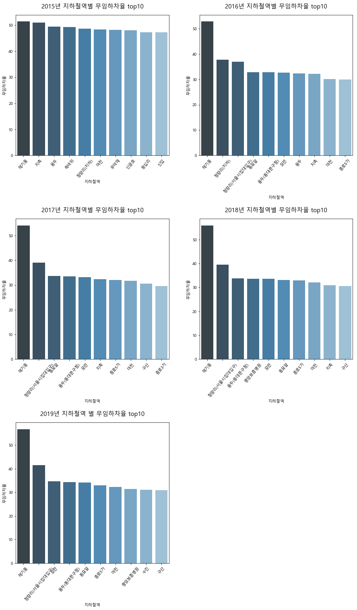


### 무임승하차율 상위 역사 top5


```python
grouped = sub['무임승하차율'].groupby(sub['지하철역']).mean()
grouped = pd.DataFrame(grouped)
grouped.sort_values(['무임승하차율'], ascending=[False])[:5]
```


<div>
<style scoped>
    .dataframe tbody tr th:only-of-type {
        vertical-align: middle;
    }

    .dataframe tbody tr th {
        vertical-align: top;
    }

    .dataframe thead th {
        text-align: right;
    }
</style>
<table border="1" class="dataframe">
  <thead>
    <tr style="text-align: right;">
      <th></th>
      <th>무임승하차율</th>
    </tr>
    <tr>
      <th>지하철역</th>
      <th></th>
    </tr>
  </thead>
  <tbody>
    <tr>
      <th>제기동</th>
      <td>53.192045</td>
    </tr>
    <tr>
      <th>왕십리</th>
      <td>50.594869</td>
    </tr>
    <tr>
      <th>청량리(지하)</th>
      <td>44.611483</td>
    </tr>
    <tr>
      <th>용두</th>
      <td>42.407449</td>
    </tr>
    <tr>
      <th>청량리(서울시립대입구)</th>
      <td>40.349353</td>
    </tr>
  </tbody>
</table>
</div>


### 무임승하차율 하위 역사 top5


```python
grouped = sub['무임승하차율'].groupby(sub['지하철역']).mean()
grouped = pd.DataFrame(grouped)
grouped.sort_values(['무임승하차율'], ascending=[True])[:5]
```


<div>
<style scoped>
    .dataframe tbody tr th:only-of-type {
        vertical-align: middle;
    }

    .dataframe tbody tr th {
        vertical-align: top;
    }

    .dataframe thead th {
        text-align: right;
    }
</style>
<table border="1" class="dataframe">
  <thead>
    <tr style="text-align: right;">
      <th></th>
      <th>무임승하차율</th>
    </tr>
    <tr>
      <th>지하철역</th>
      <th></th>
    </tr>
  </thead>
  <tbody>
    <tr>
      <th>삼성(무역센터)</th>
      <td>6.851828</td>
    </tr>
    <tr>
      <th>마곡나루(서울식물원)</th>
      <td>7.406416</td>
    </tr>
    <tr>
      <th>안암(고대병원앞)</th>
      <td>8.237770</td>
    </tr>
    <tr>
      <th>광화문(세종문화회관)</th>
      <td>8.242564</td>
    </tr>
    <tr>
      <th>어린이대공원(세종대)</th>
      <td>9.382923</td>
    </tr>
  </tbody>
</table>
</div>


### 1호선 제기동역의 총 승하차인원과 유,무임승하차인원
* 제기동 : 무임승하차율이 가장 높은 역


```python
plt.rcParams['font.family'] = 'Malgun Gothic'
station1 = sub[sub['지하철역']=="제기동"]
sta1 = station1[['유임승하차인원','무임승하차인원','승하차인원']]
sta1.plot()
```


    <matplotlib.axes._subplots.AxesSubplot at 0x2213c45fcf8>


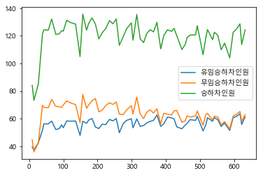


### 2호선 삼성역의 총 승하차인원과 유,무임승하차인원
* 삼성 : 무임승하차율이 가장 낮은 역


```python
plt.rcParams['font.family'] = 'Malgun Gothic'
station2 = sub[sub['지하철역']=="삼성"]
sta2 = station2[['유임승하차인원','무임승하차인원','승하차인원']]
sta2.plot()
```


    <matplotlib.axes._subplots.AxesSubplot at 0x2213eb6c2b0>


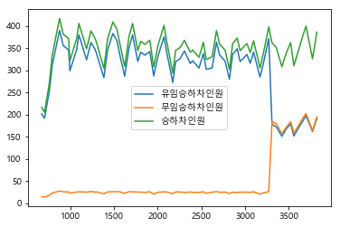


### 코로나 영향에 따른 지하철 이용객 수 변동 추이

2018년 12월 ~ 2019년 4월 데이터


```python
sub_1812_1904 = sub[(sub.사용월 == 201812) | (sub.사용월 == 201901) | 
                    (sub.사용월 == 201902) | (sub.사용월 == 201903) | (sub.사용월 == 201904)]
```

2019년 12월 ~ 2020년 4월 데이터


```python
sub_1912_2004 = sub[(sub.사용월 == 201912) | (sub.사용월 == 202001) | 
                    (sub.사용월 == 202002) | (sub.사용월 == 202003) | (sub.사용월 == 202004)]
```

2019년 1월 ~ 2019년 4월 데이터, 2019년 12월 ~ 2020년 4월 데이터 비교


```python
plt.figure(figsize=(15,25))
plt.rcParams['font.family'] = 'Malgun Gothic'

plt.subplot(3,2,1)
plt.ylim(0,120)
plt.title('월별 승하차인원 (2018.12 ~ 2019.04)     (단위: 만 명)', size=15, position=(0.5, 1.0+0.03))
sns.barplot(x='사용월', y='승하차인원', data=sub_1812_1904, ci=False, palette="Blues_d")

plt.subplot(3,2,2)
plt.ylim(0,120)
plt.title('월별 승하차인원 (2019.12 ~ 2020.04)     (단위: 만 명)', size=15, position=(0.5, 1.0+0.03))
sns.barplot(x='사용월', y='승하차인원', data=sub_1912_2004, ci=False, palette="Blues_d");

plt.subplot(3,2,3)
plt.ylim(0,110)
plt.title('월별 유임승하차인원 (2018.12 ~ 2019.04)     (단위: 만 명)', size=15, position=(0.5, 1.0+0.03))
sns.barplot(x='사용월', y='유임승하차인원', data=sub_1812_1904, ci=False, palette="Greens_r")

plt.subplot(3,2,4)
plt.ylim(0,110)
plt.title('월별 유임승하차인원 (2019.12 ~ 2020.04)     (단위: 만 명)', size=15, position=(0.5, 1.0+0.03))
sns.barplot(x='사용월', y='유임승하차인원', data=sub_1912_2004, ci=False, palette="Greens_r")

plt.subplot(3,2,5)
plt.ylim(0,20)
plt.title('월별 무임승하차인원 (2018.12 ~ 2019.04)     (단위: 만 명)', size=15, position=(0.5, 1.0+0.03))
sns.barplot(x='사용월', y='무임승하차인원', data=sub_1812_1904, ci=False, palette="Oranges_r")

plt.subplot(3,2,6)
plt.ylim(0,20)
plt.title('월별 무임승하차인원 (2019.12 ~ 2020.04)     (단위: 만 명)', size=15, position=(0.5, 1.0+0.03))
sns.barplot(x='사용월', y='무임승하차인원', data=sub_1912_2004, ci=False, palette="Oranges_r")

plt.subplots_adjust(hspace=0.35)   # 그래프 간 위아래 간격 조정
plt.show()
```

    C:\Users\Seoul IT\Anaconda3\lib\site-packages\scipy\stats\stats.py:1713: FutureWarning: Using a non-tuple sequence for multidimensional indexing is deprecated; use `arr[tuple(seq)]` instead of `arr[seq]`. In the future this will be interpreted as an array index, `arr[np.array(seq)]`, which will result either in an error or a different result.
      return np.add.reduce(sorted[indexer] * weights, axis=axis) / sumval
    


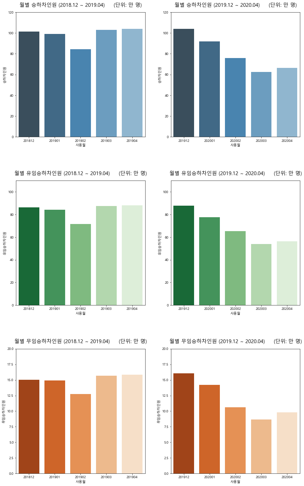


제기동
* 코로나 전 : 2018년 12월 ~ 2019년 4월 데이터
* 코로나 후 : 2019년 12월 ~ 2020년 4월 데이터


```python
station1_2019 = station1[(station1.사용월 == 201812) | (station1.사용월 == 201901) | 
                    (station1.사용월 == 201902) | (station1.사용월 == 201903) | (station1.사용월 == 201904)]
station1_2020 = station1[(station1.사용월 == 201912) | (station1.사용월 == 202001) | 
                    (station1.사용월 == 202002) | (station1.사용월 == 202003) | (station1.사용월 == 202004)]

jegi_2019 = station1_2019[['유임승하차인원','무임승하차인원','승하차인원']]
jegi_2020 = station1_2020[['유임승하차인원','무임승하차인원','승하차인원']]
```


```python
jegi_2019.plot()
```


    <matplotlib.axes._subplots.AxesSubplot at 0x2213eb42c88>


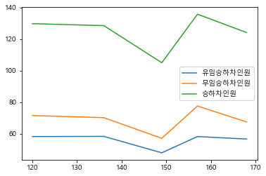


```python
jegi_2020.plot()
```


    <matplotlib.axes._subplots.AxesSubplot at 0x2213ea924a8>


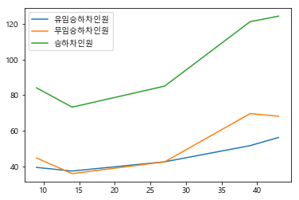


삼성
* 코로나 전 : 2018년 12월 ~ 2019년 4월 데이터
* 코로나 후 : 2019년 12월 ~ 2020년 4월 데이터


```python
station2_2019 = station2[(station2.사용월 == 201812) | (station2.사용월 == 201901) | 
                    (station2.사용월 == 201902) | (station2.사용월 == 201903) | (station2.사용월 == 201904)]
station2_2020 = station2[(station2.사용월 == 201912) | (station2.사용월 == 202001) | 
                    (station2.사용월 == 202002) | (station2.사용월 == 202003) | (station2.사용월 == 202004)]

samsung_2019 = station2_2019[['유임승하차인원','무임승하차인원','승하차인원']]
samsung_2020 = station2_2020[['유임승하차인원','무임승하차인원','승하차인원']]
```


```python
samsung_2019.plot()
```


    <matplotlib.axes._subplots.AxesSubplot at 0x2213e8abf28>


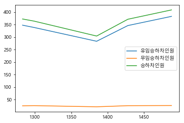


```python
samsung_2020.plot()
```


    <matplotlib.axes._subplots.AxesSubplot at 0x2213ed19668>


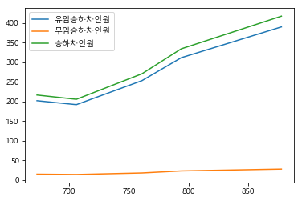


### 지하철역별 승하차인원


```python
# 15년도 지하철역별 승하차인원
grouped = sub_15['승하차인원'].groupby(sub['지하철역']).sum()
df_15 = pd.DataFrame({'지하철역':grouped.index,'승하차인원':grouped}).reset_index(drop=True)
top10_15 = df_15.sort_values(['승하차인원'], ascending=[False]).head(10).reset_index(drop=True)

# 16년도 지하철역별 승하차인원
grouped = sub_16['승하차인원'].groupby(sub['지하철역']).sum()
df_16 = pd.DataFrame({'지하철역':grouped.index,'승하차인원':grouped}).reset_index(drop=True)
top10_16 = df_16.sort_values(['승하차인원'], ascending=[False]).head(10).reset_index(drop=True)

# 17년도 지하철역별 승하차인원
grouped = sub_17['승하차인원'].groupby(sub['지하철역']).sum()
df_17 = pd.DataFrame({'지하철역':grouped.index,'승하차인원':grouped}).reset_index(drop=True)
top10_17 = df_17.sort_values(['승하차인원'], ascending=[False]).head(10).reset_index(drop=True)

# 18년도 지하철역별 승하차인원
grouped = sub_18['승하차인원'].groupby(sub['지하철역']).sum()
df_18 = pd.DataFrame({'지하철역':grouped.index,'승하차인원':grouped}).reset_index(drop=True)
top10_18 = df_18.sort_values(['승하차인원'], ascending=[False]).head(10).reset_index(drop=True)

# 19년도 지하철역별 승하차인원
grouped = sub_19['승하차인원'].groupby(sub['지하철역']).sum()
df_19 = pd.DataFrame({'지하철역':grouped.index,'승하차인원':grouped}).reset_index(drop=True)
top10_19 = df_19.sort_values(['승하차인원'], ascending=[False]).head(10).reset_index(drop=True)
```


```python
plt.figure(figsize=(15,25))
plt.rcParams['font.family'] = 'Malgun Gothic'

plt.subplot(3,2,1)
plt.ylim(0,18300)
plt.xticks(rotation=20)
plt.title('15년도 지하철역별 승하차인원     (단위: 만 명)', size=15, position=(0.5, 1.0+0.03))
sns.barplot(x='지하철역', y='승하차인원', data=top10_15, ci=False, palette="Blues_d")

plt.subplot(3,2,2)
plt.ylim(0,18300)
plt.xticks(rotation=20)
plt.title('16년도 지하철역별 승하차인원     (단위: 만 명)', size=15, position=(0.5, 1.0+0.03))
sns.barplot(x='지하철역', y='승하차인원', data=top10_16, ci=False, palette="Blues_d")

plt.subplot(3,2,3)
plt.ylim(0,18300)
plt.xticks(rotation=20)
plt.title('17년도 지하철역별 승하차인원     (단위: 만 명)', size=15, position=(0.5, 1.0+0.03))
sns.barplot(x='지하철역', y='승하차인원', data=top10_17, ci=False, palette="Blues_d")

plt.subplot(3,2,4)
plt.ylim(0,18300)
plt.xticks(rotation=20)
plt.title('18년도 지하철역별 승하차인원     (단위: 만 명)', size=15, position=(0.5, 1.0+0.03))
sns.barplot(x='지하철역', y='승하차인원', data=top10_18, ci=False, palette="Blues_d")

plt.subplot(3,2,5)
plt.ylim(0,18300)
plt.xticks(rotation=20)
plt.title('19년도 지하철역별 승하차인원     (단위: 만 명)', size=15, position=(0.5, 1.0+0.03))
sns.barplot(x='지하철역', y='승하차인원', data=top10_19, ci=False, palette="Blues_d")

plt.subplots_adjust(hspace=0.35)
plt.show()
```


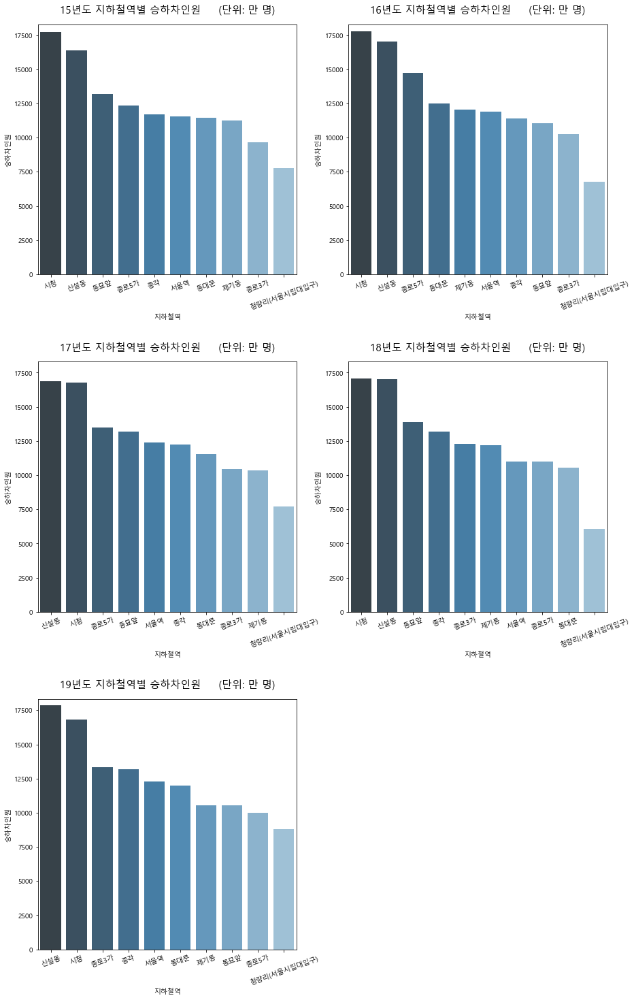


## 서울시 역코드로 지하철역 위치 조회.csv


### 전체승차인원 대비 무임승차인원을 지도에 시각화
* folium 사용


```python
# 지하철역 위치정보의 encoding 정보 찾기
import chardet
with open('location/서울시 역코드로 지하철역 위치 조회.csv', 'rb') as f:
    result = chardet.detect(f.read())  # or readline if the file is large
print(result)
```

    {'encoding': 'EUC-KR', 'confidence': 0.99, 'language': 'Korean'}
    


```python
import os

os.chdir("H:/빅데이터/TEAM PROJECT/데이터 시각화/location")

dfs = [pd.read_csv(f,encoding="EUC-KR",index_col=[0], parse_dates=[0], engine='python') for f in os.listdir(os.getcwd()) if f.endswith('csv')]
# # pre_subway_location = pd.concat(dfs, axis=1, join='inner').sort_index()
pre_subway_location = pd.concat(dfs,ignore_index=True)

pre_subway_location
```


<div>
<style scoped>
    .dataframe tbody tr th:only-of-type {
        vertical-align: middle;
    }

    .dataframe tbody tr th {
        vertical-align: top;
    }

    .dataframe thead th {
        text-align: right;
    }
</style>
<table border="1" class="dataframe">
  <thead>
    <tr style="text-align: right;">
      <th></th>
      <th>전철역명</th>
      <th>호선</th>
      <th>외부코드</th>
      <th>사이버스테이션</th>
      <th>X좌표</th>
      <th>Y좌표</th>
      <th>X좌표(WGS)</th>
      <th>Y좌표(WGS)</th>
    </tr>
  </thead>
  <tbody>
    <tr>
      <th>0</th>
      <td>가락시장</td>
      <td>8</td>
      <td>817</td>
      <td>2818</td>
      <td>525992.0</td>
      <td>1108579.0</td>
      <td>37.492522</td>
      <td>127.118234</td>
    </tr>
    <tr>
      <th>1</th>
      <td>가락시장</td>
      <td>3</td>
      <td>350</td>
      <td>2818</td>
      <td>525992.0</td>
      <td>1108579.0</td>
      <td>37.492522</td>
      <td>127.118234</td>
    </tr>
    <tr>
      <th>2</th>
      <td>종로3가</td>
      <td>5</td>
      <td>534</td>
      <td>153</td>
      <td>498060.0</td>
      <td>1130332.0</td>
      <td>37.571607</td>
      <td>126.991806</td>
    </tr>
    <tr>
      <th>3</th>
      <td>종로3가</td>
      <td>3</td>
      <td>329</td>
      <td>153</td>
      <td>498060.0</td>
      <td>1130332.0</td>
      <td>37.571607</td>
      <td>126.991806</td>
    </tr>
    <tr>
      <th>4</th>
      <td>종로3가</td>
      <td>1</td>
      <td>130</td>
      <td>153</td>
      <td>498060.0</td>
      <td>1130332.0</td>
      <td>37.571607</td>
      <td>126.991806</td>
    </tr>
    <tr>
      <th>...</th>
      <td>...</td>
      <td>...</td>
      <td>...</td>
      <td>...</td>
      <td>...</td>
      <td>...</td>
      <td>...</td>
      <td>...</td>
    </tr>
    <tr>
      <th>18575</th>
      <td>동백</td>
      <td>E</td>
      <td>Y114</td>
      <td>4505</td>
      <td>533700.0</td>
      <td>1046500.0</td>
      <td>37.269043</td>
      <td>127.152716</td>
    </tr>
    <tr>
      <th>18576</th>
      <td>초당</td>
      <td>E</td>
      <td>Y115</td>
      <td>4506</td>
      <td>535500.0</td>
      <td>1044100.0</td>
      <td>37.260752</td>
      <td>127.159443</td>
    </tr>
    <tr>
      <th>18577</th>
      <td>삼가</td>
      <td>E</td>
      <td>Y116</td>
      <td>4508</td>
      <td>537300.0</td>
      <td>1039000.0</td>
      <td>37.242115</td>
      <td>127.168075</td>
    </tr>
    <tr>
      <th>18578</th>
      <td>시청?용인대</td>
      <td>E</td>
      <td>Y117</td>
      <td>4509</td>
      <td>539500.0</td>
      <td>1038300.0</td>
      <td>37.239151</td>
      <td>127.178406</td>
    </tr>
    <tr>
      <th>18579</th>
      <td>명지대</td>
      <td>E</td>
      <td>Y118</td>
      <td>4510</td>
      <td>542100.0</td>
      <td>1037900.0</td>
      <td>37.237964</td>
      <td>127.190294</td>
    </tr>
  </tbody>
</table>
<p>18580 rows × 8 columns</p>
</div>


```python
len(pre_subway_location)
```


    18580


```python
# 역별 좌표 추출
subway_location = pre_subway_location[['X좌표(WGS)','Y좌표(WGS)']].groupby(pre_subway_location['전철역명']).mean()
subway_location
```


<div>
<style scoped>
    .dataframe tbody tr th:only-of-type {
        vertical-align: middle;
    }

    .dataframe tbody tr th {
        vertical-align: top;
    }

    .dataframe thead th {
        text-align: right;
    }
</style>
<table border="1" class="dataframe">
  <thead>
    <tr style="text-align: right;">
      <th></th>
      <th>X좌표(WGS)</th>
      <th>Y좌표(WGS)</th>
    </tr>
    <tr>
      <th>전철역명</th>
      <th></th>
      <th></th>
    </tr>
  </thead>
  <tbody>
    <tr>
      <th>419민주묘지</th>
      <td>NaN</td>
      <td>NaN</td>
    </tr>
    <tr>
      <th>가능</th>
      <td>37.748577</td>
      <td>127.044213</td>
    </tr>
    <tr>
      <th>가락시장</th>
      <td>37.492522</td>
      <td>127.118234</td>
    </tr>
    <tr>
      <th>가산디지털단지</th>
      <td>37.481072</td>
      <td>126.882343</td>
    </tr>
    <tr>
      <th>가양</th>
      <td>37.561391</td>
      <td>126.854456</td>
    </tr>
    <tr>
      <th>...</th>
      <td>...</td>
      <td>...</td>
    </tr>
    <tr>
      <th>회현</th>
      <td>37.558514</td>
      <td>126.978246</td>
    </tr>
    <tr>
      <th>효자</th>
      <td>37.754025</td>
      <td>127.076902</td>
    </tr>
    <tr>
      <th>효창공원앞</th>
      <td>37.539261</td>
      <td>126.961351</td>
    </tr>
    <tr>
      <th>흑석</th>
      <td>37.508770</td>
      <td>126.963708</td>
    </tr>
    <tr>
      <th>흥선</th>
      <td>37.743302</td>
      <td>127.037023</td>
    </tr>
  </tbody>
</table>
<p>591 rows × 2 columns</p>
</div>


```python
# 원데이터와 위도경도데이터의 결합
sub['전철역명'] = sub['지하철역'].str.split('(').str[0]
df = pd.merge(sub, subway_location,how='left',on='전철역명')
df
```


<div>
<style scoped>
    .dataframe tbody tr th:only-of-type {
        vertical-align: middle;
    }

    .dataframe tbody tr th {
        vertical-align: top;
    }

    .dataframe thead th {
        text-align: right;
    }
</style>
<table border="1" class="dataframe">
  <thead>
    <tr style="text-align: right;">
      <th></th>
      <th>사용월</th>
      <th>호선명</th>
      <th>지하철역</th>
      <th>유임승차인원</th>
      <th>무임승차인원</th>
      <th>유임하차인원</th>
      <th>무임하차인원</th>
      <th>연도</th>
      <th>월</th>
      <th>유임승하차인원</th>
      <th>...</th>
      <th>승하차인원</th>
      <th>승차인원</th>
      <th>하차인원</th>
      <th>유임하차율</th>
      <th>무임하차율</th>
      <th>유임승하차율</th>
      <th>무임승하차율</th>
      <th>전철역명</th>
      <th>X좌표(WGS)</th>
      <th>Y좌표(WGS)</th>
    </tr>
  </thead>
  <tbody>
    <tr>
      <th>0</th>
      <td>202004</td>
      <td>1호선</td>
      <td>서울역</td>
      <td>77.5859</td>
      <td>13.9595</td>
      <td>74.8330</td>
      <td>13.0554</td>
      <td>2020</td>
      <td>04</td>
      <td>152.4189</td>
      <td>...</td>
      <td>179.4338</td>
      <td>91.5454</td>
      <td>87.8884</td>
      <td>85.145480</td>
      <td>14.854520</td>
      <td>84.944364</td>
      <td>15.055636</td>
      <td>서울역</td>
      <td>NaN</td>
      <td>NaN</td>
    </tr>
    <tr>
      <th>1</th>
      <td>202004</td>
      <td>1호선</td>
      <td>종각</td>
      <td>70.6082</td>
      <td>9.6784</td>
      <td>68.7093</td>
      <td>9.0826</td>
      <td>2020</td>
      <td>04</td>
      <td>139.3175</td>
      <td>...</td>
      <td>158.0785</td>
      <td>80.2866</td>
      <td>77.7919</td>
      <td>88.324491</td>
      <td>11.675509</td>
      <td>88.131846</td>
      <td>11.868154</td>
      <td>종각</td>
      <td>37.570161</td>
      <td>126.982923</td>
    </tr>
    <tr>
      <th>2</th>
      <td>202004</td>
      <td>1호선</td>
      <td>종로3가</td>
      <td>38.8837</td>
      <td>23.1829</td>
      <td>36.8220</td>
      <td>22.0625</td>
      <td>2020</td>
      <td>04</td>
      <td>75.7057</td>
      <td>...</td>
      <td>120.9511</td>
      <td>62.0666</td>
      <td>58.8845</td>
      <td>62.532585</td>
      <td>37.467415</td>
      <td>62.591990</td>
      <td>37.408010</td>
      <td>종로3가</td>
      <td>37.571607</td>
      <td>126.991806</td>
    </tr>
    <tr>
      <th>3</th>
      <td>202004</td>
      <td>1호선</td>
      <td>신설동</td>
      <td>24.0865</td>
      <td>9.0729</td>
      <td>23.9399</td>
      <td>8.6446</td>
      <td>2020</td>
      <td>04</td>
      <td>48.0264</td>
      <td>...</td>
      <td>65.7439</td>
      <td>33.1594</td>
      <td>32.5845</td>
      <td>73.470208</td>
      <td>26.529792</td>
      <td>73.050732</td>
      <td>26.949268</td>
      <td>신설동</td>
      <td>37.575297</td>
      <td>127.025087</td>
    </tr>
    <tr>
      <th>4</th>
      <td>202004</td>
      <td>1호선</td>
      <td>시청</td>
      <td>38.1606</td>
      <td>5.2670</td>
      <td>38.4171</td>
      <td>5.0782</td>
      <td>2020</td>
      <td>04</td>
      <td>76.5777</td>
      <td>...</td>
      <td>86.9229</td>
      <td>43.4276</td>
      <td>43.4953</td>
      <td>88.324716</td>
      <td>11.675284</td>
      <td>88.098418</td>
      <td>11.901582</td>
      <td>시청</td>
      <td>37.564718</td>
      <td>126.977108</td>
    </tr>
    <tr>
      <th>...</th>
      <td>...</td>
      <td>...</td>
      <td>...</td>
      <td>...</td>
      <td>...</td>
      <td>...</td>
      <td>...</td>
      <td>...</td>
      <td>...</td>
      <td>...</td>
      <td>...</td>
      <td>...</td>
      <td>...</td>
      <td>...</td>
      <td>...</td>
      <td>...</td>
      <td>...</td>
      <td>...</td>
      <td>...</td>
      <td>...</td>
      <td>...</td>
    </tr>
    <tr>
      <th>19774</th>
      <td>201501</td>
      <td>9호선</td>
      <td>마곡나루</td>
      <td>4.9608</td>
      <td>4.5753</td>
      <td>0.7012</td>
      <td>0.7072</td>
      <td>2015</td>
      <td>01</td>
      <td>5.6620</td>
      <td>...</td>
      <td>10.9445</td>
      <td>9.5361</td>
      <td>1.4084</td>
      <td>49.786992</td>
      <td>50.213008</td>
      <td>51.733748</td>
      <td>48.266252</td>
      <td>마곡나루</td>
      <td>37.567336</td>
      <td>126.829497</td>
    </tr>
    <tr>
      <th>19775</th>
      <td>201501</td>
      <td>9호선</td>
      <td>신방화</td>
      <td>16.9119</td>
      <td>16.0054</td>
      <td>3.8500</td>
      <td>3.8259</td>
      <td>2015</td>
      <td>01</td>
      <td>20.7619</td>
      <td>...</td>
      <td>40.5932</td>
      <td>32.9173</td>
      <td>7.6759</td>
      <td>50.156985</td>
      <td>49.843015</td>
      <td>51.146251</td>
      <td>48.853749</td>
      <td>신방화</td>
      <td>37.567532</td>
      <td>126.816601</td>
    </tr>
    <tr>
      <th>19776</th>
      <td>201501</td>
      <td>9호선</td>
      <td>공항시장</td>
      <td>7.2585</td>
      <td>8.2551</td>
      <td>2.0927</td>
      <td>2.2899</td>
      <td>2015</td>
      <td>01</td>
      <td>9.3512</td>
      <td>...</td>
      <td>19.8962</td>
      <td>15.5136</td>
      <td>4.3826</td>
      <td>47.750194</td>
      <td>52.249806</td>
      <td>46.999930</td>
      <td>53.000070</td>
      <td>공항시장</td>
      <td>37.563726</td>
      <td>126.810678</td>
    </tr>
    <tr>
      <th>19777</th>
      <td>201501</td>
      <td>9호선</td>
      <td>김포공항</td>
      <td>24.6752</td>
      <td>28.7114</td>
      <td>2.0160</td>
      <td>2.0841</td>
      <td>2015</td>
      <td>01</td>
      <td>26.6912</td>
      <td>...</td>
      <td>57.4867</td>
      <td>53.3866</td>
      <td>4.1001</td>
      <td>49.169532</td>
      <td>50.830468</td>
      <td>46.430218</td>
      <td>53.569782</td>
      <td>김포공항</td>
      <td>37.562434</td>
      <td>126.801058</td>
    </tr>
    <tr>
      <th>19778</th>
      <td>201501</td>
      <td>9호선</td>
      <td>개화</td>
      <td>14.8155</td>
      <td>8.8699</td>
      <td>2.7453</td>
      <td>1.9874</td>
      <td>2015</td>
      <td>01</td>
      <td>17.5608</td>
      <td>...</td>
      <td>28.4181</td>
      <td>23.6854</td>
      <td>4.7327</td>
      <td>58.007057</td>
      <td>41.992943</td>
      <td>61.794420</td>
      <td>38.205580</td>
      <td>개화</td>
      <td>37.578608</td>
      <td>126.798153</td>
    </tr>
  </tbody>
</table>
<p>19779 rows × 21 columns</p>
</div>


```python
# pip install folium
# pip install geopy

import folium # 지도 관련 시각화
from folium.plugins import MarkerCluster #지도 관련 시각화
import geopy.distance #거리 계산해주는 패키지 사용
```


```python
#-*- coding:utf-8 -*-
df = df[['승차인원','무임승차인원','X좌표(WGS)','Y좌표(WGS)']].groupby(df['전철역명']).mean().sort_values(by=['무임승차인원'], axis=0, ascending=False).dropna().head(20)

map = folium.Map(location=[37.5502, 126.982], zoom_start=12)

for n in df.index:
  folium.CircleMarker([df['X좌표(WGS)'][n], df['Y좌표(WGS)'][n]],popup=n,tooltip=n, Encoding='utf-8',
                        radius = df['승차인원'][n]/3,
                        color='#fffggg', fill_color='#fffggg').add_to(map)
for n in df.index:
  folium.CircleMarker([df['X좌표(WGS)'][n], df['Y좌표(WGS)'][n]],popup=n,tooltip=n, Encoding='utf-8',
                        radius = df['무임승차인원'][n]/3,
                        color='#fffggg', fill_color='red').add_to(map)

map
```


<div style="width:100%;"><div style="position:relative;width:100%;height:0;padding-bottom:60%;"><span style="color:#565656">Make this Notebook Trusted to load map: File -> Trust Notebook</span><iframe src="about:blank" style="position:absolute;width:100%;height:100%;left:0;top:0;border:none !important;" data-html=PCFET0NUWVBFIGh0bWw+CjxoZWFkPiAgICAKICAgIDxtZXRhIGh0dHAtZXF1aXY9ImNvbnRlbnQtdHlwZSIgY29udGVudD0idGV4dC9odG1sOyBjaGFyc2V0PVVURi04IiAvPgogICAgCiAgICAgICAgPHNjcmlwdD4KICAgICAgICAgICAgTF9OT19UT1VDSCA9IGZhbHNlOwogICAgICAgICAgICBMX0RJU0FCTEVfM0QgPSBmYWxzZTsKICAgICAgICA8L3NjcmlwdD4KICAgIAogICAgPHNjcmlwdCBzcmM9Imh0dHBzOi8vY2RuLmpzZGVsaXZyLm5ldC9ucG0vbGVhZmxldEAxLjYuMC9kaXN0L2xlYWZsZXQuanMiPjwvc2NyaXB0PgogICAgPHNjcmlwdCBzcmM9Imh0dHBzOi8vY29kZS5qcXVlcnkuY29tL2pxdWVyeS0xLjEyLjQubWluLmpzIj48L3NjcmlwdD4KICAgIDxzY3JpcHQgc3JjPSJodHRwczovL21heGNkbi5ib290c3RyYXBjZG4uY29tL2Jvb3RzdHJhcC8zLjIuMC9qcy9ib290c3RyYXAubWluLmpzIj48L3NjcmlwdD4KICAgIDxzY3JpcHQgc3JjPSJodHRwczovL2NkbmpzLmNsb3VkZmxhcmUuY29tL2FqYXgvbGlicy9MZWFmbGV0LmF3ZXNvbWUtbWFya2Vycy8yLjAuMi9sZWFmbGV0LmF3ZXNvbWUtbWFya2Vycy5qcyI+PC9zY3JpcHQ+CiAgICA8bGluayByZWw9InN0eWxlc2hlZXQiIGhyZWY9Imh0dHBzOi8vY2RuLmpzZGVsaXZyLm5ldC9ucG0vbGVhZmxldEAxLjYuMC9kaXN0L2xlYWZsZXQuY3NzIi8+CiAgICA8bGluayByZWw9InN0eWxlc2hlZXQiIGhyZWY9Imh0dHBzOi8vbWF4Y2RuLmJvb3RzdHJhcGNkbi5jb20vYm9vdHN0cmFwLzMuMi4wL2Nzcy9ib290c3RyYXAubWluLmNzcyIvPgogICAgPGxpbmsgcmVsPSJzdHlsZXNoZWV0IiBocmVmPSJodHRwczovL21heGNkbi5ib290c3RyYXBjZG4uY29tL2Jvb3RzdHJhcC8zLjIuMC9jc3MvYm9vdHN0cmFwLXRoZW1lLm1pbi5jc3MiLz4KICAgIDxsaW5rIHJlbD0ic3R5bGVzaGVldCIgaHJlZj0iaHR0cHM6Ly9tYXhjZG4uYm9vdHN0cmFwY2RuLmNvbS9mb250LWF3ZXNvbWUvNC42LjMvY3NzL2ZvbnQtYXdlc29tZS5taW4uY3NzIi8+CiAgICA8bGluayByZWw9InN0eWxlc2hlZXQiIGhyZWY9Imh0dHBzOi8vY2RuanMuY2xvdWRmbGFyZS5jb20vYWpheC9saWJzL0xlYWZsZXQuYXdlc29tZS1tYXJrZXJzLzIuMC4yL2xlYWZsZXQuYXdlc29tZS1tYXJrZXJzLmNzcyIvPgogICAgPGxpbmsgcmVsPSJzdHlsZXNoZWV0IiBocmVmPSJodHRwczovL3Jhd2Nkbi5naXRoYWNrLmNvbS9weXRob24tdmlzdWFsaXphdGlvbi9mb2xpdW0vbWFzdGVyL2ZvbGl1bS90ZW1wbGF0ZXMvbGVhZmxldC5hd2Vzb21lLnJvdGF0ZS5jc3MiLz4KICAgIDxzdHlsZT5odG1sLCBib2R5IHt3aWR0aDogMTAwJTtoZWlnaHQ6IDEwMCU7bWFyZ2luOiAwO3BhZGRpbmc6IDA7fTwvc3R5bGU+CiAgICA8c3R5bGU+I21hcCB7cG9zaXRpb246YWJzb2x1dGU7dG9wOjA7Ym90dG9tOjA7cmlnaHQ6MDtsZWZ0OjA7fTwvc3R5bGU+CiAgICAKICAgICAgICAgICAgPG1ldGEgbmFtZT0idmlld3BvcnQiIGNvbnRlbnQ9IndpZHRoPWRldmljZS13aWR0aCwKICAgICAgICAgICAgICAgIGluaXRpYWwtc2NhbGU9MS4wLCBtYXhpbXVtLXNjYWxlPTEuMCwgdXNlci1zY2FsYWJsZT1ubyIgLz4KICAgICAgICAgICAgPHN0eWxlPgogICAgICAgICAgICAgICAgI21hcF84NmMxOTExYTdlNDY0Y2IxYTNlZTZhMWNjYzEwMWI3MSB7CiAgICAgICAgICAgICAgICAgICAgcG9zaXRpb246IHJlbGF0aXZlOwogICAgICAgICAgICAgICAgICAgIHdpZHRoOiAxMDAuMCU7CiAgICAgICAgICAgICAgICAgICAgaGVpZ2h0OiAxMDAuMCU7CiAgICAgICAgICAgICAgICAgICAgbGVmdDogMC4wJTsKICAgICAgICAgICAgICAgICAgICB0b3A6IDAuMCU7CiAgICAgICAgICAgICAgICB9CiAgICAgICAgICAgIDwvc3R5bGU+CiAgICAgICAgCjwvaGVhZD4KPGJvZHk+ICAgIAogICAgCiAgICAgICAgICAgIDxkaXYgY2xhc3M9ImZvbGl1bS1tYXAiIGlkPSJtYXBfODZjMTkxMWE3ZTQ2NGNiMWEzZWU2YTFjY2MxMDFiNzEiID48L2Rpdj4KICAgICAgICAKPC9ib2R5Pgo8c2NyaXB0PiAgICAKICAgIAogICAgICAgICAgICB2YXIgbWFwXzg2YzE5MTFhN2U0NjRjYjFhM2VlNmExY2NjMTAxYjcxID0gTC5tYXAoCiAgICAgICAgICAgICAgICAibWFwXzg2YzE5MTFhN2U0NjRjYjFhM2VlNmExY2NjMTAxYjcxIiwKICAgICAgICAgICAgICAgIHsKICAgICAgICAgICAgICAgICAgICBjZW50ZXI6IFszNy41NTAyLCAxMjYuOTgyXSwKICAgICAgICAgICAgICAgICAgICBjcnM6IEwuQ1JTLkVQU0czODU3LAogICAgICAgICAgICAgICAgICAgIHpvb206IDEyLAogICAgICAgICAgICAgICAgICAgIHpvb21Db250cm9sOiB0cnVlLAogICAgICAgICAgICAgICAgICAgIHByZWZlckNhbnZhczogZmFsc2UsCiAgICAgICAgICAgICAgICB9CiAgICAgICAgICAgICk7CgogICAgICAgICAgICAKCiAgICAgICAgCiAgICAKICAgICAgICAgICAgdmFyIHRpbGVfbGF5ZXJfODgwMDA1NzM1YmQ1NDA5MDkyYjQ0Y2JlYjYzODk5N2UgPSBMLnRpbGVMYXllcigKICAgICAgICAgICAgICAgICJodHRwczovL3tzfS50aWxlLm9wZW5zdHJlZXRtYXAub3JnL3t6fS97eH0ve3l9LnBuZyIsCiAgICAgICAgICAgICAgICB7ImF0dHJpYnV0aW9uIjogIkRhdGEgYnkgXHUwMDI2Y29weTsgXHUwMDNjYSBocmVmPVwiaHR0cDovL29wZW5zdHJlZXRtYXAub3JnXCJcdTAwM2VPcGVuU3RyZWV0TWFwXHUwMDNjL2FcdTAwM2UsIHVuZGVyIFx1MDAzY2EgaHJlZj1cImh0dHA6Ly93d3cub3BlbnN0cmVldG1hcC5vcmcvY29weXJpZ2h0XCJcdTAwM2VPRGJMXHUwMDNjL2FcdTAwM2UuIiwgImRldGVjdFJldGluYSI6IGZhbHNlLCAibWF4TmF0aXZlWm9vbSI6IDE4LCAibWF4Wm9vbSI6IDE4LCAibWluWm9vbSI6IDAsICJub1dyYXAiOiBmYWxzZSwgIm9wYWNpdHkiOiAxLCAic3ViZG9tYWlucyI6ICJhYmMiLCAidG1zIjogZmFsc2V9CiAgICAgICAgICAgICkuYWRkVG8obWFwXzg2YzE5MTFhN2U0NjRjYjFhM2VlNmExY2NjMTAxYjcxKTsKICAgICAgICAKICAgIAogICAgICAgICAgICB2YXIgY2lyY2xlX21hcmtlcl9lOGMyMDc3Y2FjYzA0NmNhOTcwMDFkYTBiZDM0ZmY4OCA9IEwuY2lyY2xlTWFya2VyKAogICAgICAgICAgICAgICAgWzM3LjQ5NzE3NDk5OTk5OTk4LCAxMjcuMDI3OTI1OTk5OTk5OTRdLAogICAgICAgICAgICAgICAgeyJidWJibGluZ01vdXNlRXZlbnRzIjogdHJ1ZSwgImNvbG9yIjogIiNmZmZnZ2ciLCAiZGFzaEFycmF5IjogbnVsbCwgImRhc2hPZmZzZXQiOiBudWxsLCAiZmlsbCI6IHRydWUsICJmaWxsQ29sb3IiOiAiI2ZmZmdnZyIsICJmaWxsT3BhY2l0eSI6IDAuMiwgImZpbGxSdWxlIjogImV2ZW5vZGQiLCAibGluZUNhcCI6ICJyb3VuZCIsICJsaW5lSm9pbiI6ICJyb3VuZCIsICJvcGFjaXR5IjogMS4wLCAicmFkaXVzIjogMTE1LjU5MzI2MzU0MTY2NjYyLCAic3Ryb2tlIjogdHJ1ZSwgIndlaWdodCI6IDN9CiAgICAgICAgICAgICkuYWRkVG8obWFwXzg2YzE5MTFhN2U0NjRjYjFhM2VlNmExY2NjMTAxYjcxKTsKICAgICAgICAKICAgIAogICAgICAgIHZhciBwb3B1cF8xZjY3MzZmMGY4NTQ0YTllOGQyYjE1NzdmNWY4ZDMzMiA9IEwucG9wdXAoeyJtYXhXaWR0aCI6ICIxMDAlIn0pOwoKICAgICAgICAKICAgICAgICAgICAgdmFyIGh0bWxfZDUxOTZlMjE4M2FlNDM5OWJlYjdlYzQ5OTFkMjFiNWUgPSAkKGA8ZGl2IGlkPSJodG1sX2Q1MTk2ZTIxODNhZTQzOTliZWI3ZWM0OTkxZDIxYjVlIiBzdHlsZT0id2lkdGg6IDEwMC4wJTsgaGVpZ2h0OiAxMDAuMCU7Ij7qsJXrgqg8L2Rpdj5gKVswXTsKICAgICAgICAgICAgcG9wdXBfMWY2NzM2ZjBmODU0NGE5ZThkMmIxNTc3ZjVmOGQzMzIuc2V0Q29udGVudChodG1sX2Q1MTk2ZTIxODNhZTQzOTliZWI3ZWM0OTkxZDIxYjVlKTsKICAgICAgICAKCiAgICAgICAgY2lyY2xlX21hcmtlcl9lOGMyMDc3Y2FjYzA0NmNhOTcwMDFkYTBiZDM0ZmY4OC5iaW5kUG9wdXAocG9wdXBfMWY2NzM2ZjBmODU0NGE5ZThkMmIxNTc3ZjVmOGQzMzIpCiAgICAgICAgOwoKICAgICAgICAKICAgIAogICAgCiAgICAgICAgICAgIGNpcmNsZV9tYXJrZXJfZThjMjA3N2NhY2MwNDZjYTk3MDAxZGEwYmQzNGZmODguYmluZFRvb2x0aXAoCiAgICAgICAgICAgICAgICBgPGRpdj4KICAgICAgICAgICAgICAgICAgICAg6rCV64KoCiAgICAgICAgICAgICAgICAgPC9kaXY+YCwKICAgICAgICAgICAgICAgIHsic3RpY2t5IjogdHJ1ZX0KICAgICAgICAgICAgKTsKICAgICAgICAKICAgIAogICAgICAgICAgICB2YXIgY2lyY2xlX21hcmtlcl9kMTc1YmRiYjYyNWY0NDc4OTYyMzk1MzE3OGQxZWY0YyA9IEwuY2lyY2xlTWFya2VyKAogICAgICAgICAgICAgICAgWzM3LjQ4NDIwMTAwMDAwMDAyLCAxMjYuOTI5NzE1MDAwMDAwMTZdLAogICAgICAgICAgICAgICAgeyJidWJibGluZ01vdXNlRXZlbnRzIjogdHJ1ZSwgImNvbG9yIjogIiNmZmZnZ2ciLCAiZGFzaEFycmF5IjogbnVsbCwgImRhc2hPZmZzZXQiOiBudWxsLCAiZmlsbCI6IHRydWUsICJmaWxsQ29sb3IiOiAiI2ZmZmdnZyIsICJmaWxsT3BhY2l0eSI6IDAuMiwgImZpbGxSdWxlIjogImV2ZW5vZGQiLCAibGluZUNhcCI6ICJyb3VuZCIsICJsaW5lSm9pbiI6ICJyb3VuZCIsICJvcGFjaXR5IjogMS4wLCAicmFkaXVzIjogODAuNTk3NTMzMzMzMzMzMzMsICJzdHJva2UiOiB0cnVlLCAid2VpZ2h0IjogM30KICAgICAgICAgICAgKS5hZGRUbyhtYXBfODZjMTkxMWE3ZTQ2NGNiMWEzZWU2YTFjY2MxMDFiNzEpOwogICAgICAgIAogICAgCiAgICAgICAgdmFyIHBvcHVwXzRkZGRmYjhjMDRlOTQ0NjY5ZDNhM2NiNjdmZTVjNDg2ID0gTC5wb3B1cCh7Im1heFdpZHRoIjogIjEwMCUifSk7CgogICAgICAgIAogICAgICAgICAgICB2YXIgaHRtbF9hZGU5YjBjNDA2MTk0NTdkYTdhYmM4Mjk2ZDEwOWFmNiA9ICQoYDxkaXYgaWQ9Imh0bWxfYWRlOWIwYzQwNjE5NDU3ZGE3YWJjODI5NmQxMDlhZjYiIHN0eWxlPSJ3aWR0aDogMTAwLjAlOyBoZWlnaHQ6IDEwMC4wJTsiPuyLoOumvDwvZGl2PmApWzBdOwogICAgICAgICAgICBwb3B1cF80ZGRkZmI4YzA0ZTk0NDY2OWQzYTNjYjY3ZmU1YzQ4Ni5zZXRDb250ZW50KGh0bWxfYWRlOWIwYzQwNjE5NDU3ZGE3YWJjODI5NmQxMDlhZjYpOwogICAgICAgIAoKICAgICAgICBjaXJjbGVfbWFya2VyX2QxNzViZGJiNjI1ZjQ0Nzg5NjIzOTUzMTc4ZDFlZjRjLmJpbmRQb3B1cChwb3B1cF80ZGRkZmI4YzA0ZTk0NDY2OWQzYTNjYjY3ZmU1YzQ4NikKICAgICAgICA7CgogICAgICAgIAogICAgCiAgICAKICAgICAgICAgICAgY2lyY2xlX21hcmtlcl9kMTc1YmRiYjYyNWY0NDc4OTYyMzk1MzE3OGQxZWY0Yy5iaW5kVG9vbHRpcCgKICAgICAgICAgICAgICAgIGA8ZGl2PgogICAgICAgICAgICAgICAgICAgICDsi6DrprwKICAgICAgICAgICAgICAgICA8L2Rpdj5gLAogICAgICAgICAgICAgICAgeyJzdGlja3kiOiB0cnVlfQogICAgICAgICAgICApOwogICAgICAgIAogICAgCiAgICAgICAgICAgIHZhciBjaXJjbGVfbWFya2VyXzg2OGU2YjkwYTY5MTQyNWU4NTZhMDI0ZDViN2U2MWQ2ID0gTC5jaXJjbGVNYXJrZXIoCiAgICAgICAgICAgICAgICBbMzcuNTU3MTkyMDAwMDAwMTcsIDEyNi45MjUzODFdLAogICAgICAgICAgICAgICAgeyJidWJibGluZ01vdXNlRXZlbnRzIjogdHJ1ZSwgImNvbG9yIjogIiNmZmZnZ2ciLCAiZGFzaEFycmF5IjogbnVsbCwgImRhc2hPZmZzZXQiOiBudWxsLCAiZmlsbCI6IHRydWUsICJmaWxsQ29sb3IiOiAiI2ZmZmdnZyIsICJmaWxsT3BhY2l0eSI6IDAuMiwgImZpbGxSdWxlIjogImV2ZW5vZGQiLCAibGluZUNhcCI6ICJyb3VuZCIsICJsaW5lSm9pbiI6ICJyb3VuZCIsICJvcGFjaXR5IjogMS4wLCAicmFkaXVzIjogODkuMDkxODcyOTE2NjY2NjYsICJzdHJva2UiOiB0cnVlLCAid2VpZ2h0IjogM30KICAgICAgICAgICAgKS5hZGRUbyhtYXBfODZjMTkxMWE3ZTQ2NGNiMWEzZWU2YTFjY2MxMDFiNzEpOwogICAgICAgIAogICAgCiAgICAgICAgdmFyIHBvcHVwXzYxNGM0NzQ5N2M3YzQ2NzU4MDViOGMwNDY1YWU2MTdmID0gTC5wb3B1cCh7Im1heFdpZHRoIjogIjEwMCUifSk7CgogICAgICAgIAogICAgICAgICAgICB2YXIgaHRtbF8yMzAxYWNhZjYzYzk0NTVkODY3N2MwODg2NzRkYWE5NiA9ICQoYDxkaXYgaWQ9Imh0bWxfMjMwMWFjYWY2M2M5NDU1ZDg2NzdjMDg4Njc0ZGFhOTYiIHN0eWxlPSJ3aWR0aDogMTAwLjAlOyBoZWlnaHQ6IDEwMC4wJTsiPu2ZjeuMgOyeheq1rDwvZGl2PmApWzBdOwogICAgICAgICAgICBwb3B1cF82MTRjNDc0OTdjN2M0Njc1ODA1YjhjMDQ2NWFlNjE3Zi5zZXRDb250ZW50KGh0bWxfMjMwMWFjYWY2M2M5NDU1ZDg2NzdjMDg4Njc0ZGFhOTYpOwogICAgICAgIAoKICAgICAgICBjaXJjbGVfbWFya2VyXzg2OGU2YjkwYTY5MTQyNWU4NTZhMDI0ZDViN2U2MWQ2LmJpbmRQb3B1cChwb3B1cF82MTRjNDc0OTdjN2M0Njc1ODA1YjhjMDQ2NWFlNjE3ZikKICAgICAgICA7CgogICAgICAgIAogICAgCiAgICAKICAgICAgICAgICAgY2lyY2xlX21hcmtlcl84NjhlNmI5MGE2OTE0MjVlODU2YTAyNGQ1YjdlNjFkNi5iaW5kVG9vbHRpcCgKICAgICAgICAgICAgICAgIGA8ZGl2PgogICAgICAgICAgICAgICAgICAgICDtmY3rjIDsnoXqtawKICAgICAgICAgICAgICAgICA8L2Rpdj5gLAogICAgICAgICAgICAgICAgeyJzdGlja3kiOiB0cnVlfQogICAgICAgICAgICApOwogICAgICAgIAogICAgCiAgICAgICAgICAgIHZhciBjaXJjbGVfbWFya2VyXzEzYmNlNWU0MDE1ZDQ4MzE4NWFmMTEwYmRmZDQ0NzYyID0gTC5jaXJjbGVNYXJrZXIoCiAgICAgICAgICAgICAgICBbMzcuNTA4NzI0OTk5OTk5OTksIDEyNi44OTEyOTUwMDAwMDAxNF0sCiAgICAgICAgICAgICAgICB7ImJ1YmJsaW5nTW91c2VFdmVudHMiOiB0cnVlLCAiY29sb3IiOiAiI2ZmZmdnZyIsICJkYXNoQXJyYXkiOiBudWxsLCAiZGFzaE9mZnNldCI6IG51bGwsICJmaWxsIjogdHJ1ZSwgImZpbGxDb2xvciI6ICIjZmZmZ2dnIiwgImZpbGxPcGFjaXR5IjogMC4yLCAiZmlsbFJ1bGUiOiAiZXZlbm9kZCIsICJsaW5lQ2FwIjogInJvdW5kIiwgImxpbmVKb2luIjogInJvdW5kIiwgIm9wYWNpdHkiOiAxLjAsICJyYWRpdXMiOiA2OS43MDA2OTIxODc1LCAic3Ryb2tlIjogdHJ1ZSwgIndlaWdodCI6IDN9CiAgICAgICAgICAgICkuYWRkVG8obWFwXzg2YzE5MTFhN2U0NjRjYjFhM2VlNmExY2NjMTAxYjcxKTsKICAgICAgICAKICAgIAogICAgICAgIHZhciBwb3B1cF85YTU0ZDFiZTJlMjg0MjZjODliNGViZWE2Nzk3YTgwMSA9IEwucG9wdXAoeyJtYXhXaWR0aCI6ICIxMDAlIn0pOwoKICAgICAgICAKICAgICAgICAgICAgdmFyIGh0bWxfMzdmMmI1NWJlOGQ1NGUxMGEwOThhNTFiZWY1NDY3MTcgPSAkKGA8ZGl2IGlkPSJodG1sXzM3ZjJiNTViZThkNTRlMTBhMDk4YTUxYmVmNTQ2NzE3IiBzdHlsZT0id2lkdGg6IDEwMC4wJTsgaGVpZ2h0OiAxMDAuMCU7Ij7si6Drj4Trprw8L2Rpdj5gKVswXTsKICAgICAgICAgICAgcG9wdXBfOWE1NGQxYmUyZTI4NDI2Yzg5YjRlYmVhNjc5N2E4MDEuc2V0Q29udGVudChodG1sXzM3ZjJiNTViZThkNTRlMTBhMDk4YTUxYmVmNTQ2NzE3KTsKICAgICAgICAKCiAgICAgICAgY2lyY2xlX21hcmtlcl8xM2JjZTVlNDAxNWQ0ODMxODVhZjExMGJkZmQ0NDc2Mi5iaW5kUG9wdXAocG9wdXBfOWE1NGQxYmUyZTI4NDI2Yzg5YjRlYmVhNjc5N2E4MDEpCiAgICAgICAgOwoKICAgICAgICAKICAgIAogICAgCiAgICAgICAgICAgIGNpcmNsZV9tYXJrZXJfMTNiY2U1ZTQwMTVkNDgzMTg1YWYxMTBiZGZkNDQ3NjIuYmluZFRvb2x0aXAoCiAgICAgICAgICAgICAgICBgPGRpdj4KICAgICAgICAgICAgICAgICAgICAg7Iug64+E66a8CiAgICAgICAgICAgICAgICAgPC9kaXY+YCwKICAgICAgICAgICAgICAgIHsic3RpY2t5IjogdHJ1ZX0KICAgICAgICAgICAgKTsKICAgICAgICAKICAgIAogICAgICAgICAgICB2YXIgY2lyY2xlX21hcmtlcl84M2YxNzIxOGVkNTA0MzM3OTZhMmYwZGYxZDQ3MDUwMCA9IEwuY2lyY2xlTWFya2VyKAogICAgICAgICAgICAgICAgWzM3LjQ4NTI2NTk5OTk5OTk5LCAxMjYuOTAxNDAxMDAwMDAwMDZdLAogICAgICAgICAgICAgICAgeyJidWJibGluZ01vdXNlRXZlbnRzIjogdHJ1ZSwgImNvbG9yIjogIiNmZmZnZ2ciLCAiZGFzaEFycmF5IjogbnVsbCwgImRhc2hPZmZzZXQiOiBudWxsLCAiZmlsbCI6IHRydWUsICJmaWxsQ29sb3IiOiAiI2ZmZmdnZyIsICJmaWxsT3BhY2l0eSI6IDAuMiwgImZpbGxSdWxlIjogImV2ZW5vZGQiLCAibGluZUNhcCI6ICJyb3VuZCIsICJsaW5lSm9pbiI6ICJyb3VuZCIsICJvcGFjaXR5IjogMS4wLCAicmFkaXVzIjogNzEuNTgxMTE5NzkxNjY2NjcsICJzdHJva2UiOiB0cnVlLCAid2VpZ2h0IjogM30KICAgICAgICAgICAgKS5hZGRUbyhtYXBfODZjMTkxMWE3ZTQ2NGNiMWEzZWU2YTFjY2MxMDFiNzEpOwogICAgICAgIAogICAgCiAgICAgICAgdmFyIHBvcHVwX2UwZjIxOTU4M2RkYTRhYTg4NzBmYWEwMWM1OThhY2U4ID0gTC5wb3B1cCh7Im1heFdpZHRoIjogIjEwMCUifSk7CgogICAgICAgIAogICAgICAgICAgICB2YXIgaHRtbF9jMDBkMzE5ZjJmYmM0YTc3YTkyZTY0N2FlYTc1NDlkZiA9ICQoYDxkaXYgaWQ9Imh0bWxfYzAwZDMxOWYyZmJjNGE3N2E5MmU2NDdhZWE3NTQ5ZGYiIHN0eWxlPSJ3aWR0aDogMTAwLjAlOyBoZWlnaHQ6IDEwMC4wJTsiPuq1rOuhnOuUlOyngO2EuOuLqOyngDwvZGl2PmApWzBdOwogICAgICAgICAgICBwb3B1cF9lMGYyMTk1ODNkZGE0YWE4ODcwZmFhMDFjNTk4YWNlOC5zZXRDb250ZW50KGh0bWxfYzAwZDMxOWYyZmJjNGE3N2E5MmU2NDdhZWE3NTQ5ZGYpOwogICAgICAgIAoKICAgICAgICBjaXJjbGVfbWFya2VyXzgzZjE3MjE4ZWQ1MDQzMzc5NmEyZjBkZjFkNDcwNTAwLmJpbmRQb3B1cChwb3B1cF9lMGYyMTk1ODNkZGE0YWE4ODcwZmFhMDFjNTk4YWNlOCkKICAgICAgICA7CgogICAgICAgIAogICAgCiAgICAKICAgICAgICAgICAgY2lyY2xlX21hcmtlcl84M2YxNzIxOGVkNTA0MzM3OTZhMmYwZGYxZDQ3MDUwMC5iaW5kVG9vbHRpcCgKICAgICAgICAgICAgICAgIGA8ZGl2PgogICAgICAgICAgICAgICAgICAgICDqtazroZzrlJTsp4DthLjri6jsp4AKICAgICAgICAgICAgICAgICA8L2Rpdj5gLAogICAgICAgICAgICAgICAgeyJzdGlja3kiOiB0cnVlfQogICAgICAgICAgICApOwogICAgICAgIAogICAgCiAgICAgICAgICAgIHZhciBjaXJjbGVfbWFya2VyXzM0OGEzYzA0N2QxYjRlZTZhYTAxODg5YjU4ZWE0MTIyID0gTC5jaXJjbGVNYXJrZXIoCiAgICAgICAgICAgICAgICBbMzcuNDgxMjQ2OTk5OTk5OTgsIDEyNi45NTI3MzkwMDAwMDAxMV0sCiAgICAgICAgICAgICAgICB7ImJ1YmJsaW5nTW91c2VFdmVudHMiOiB0cnVlLCAiY29sb3IiOiAiI2ZmZmdnZyIsICJkYXNoQXJyYXkiOiBudWxsLCAiZGFzaE9mZnNldCI6IG51bGwsICJmaWxsIjogdHJ1ZSwgImZpbGxDb2xvciI6ICIjZmZmZ2dnIiwgImZpbGxPcGFjaXR5IjogMC4yLCAiZmlsbFJ1bGUiOiAiZXZlbm9kZCIsICJsaW5lQ2FwIjogInJvdW5kIiwgImxpbmVKb2luIjogInJvdW5kIiwgIm9wYWNpdHkiOiAxLjAsICJyYWRpdXMiOiA1OS40OTI1NjQ1ODMzMzMzMSwgInN0cm9rZSI6IHRydWUsICJ3ZWlnaHQiOiAzfQogICAgICAgICAgICApLmFkZFRvKG1hcF84NmMxOTExYTdlNDY0Y2IxYTNlZTZhMWNjYzEwMWI3MSk7CiAgICAgICAgCiAgICAKICAgICAgICB2YXIgcG9wdXBfYjZhOTljNGVkZTIyNDExNGFjYzllODAyYTJjOTYwNDAgPSBMLnBvcHVwKHsibWF4V2lkdGgiOiAiMTAwJSJ9KTsKCiAgICAgICAgCiAgICAgICAgICAgIHZhciBodG1sXzZmYTM1MWU1N2RkMjRmZjg5NmYyYjg5NzAyOTI1YjExID0gJChgPGRpdiBpZD0iaHRtbF82ZmEzNTFlNTdkZDI0ZmY4OTZmMmI4OTcwMjkyNWIxMSIgc3R5bGU9IndpZHRoOiAxMDAuMCU7IGhlaWdodDogMTAwLjAlOyI+7ISc7Jq464yA7J6F6rWsPC9kaXY+YClbMF07CiAgICAgICAgICAgIHBvcHVwX2I2YTk5YzRlZGUyMjQxMTRhY2M5ZTgwMmEyYzk2MDQwLnNldENvbnRlbnQoaHRtbF82ZmEzNTFlNTdkZDI0ZmY4OTZmMmI4OTcwMjkyNWIxMSk7CiAgICAgICAgCgogICAgICAgIGNpcmNsZV9tYXJrZXJfMzQ4YTNjMDQ3ZDFiNGVlNmFhMDE4ODliNThlYTQxMjIuYmluZFBvcHVwKHBvcHVwX2I2YTk5YzRlZGUyMjQxMTRhY2M5ZTgwMmEyYzk2MDQwKQogICAgICAgIDsKCiAgICAgICAgCiAgICAKICAgIAogICAgICAgICAgICBjaXJjbGVfbWFya2VyXzM0OGEzYzA0N2QxYjRlZTZhYTAxODg5YjU4ZWE0MTIyLmJpbmRUb29sdGlwKAogICAgICAgICAgICAgICAgYDxkaXY+CiAgICAgICAgICAgICAgICAgICAgIOyEnOyauOuMgOyeheq1rAogICAgICAgICAgICAgICAgIDwvZGl2PmAsCiAgICAgICAgICAgICAgICB7InN0aWNreSI6IHRydWV9CiAgICAgICAgICAgICk7CiAgICAgICAgCiAgICAKICAgICAgICAgICAgdmFyIGNpcmNsZV9tYXJrZXJfYTM3ODM5ZDc5YmE4NGZjMWIyZWI4OTcxNDJmYzEzYzYgPSBMLmNpcmNsZU1hcmtlcigKICAgICAgICAgICAgICAgIFszNy41MDg4NDM5OTk5OTk5NywgMTI3LjA2MzE1OTk5OTk5OTg4XSwKICAgICAgICAgICAgICAgIHsiYnViYmxpbmdNb3VzZUV2ZW50cyI6IHRydWUsICJjb2xvciI6ICIjZmZmZ2dnIiwgImRhc2hBcnJheSI6IG51bGwsICJkYXNoT2Zmc2V0IjogbnVsbCwgImZpbGwiOiB0cnVlLCAiZmlsbENvbG9yIjogIiNmZmZnZ2ciLCAiZmlsbE9wYWNpdHkiOiAwLjIsICJmaWxsUnVsZSI6ICJldmVub2RkIiwgImxpbmVDYXAiOiAicm91bmQiLCAibGluZUpvaW4iOiAicm91bmQiLCAib3BhY2l0eSI6IDEuMCwgInJhZGl1cyI6IDY2LjMwMDQ1NDE2NjY2NjY4LCAic3Ryb2tlIjogdHJ1ZSwgIndlaWdodCI6IDN9CiAgICAgICAgICAgICkuYWRkVG8obWFwXzg2YzE5MTFhN2U0NjRjYjFhM2VlNmExY2NjMTAxYjcxKTsKICAgICAgICAKICAgIAogICAgICAgIHZhciBwb3B1cF9iOTI2N2MwODc4MjU0ZWYzOWEwYzA0NjNmNjNjMDQwZCA9IEwucG9wdXAoeyJtYXhXaWR0aCI6ICIxMDAlIn0pOwoKICAgICAgICAKICAgICAgICAgICAgdmFyIGh0bWxfOTY0MDk4MmUzYmYzNDkxOTljZmU1NWNiY2VkMjQ5MGUgPSAkKGA8ZGl2IGlkPSJodG1sXzk2NDA5ODJlM2JmMzQ5MTk5Y2ZlNTVjYmNlZDI0OTBlIiBzdHlsZT0id2lkdGg6IDEwMC4wJTsgaGVpZ2h0OiAxMDAuMCU7Ij7sgrzshLE8L2Rpdj5gKVswXTsKICAgICAgICAgICAgcG9wdXBfYjkyNjdjMDg3ODI1NGVmMzlhMGMwNDYzZjYzYzA0MGQuc2V0Q29udGVudChodG1sXzk2NDA5ODJlM2JmMzQ5MTk5Y2ZlNTVjYmNlZDI0OTBlKTsKICAgICAgICAKCiAgICAgICAgY2lyY2xlX21hcmtlcl9hMzc4MzlkNzliYTg0ZmMxYjJlYjg5NzE0MmZjMTNjNi5iaW5kUG9wdXAocG9wdXBfYjkyNjdjMDg3ODI1NGVmMzlhMGMwNDYzZjYzYzA0MGQpCiAgICAgICAgOwoKICAgICAgICAKICAgIAogICAgCiAgICAgICAgICAgIGNpcmNsZV9tYXJrZXJfYTM3ODM5ZDc5YmE4NGZjMWIyZWI4OTcxNDJmYzEzYzYuYmluZFRvb2x0aXAoCiAgICAgICAgICAgICAgICBgPGRpdj4KICAgICAgICAgICAgICAgICAgICAg7IK87ISxCiAgICAgICAgICAgICAgICAgPC9kaXY+YCwKICAgICAgICAgICAgICAgIHsic3RpY2t5IjogdHJ1ZX0KICAgICAgICAgICAgKTsKICAgICAgICAKICAgIAogICAgICAgICAgICB2YXIgY2lyY2xlX21hcmtlcl82YzU5MDEzNzRmODI0MGQ1OTRlODZkYTQ2ZWIzOTlmOCA9IEwuY2lyY2xlTWFya2VyKAogICAgICAgICAgICAgICAgWzM3LjUwNDUwMzAwMDAwMDEsIDEyNy4wNDkwMDc5OTk5OTk5N10sCiAgICAgICAgICAgICAgICB7ImJ1YmJsaW5nTW91c2VFdmVudHMiOiB0cnVlLCAiY29sb3IiOiAiI2ZmZmdnZyIsICJkYXNoQXJyYXkiOiBudWxsLCAiZGFzaE9mZnNldCI6IG51bGwsICJmaWxsIjogdHJ1ZSwgImZpbGxDb2xvciI6ICIjZmZmZ2dnIiwgImZpbGxPcGFjaXR5IjogMC4yLCAiZmlsbFJ1bGUiOiAiZXZlbm9kZCIsICJsaW5lQ2FwIjogInJvdW5kIiwgImxpbmVKb2luIjogInJvdW5kIiwgIm9wYWNpdHkiOiAxLjAsICJyYWRpdXMiOiA1OS45NDU2NTEwNDE2NjY2NiwgInN0cm9rZSI6IHRydWUsICJ3ZWlnaHQiOiAzfQogICAgICAgICAgICApLmFkZFRvKG1hcF84NmMxOTExYTdlNDY0Y2IxYTNlZTZhMWNjYzEwMWI3MSk7CiAgICAgICAgCiAgICAKICAgICAgICB2YXIgcG9wdXBfOGM1M2FmODNlZmUzNDJkMWE3YzMyMjczMzlhOGRiODYgPSBMLnBvcHVwKHsibWF4V2lkdGgiOiAiMTAwJSJ9KTsKCiAgICAgICAgCiAgICAgICAgICAgIHZhciBodG1sXzI0ZTkxOTgxODRjNjQ0N2FhMmMzNDRmOTZlMDQ3MjRhID0gJChgPGRpdiBpZD0iaHRtbF8yNGU5MTk4MTg0YzY0NDdhYTJjMzQ0Zjk2ZTA0NzI0YSIgc3R5bGU9IndpZHRoOiAxMDAuMCU7IGhlaWdodDogMTAwLjAlOyI+7ISg66aJPC9kaXY+YClbMF07CiAgICAgICAgICAgIHBvcHVwXzhjNTNhZjgzZWZlMzQyZDFhN2MzMjI3MzM5YThkYjg2LnNldENvbnRlbnQoaHRtbF8yNGU5MTk4MTg0YzY0NDdhYTJjMzQ0Zjk2ZTA0NzI0YSk7CiAgICAgICAgCgogICAgICAgIGNpcmNsZV9tYXJrZXJfNmM1OTAxMzc0ZjgyNDBkNTk0ZTg2ZGE0NmViMzk5ZjguYmluZFBvcHVwKHBvcHVwXzhjNTNhZjgzZWZlMzQyZDFhN2MzMjI3MzM5YThkYjg2KQogICAgICAgIDsKCiAgICAgICAgCiAgICAKICAgIAogICAgICAgICAgICBjaXJjbGVfbWFya2VyXzZjNTkwMTM3NGY4MjQwZDU5NGU4NmRhNDZlYjM5OWY4LmJpbmRUb29sdGlwKAogICAgICAgICAgICAgICAgYDxkaXY+CiAgICAgICAgICAgICAgICAgICAgIOyEoOumiQogICAgICAgICAgICAgICAgIDwvZGl2PmAsCiAgICAgICAgICAgICAgICB7InN0aWNreSI6IHRydWV9CiAgICAgICAgICAgICk7CiAgICAgICAgCiAgICAKICAgICAgICAgICAgdmFyIGNpcmNsZV9tYXJrZXJfZDkxYTIxZWY3OWY5NDQ0YmJkYTk3ZWNmNGI4NjY1YTMgPSBMLmNpcmNsZU1hcmtlcigKICAgICAgICAgICAgICAgIFszNy42MzgwNTE5OTk5OTk5OCwgMTI3LjAyNTczMjAwMDAwMDA1XSwKICAgICAgICAgICAgICAgIHsiYnViYmxpbmdNb3VzZUV2ZW50cyI6IHRydWUsICJjb2xvciI6ICIjZmZmZ2dnIiwgImRhc2hBcnJheSI6IG51bGwsICJkYXNoT2Zmc2V0IjogbnVsbCwgImZpbGwiOiB0cnVlLCAiZmlsbENvbG9yIjogIiNmZmZnZ2ciLCAiZmlsbE9wYWNpdHkiOiAwLjIsICJmaWxsUnVsZSI6ICJldmVub2RkIiwgImxpbmVDYXAiOiAicm91bmQiLCAibGluZUpvaW4iOiAicm91bmQiLCAib3BhY2l0eSI6IDEuMCwgInJhZGl1cyI6IDQ3LjIxMTM3Mzk1ODMzMzMyNiwgInN0cm9rZSI6IHRydWUsICJ3ZWlnaHQiOiAzfQogICAgICAgICAgICApLmFkZFRvKG1hcF84NmMxOTExYTdlNDY0Y2IxYTNlZTZhMWNjYzEwMWI3MSk7CiAgICAgICAgCiAgICAKICAgICAgICB2YXIgcG9wdXBfMTJjYzgxOGZiZTk2NGVkN2JlODcyM2MxMjk5NDY4ODQgPSBMLnBvcHVwKHsibWF4V2lkdGgiOiAiMTAwJSJ9KTsKCiAgICAgICAgCiAgICAgICAgICAgIHZhciBodG1sXzk2ZTJhOTYxM2IzYjRkMmJhM2RkNmI1YjY2ZjMyZDI0ID0gJChgPGRpdiBpZD0iaHRtbF85NmUyYTk2MTNiM2I0ZDJiYTNkZDZiNWI2NmYzMmQyNCIgc3R5bGU9IndpZHRoOiAxMDAuMCU7IGhlaWdodDogMTAwLjAlOyI+7IiY7JygPC9kaXY+YClbMF07CiAgICAgICAgICAgIHBvcHVwXzEyY2M4MThmYmU5NjRlZDdiZTg3MjNjMTI5OTQ2ODg0LnNldENvbnRlbnQoaHRtbF85NmUyYTk2MTNiM2I0ZDJiYTNkZDZiNWI2NmYzMmQyNCk7CiAgICAgICAgCgogICAgICAgIGNpcmNsZV9tYXJrZXJfZDkxYTIxZWY3OWY5NDQ0YmJkYTk3ZWNmNGI4NjY1YTMuYmluZFBvcHVwKHBvcHVwXzEyY2M4MThmYmU5NjRlZDdiZTg3MjNjMTI5OTQ2ODg0KQogICAgICAgIDsKCiAgICAgICAgCiAgICAKICAgIAogICAgICAgICAgICBjaXJjbGVfbWFya2VyX2Q5MWEyMWVmNzlmOTQ0NGJiZGE5N2VjZjRiODY2NWEzLmJpbmRUb29sdGlwKAogICAgICAgICAgICAgICAgYDxkaXY+CiAgICAgICAgICAgICAgICAgICAgIOyImOycoAogICAgICAgICAgICAgICAgIDwvZGl2PmAsCiAgICAgICAgICAgICAgICB7InN0aWNreSI6IHRydWV9CiAgICAgICAgICAgICk7CiAgICAgICAgCiAgICAKICAgICAgICAgICAgdmFyIGNpcmNsZV9tYXJrZXJfZjg2MjhmNzYzMThkNDFkZmEwNTQ5ZWZkZDEzZTU0ZjkgPSBMLmNpcmNsZU1hcmtlcigKICAgICAgICAgICAgICAgIFszNy41ODAxNzgwMDAwMDAxNDYsIDEyNy4wNDY4MzUwMDAwMDAwOV0sCiAgICAgICAgICAgICAgICB7ImJ1YmJsaW5nTW91c2VFdmVudHMiOiB0cnVlLCAiY29sb3IiOiAiI2ZmZmdnZyIsICJkYXNoQXJyYXkiOiBudWxsLCAiZGFzaE9mZnNldCI6IG51bGwsICJmaWxsIjogdHJ1ZSwgImZpbGxDb2xvciI6ICIjZmZmZ2dnIiwgImZpbGxPcGFjaXR5IjogMC4yLCAiZmlsbFJ1bGUiOiAiZXZlbm9kZCIsICJsaW5lQ2FwIjogInJvdW5kIiwgImxpbmVKb2luIjogInJvdW5kIiwgIm9wYWNpdHkiOiAxLjAsICJyYWRpdXMiOiAyOS4wMTIxMDQxNjY2NjY2NjMsICJzdHJva2UiOiB0cnVlLCAid2VpZ2h0IjogM30KICAgICAgICAgICAgKS5hZGRUbyhtYXBfODZjMTkxMWE3ZTQ2NGNiMWEzZWU2YTFjY2MxMDFiNzEpOwogICAgICAgIAogICAgCiAgICAgICAgdmFyIHBvcHVwX2I1MjBjYWVhZGFkMDQxMGNhZmY1NTE3OGIyZWUwMzAwID0gTC5wb3B1cCh7Im1heFdpZHRoIjogIjEwMCUifSk7CgogICAgICAgIAogICAgICAgICAgICB2YXIgaHRtbF82YWYxYWNjMWEyOTA0MGQxODU3NDRjNzlhMzRlMDk0MSA9ICQoYDxkaXYgaWQ9Imh0bWxfNmFmMWFjYzFhMjkwNDBkMTg1NzQ0Yzc5YTM0ZTA5NDEiIHN0eWxlPSJ3aWR0aDogMTAwLjAlOyBoZWlnaHQ6IDEwMC4wJTsiPuyyreufieumrDwvZGl2PmApWzBdOwogICAgICAgICAgICBwb3B1cF9iNTIwY2FlYWRhZDA0MTBjYWZmNTUxNzhiMmVlMDMwMC5zZXRDb250ZW50KGh0bWxfNmFmMWFjYzFhMjkwNDBkMTg1NzQ0Yzc5YTM0ZTA5NDEpOwogICAgICAgIAoKICAgICAgICBjaXJjbGVfbWFya2VyX2Y4NjI4Zjc2MzE4ZDQxZGZhMDU0OWVmZGQxM2U1NGY5LmJpbmRQb3B1cChwb3B1cF9iNTIwY2FlYWRhZDA0MTBjYWZmNTUxNzhiMmVlMDMwMCkKICAgICAgICA7CgogICAgICAgIAogICAgCiAgICAKICAgICAgICAgICAgY2lyY2xlX21hcmtlcl9mODYyOGY3NjMxOGQ0MWRmYTA1NDllZmRkMTNlNTRmOS5iaW5kVG9vbHRpcCgKICAgICAgICAgICAgICAgIGA8ZGl2PgogICAgICAgICAgICAgICAgICAgICDssq3rn4nrpqwKICAgICAgICAgICAgICAgICA8L2Rpdj5gLAogICAgICAgICAgICAgICAgeyJzdGlja3kiOiB0cnVlfQogICAgICAgICAgICApOwogICAgICAgIAogICAgCiAgICAgICAgICAgIHZhciBjaXJjbGVfbWFya2VyXzk0NTU0Y2Y0YWZjYzQ2ZWM5MWVkY2VlN2Q4MDA1YTU2ID0gTC5jaXJjbGVNYXJrZXIoCiAgICAgICAgICAgICAgICBbMzcuNTU1MTMzOTk5OTk5OTk1LCAxMjYuOTM2ODkzMDAwMDAwMDRdLAogICAgICAgICAgICAgICAgeyJidWJibGluZ01vdXNlRXZlbnRzIjogdHJ1ZSwgImNvbG9yIjogIiNmZmZnZ2ciLCAiZGFzaEFycmF5IjogbnVsbCwgImRhc2hPZmZzZXQiOiBudWxsLCAiZmlsbCI6IHRydWUsICJmaWxsQ29sb3IiOiAiI2ZmZmdnZyIsICJmaWxsT3BhY2l0eSI6IDAuMiwgImZpbGxSdWxlIjogImV2ZW5vZGQiLCAibGluZUNhcCI6ICJyb3VuZCIsICJsaW5lSm9pbiI6ICJyb3VuZCIsICJvcGFjaXR5IjogMS4wLCAicmFkaXVzIjogNTYuMzkwMTg4NTQxNjY2Njc0LCAic3Ryb2tlIjogdHJ1ZSwgIndlaWdodCI6IDN9CiAgICAgICAgICAgICkuYWRkVG8obWFwXzg2YzE5MTFhN2U0NjRjYjFhM2VlNmExY2NjMTAxYjcxKTsKICAgICAgICAKICAgIAogICAgICAgIHZhciBwb3B1cF80MzQzNWIyYmZmYTE0ZWVjODUxMDcwZTYwNGI1ODkyNCA9IEwucG9wdXAoeyJtYXhXaWR0aCI6ICIxMDAlIn0pOwoKICAgICAgICAKICAgICAgICAgICAgdmFyIGh0bWxfMDg3NGE1MGNlYzg3NGNkMTgyOGE5Zjk0OGNiNDAzMWUgPSAkKGA8ZGl2IGlkPSJodG1sXzA4NzRhNTBjZWM4NzRjZDE4MjhhOWY5NDhjYjQwMzFlIiBzdHlsZT0id2lkdGg6IDEwMC4wJTsgaGVpZ2h0OiAxMDAuMCU7Ij7si6DstIw8L2Rpdj5gKVswXTsKICAgICAgICAgICAgcG9wdXBfNDM0MzViMmJmZmExNGVlYzg1MTA3MGU2MDRiNTg5MjQuc2V0Q29udGVudChodG1sXzA4NzRhNTBjZWM4NzRjZDE4MjhhOWY5NDhjYjQwMzFlKTsKICAgICAgICAKCiAgICAgICAgY2lyY2xlX21hcmtlcl85NDU1NGNmNGFmY2M0NmVjOTFlZGNlZTdkODAwNWE1Ni5iaW5kUG9wdXAocG9wdXBfNDM0MzViMmJmZmExNGVlYzg1MTA3MGU2MDRiNTg5MjQpCiAgICAgICAgOwoKICAgICAgICAKICAgIAogICAgCiAgICAgICAgICAgIGNpcmNsZV9tYXJrZXJfOTQ1NTRjZjRhZmNjNDZlYzkxZWRjZWU3ZDgwMDVhNTYuYmluZFRvb2x0aXAoCiAgICAgICAgICAgICAgICBgPGRpdj4KICAgICAgICAgICAgICAgICAgICAg7Iug7LSMCiAgICAgICAgICAgICAgICAgPC9kaXY+YCwKICAgICAgICAgICAgICAgIHsic3RpY2t5IjogdHJ1ZX0KICAgICAgICAgICAgKTsKICAgICAgICAKICAgIAogICAgICAgICAgICB2YXIgY2lyY2xlX21hcmtlcl9kZWViY2ZiOWNmZmU0NzBhYjZhMGEyMzk1OThlNWYwOSA9IEwuY2lyY2xlTWFya2VyKAogICAgICAgICAgICAgICAgWzM3LjUwMDYyMjAwMDAwMDAxNCwgMTI3LjAzNjQ1NTk5OTk5OTg3XSwKICAgICAgICAgICAgICAgIHsiYnViYmxpbmdNb3VzZUV2ZW50cyI6IHRydWUsICJjb2xvciI6ICIjZmZmZ2dnIiwgImRhc2hBcnJheSI6IG51bGwsICJkYXNoT2Zmc2V0IjogbnVsbCwgImZpbGwiOiB0cnVlLCAiZmlsbENvbG9yIjogIiNmZmZnZ2ciLCAiZmlsbE9wYWNpdHkiOiAwLjIsICJmaWxsUnVsZSI6ICJldmVub2RkIiwgImxpbmVDYXAiOiAicm91bmQiLCAibGluZUpvaW4iOiAicm91bmQiLCAib3BhY2l0eSI6IDEuMCwgInJhZGl1cyI6IDUyLjM0MTE4NDM3NTAwMDAwNSwgInN0cm9rZSI6IHRydWUsICJ3ZWlnaHQiOiAzfQogICAgICAgICAgICApLmFkZFRvKG1hcF84NmMxOTExYTdlNDY0Y2IxYTNlZTZhMWNjYzEwMWI3MSk7CiAgICAgICAgCiAgICAKICAgICAgICB2YXIgcG9wdXBfOTQxNWYwYWY5ZDQxNDZlNTg2M2Q3NWMzNDQ0M2ViNTMgPSBMLnBvcHVwKHsibWF4V2lkdGgiOiAiMTAwJSJ9KTsKCiAgICAgICAgCiAgICAgICAgICAgIHZhciBodG1sXzc0ZTY3MmQ4YTZjZDRiNzhhMzQ1ZjgwMGFjZTc0NDdiID0gJChgPGRpdiBpZD0iaHRtbF83NGU2NzJkOGE2Y2Q0Yjc4YTM0NWY4MDBhY2U3NDQ3YiIgc3R5bGU9IndpZHRoOiAxMDAuMCU7IGhlaWdodDogMTAwLjAlOyI+7Jet7IK8PC9kaXY+YClbMF07CiAgICAgICAgICAgIHBvcHVwXzk0MTVmMGFmOWQ0MTQ2ZTU4NjNkNzVjMzQ0NDNlYjUzLnNldENvbnRlbnQoaHRtbF83NGU2NzJkOGE2Y2Q0Yjc4YTM0NWY4MDBhY2U3NDQ3Yik7CiAgICAgICAgCgogICAgICAgIGNpcmNsZV9tYXJrZXJfZGVlYmNmYjljZmZlNDcwYWI2YTBhMjM5NTk4ZTVmMDkuYmluZFBvcHVwKHBvcHVwXzk0MTVmMGFmOWQ0MTQ2ZTU4NjNkNzVjMzQ0NDNlYjUzKQogICAgICAgIDsKCiAgICAgICAgCiAgICAKICAgIAogICAgICAgICAgICBjaXJjbGVfbWFya2VyX2RlZWJjZmI5Y2ZmZTQ3MGFiNmEwYTIzOTU5OGU1ZjA5LmJpbmRUb29sdGlwKAogICAgICAgICAgICAgICAgYDxkaXY+CiAgICAgICAgICAgICAgICAgICAgIOyXreyCvAogICAgICAgICAgICAgICAgIDwvZGl2PmAsCiAgICAgICAgICAgICAgICB7InN0aWNreSI6IHRydWV9CiAgICAgICAgICAgICk7CiAgICAgICAgCiAgICAKICAgICAgICAgICAgdmFyIGNpcmNsZV9tYXJrZXJfNzY3NGM1YTJjZTdkNGFmNjk0MjIzODI4OGI1ZjUxZjYgPSBMLmNpcmNsZU1hcmtlcigKICAgICAgICAgICAgICAgIFszNy41MzUwOTUsIDEyNy4wOTQ2ODA5OTk5OTk4MV0sCiAgICAgICAgICAgICAgICB7ImJ1YmJsaW5nTW91c2VFdmVudHMiOiB0cnVlLCAiY29sb3IiOiAiI2ZmZmdnZyIsICJkYXNoQXJyYXkiOiBudWxsLCAiZGFzaE9mZnNldCI6IG51bGwsICJmaWxsIjogdHJ1ZSwgImZpbGxDb2xvciI6ICIjZmZmZ2dnIiwgImZpbGxPcGFjaXR5IjogMC4yLCAiZmlsbFJ1bGUiOiAiZXZlbm9kZCIsICJsaW5lQ2FwIjogInJvdW5kIiwgImxpbmVKb2luIjogInJvdW5kIiwgIm9wYWNpdHkiOiAxLjAsICJyYWRpdXMiOiA1NC44MTY3NDk5OTk5OTk5OSwgInN0cm9rZSI6IHRydWUsICJ3ZWlnaHQiOiAzfQogICAgICAgICAgICApLmFkZFRvKG1hcF84NmMxOTExYTdlNDY0Y2IxYTNlZTZhMWNjYzEwMWI3MSk7CiAgICAgICAgCiAgICAKICAgICAgICB2YXIgcG9wdXBfYTEzMDViYTQ3ZmEwNDM4N2EzZmU5NTQ3MzhmZWUwZWEgPSBMLnBvcHVwKHsibWF4V2lkdGgiOiAiMTAwJSJ9KTsKCiAgICAgICAgCiAgICAgICAgICAgIHZhciBodG1sXzM5NmQzMjBjNzJlNjRhYmNhZGFlMzI2NTM2YWQ5ZTk1ID0gJChgPGRpdiBpZD0iaHRtbF8zOTZkMzIwYzcyZTY0YWJjYWRhZTMyNjUzNmFkOWU5NSIgc3R5bGU9IndpZHRoOiAxMDAuMCU7IGhlaWdodDogMTAwLjAlOyI+6rCV67OAPC9kaXY+YClbMF07CiAgICAgICAgICAgIHBvcHVwX2ExMzA1YmE0N2ZhMDQzODdhM2ZlOTU0NzM4ZmVlMGVhLnNldENvbnRlbnQoaHRtbF8zOTZkMzIwYzcyZTY0YWJjYWRhZTMyNjUzNmFkOWU5NSk7CiAgICAgICAgCgogICAgICAgIGNpcmNsZV9tYXJrZXJfNzY3NGM1YTJjZTdkNGFmNjk0MjIzODI4OGI1ZjUxZjYuYmluZFBvcHVwKHBvcHVwX2ExMzA1YmE0N2ZhMDQzODdhM2ZlOTU0NzM4ZmVlMGVhKQogICAgICAgIDsKCiAgICAgICAgCiAgICAKICAgIAogICAgICAgICAgICBjaXJjbGVfbWFya2VyXzc2NzRjNWEyY2U3ZDRhZjY5NDIyMzgyODhiNWY1MWY2LmJpbmRUb29sdGlwKAogICAgICAgICAgICAgICAgYDxkaXY+CiAgICAgICAgICAgICAgICAgICAgIOqwleuzgAogICAgICAgICAgICAgICAgIDwvZGl2PmAsCiAgICAgICAgICAgICAgICB7InN0aWNreSI6IHRydWV9CiAgICAgICAgICAgICk7CiAgICAgICAgCiAgICAKICAgICAgICAgICAgdmFyIGNpcmNsZV9tYXJrZXJfZmIzMjRkOWI1YWExNDA4NTgwNmIwNjA1NDQwMTdkZDggPSBMLmNpcmNsZU1hcmtlcigKICAgICAgICAgICAgICAgIFszNy40ODQxNDY5OTk5OTk5NywgMTI3LjAzNDYzMTAwMDAwMDM5XSwKICAgICAgICAgICAgICAgIHsiYnViYmxpbmdNb3VzZUV2ZW50cyI6IHRydWUsICJjb2xvciI6ICIjZmZmZ2dnIiwgImRhc2hBcnJheSI6IG51bGwsICJkYXNoT2Zmc2V0IjogbnVsbCwgImZpbGwiOiB0cnVlLCAiZmlsbENvbG9yIjogIiNmZmZnZ2ciLCAiZmlsbE9wYWNpdHkiOiAwLjIsICJmaWxsUnVsZSI6ICJldmVub2RkIiwgImxpbmVDYXAiOiAicm91bmQiLCAibGluZUpvaW4iOiAicm91bmQiLCAib3BhY2l0eSI6IDEuMCwgInJhZGl1cyI6IDQ2LjE5MDczMjgxMjQ5OTk4LCAic3Ryb2tlIjogdHJ1ZSwgIndlaWdodCI6IDN9CiAgICAgICAgICAgICkuYWRkVG8obWFwXzg2YzE5MTFhN2U0NjRjYjFhM2VlNmExY2NjMTAxYjcxKTsKICAgICAgICAKICAgIAogICAgICAgIHZhciBwb3B1cF8wOGNkOWRiNjFmOTE0OGVjYmQwMGEwOTFiOWQ3MTE3NiA9IEwucG9wdXAoeyJtYXhXaWR0aCI6ICIxMDAlIn0pOwoKICAgICAgICAKICAgICAgICAgICAgdmFyIGh0bWxfM2MwZTNmZGIyYzI4NGE0ZDk2MDcwNTA1MjNmNzE5ZmQgPSAkKGA8ZGl2IGlkPSJodG1sXzNjMGUzZmRiMmMyODRhNGQ5NjA3MDUwNTIzZjcxOWZkIiBzdHlsZT0id2lkdGg6IDEwMC4wJTsgaGVpZ2h0OiAxMDAuMCU7Ij7slpHsnqw8L2Rpdj5gKVswXTsKICAgICAgICAgICAgcG9wdXBfMDhjZDlkYjYxZjkxNDhlY2JkMDBhMDkxYjlkNzExNzYuc2V0Q29udGVudChodG1sXzNjMGUzZmRiMmMyODRhNGQ5NjA3MDUwNTIzZjcxOWZkKTsKICAgICAgICAKCiAgICAgICAgY2lyY2xlX21hcmtlcl9mYjMyNGQ5YjVhYTE0MDg1ODA2YjA2MDU0NDAxN2RkOC5iaW5kUG9wdXAocG9wdXBfMDhjZDlkYjYxZjkxNDhlY2JkMDBhMDkxYjlkNzExNzYpCiAgICAgICAgOwoKICAgICAgICAKICAgIAogICAgCiAgICAgICAgICAgIGNpcmNsZV9tYXJrZXJfZmIzMjRkOWI1YWExNDA4NTgwNmIwNjA1NDQwMTdkZDguYmluZFRvb2x0aXAoCiAgICAgICAgICAgICAgICBgPGRpdj4KICAgICAgICAgICAgICAgICAgICAg7JaR7J6sCiAgICAgICAgICAgICAgICAgPC9kaXY+YCwKICAgICAgICAgICAgICAgIHsic3RpY2t5IjogdHJ1ZX0KICAgICAgICAgICAgKTsKICAgICAgICAKICAgIAogICAgICAgICAgICB2YXIgY2lyY2xlX21hcmtlcl9jODdjNzdmNjE0NWI0YWUxOWU2MTgxODhhYjg0ZGQ4MSA9IEwuY2lyY2xlTWFya2VyKAogICAgICAgICAgICAgICAgWzM3LjU2NjAxNCwgMTI2Ljk4MjYxNzk5OTk5OTk5XSwKICAgICAgICAgICAgICAgIHsiYnViYmxpbmdNb3VzZUV2ZW50cyI6IHRydWUsICJjb2xvciI6ICIjZmZmZ2dnIiwgImRhc2hBcnJheSI6IG51bGwsICJkYXNoT2Zmc2V0IjogbnVsbCwgImZpbGwiOiB0cnVlLCAiZmlsbENvbG9yIjogIiNmZmZnZ2ciLCAiZmlsbE9wYWNpdHkiOiAwLjIsICJmaWxsUnVsZSI6ICJldmVub2RkIiwgImxpbmVDYXAiOiAicm91bmQiLCAibGluZUpvaW4iOiAicm91bmQiLCAib3BhY2l0eSI6IDEuMCwgInJhZGl1cyI6IDU2Ljg3MDg0MDYyNTAwMDAxLCAic3Ryb2tlIjogdHJ1ZSwgIndlaWdodCI6IDN9CiAgICAgICAgICAgICkuYWRkVG8obWFwXzg2YzE5MTFhN2U0NjRjYjFhM2VlNmExY2NjMTAxYjcxKTsKICAgICAgICAKICAgIAogICAgICAgIHZhciBwb3B1cF8zOGU5MzUwYmY5YWM0MzM2ODUwZjM0NTliMTdiZWJmYyA9IEwucG9wdXAoeyJtYXhXaWR0aCI6ICIxMDAlIn0pOwoKICAgICAgICAKICAgICAgICAgICAgdmFyIGh0bWxfY2IxNTcyODI4OGZlNDZmMDlhZmRlMWJjMzA5YzczNzUgPSAkKGA8ZGl2IGlkPSJodG1sX2NiMTU3MjgyODhmZTQ2ZjA5YWZkZTFiYzMwOWM3Mzc1IiBzdHlsZT0id2lkdGg6IDEwMC4wJTsgaGVpZ2h0OiAxMDAuMCU7Ij7snYTsp4DroZzsnoXqtaw8L2Rpdj5gKVswXTsKICAgICAgICAgICAgcG9wdXBfMzhlOTM1MGJmOWFjNDMzNjg1MGYzNDU5YjE3YmViZmMuc2V0Q29udGVudChodG1sX2NiMTU3MjgyODhmZTQ2ZjA5YWZkZTFiYzMwOWM3Mzc1KTsKICAgICAgICAKCiAgICAgICAgY2lyY2xlX21hcmtlcl9jODdjNzdmNjE0NWI0YWUxOWU2MTgxODhhYjg0ZGQ4MS5iaW5kUG9wdXAocG9wdXBfMzhlOTM1MGJmOWFjNDMzNjg1MGYzNDU5YjE3YmViZmMpCiAgICAgICAgOwoKICAgICAgICAKICAgIAogICAgCiAgICAgICAgICAgIGNpcmNsZV9tYXJrZXJfYzg3Yzc3ZjYxNDViNGFlMTllNjE4MTg4YWI4NGRkODEuYmluZFRvb2x0aXAoCiAgICAgICAgICAgICAgICBgPGRpdj4KICAgICAgICAgICAgICAgICAgICAg7J2E7KeA66Gc7J6F6rWsCiAgICAgICAgICAgICAgICAgPC9kaXY+YCwKICAgICAgICAgICAgICAgIHsic3RpY2t5IjogdHJ1ZX0KICAgICAgICAgICAgKTsKICAgICAgICAKICAgIAogICAgICAgICAgICB2YXIgY2lyY2xlX21hcmtlcl9hZWNlYjI5NjhhNzY0MWJkOTM0Y2IzNWUyODg1MjEyZSA9IEwuY2lyY2xlTWFya2VyKAogICAgICAgICAgICAgICAgWzM3LjU3MDE2MTAwMDAwMDA1LCAxMjYuOTgyOTIyOTk5OTk5OF0sCiAgICAgICAgICAgICAgICB7ImJ1YmJsaW5nTW91c2VFdmVudHMiOiB0cnVlLCAiY29sb3IiOiAiI2ZmZmdnZyIsICJkYXNoQXJyYXkiOiBudWxsLCAiZGFzaE9mZnNldCI6IG51bGwsICJmaWxsIjogdHJ1ZSwgImZpbGxDb2xvciI6ICIjZmZmZ2dnIiwgImZpbGxPcGFjaXR5IjogMC4yLCAiZmlsbFJ1bGUiOiAiZXZlbm9kZCIsICJsaW5lQ2FwIjogInJvdW5kIiwgImxpbmVKb2luIjogInJvdW5kIiwgIm9wYWNpdHkiOiAxLjAsICJyYWRpdXMiOiA1MC40ODA1NDQyNzA4MzMzMiwgInN0cm9rZSI6IHRydWUsICJ3ZWlnaHQiOiAzfQogICAgICAgICAgICApLmFkZFRvKG1hcF84NmMxOTExYTdlNDY0Y2IxYTNlZTZhMWNjYzEwMWI3MSk7CiAgICAgICAgCiAgICAKICAgICAgICB2YXIgcG9wdXBfM2M5MjAwN2JkMzdhNGY5OGI5MjFiOWI5MTdlNjFkZDAgPSBMLnBvcHVwKHsibWF4V2lkdGgiOiAiMTAwJSJ9KTsKCiAgICAgICAgCiAgICAgICAgICAgIHZhciBodG1sX2JkNDg3NDNkZmE1MDRmMzVhMzY2Y2ZmYzUwNjNjOGM4ID0gJChgPGRpdiBpZD0iaHRtbF9iZDQ4NzQzZGZhNTA0ZjM1YTM2NmNmZmM1MDYzYzhjOCIgc3R5bGU9IndpZHRoOiAxMDAuMCU7IGhlaWdodDogMTAwLjAlOyI+7KKF6rCBPC9kaXY+YClbMF07CiAgICAgICAgICAgIHBvcHVwXzNjOTIwMDdiZDM3YTRmOThiOTIxYjliOTE3ZTYxZGQwLnNldENvbnRlbnQoaHRtbF9iZDQ4NzQzZGZhNTA0ZjM1YTM2NmNmZmM1MDYzYzhjOCk7CiAgICAgICAgCgogICAgICAgIGNpcmNsZV9tYXJrZXJfYWVjZWIyOTY4YTc2NDFiZDkzNGNiMzVlMjg4NTIxMmUuYmluZFBvcHVwKHBvcHVwXzNjOTIwMDdiZDM3YTRmOThiOTIxYjliOTE3ZTYxZGQwKQogICAgICAgIDsKCiAgICAgICAgCiAgICAKICAgIAogICAgICAgICAgICBjaXJjbGVfbWFya2VyX2FlY2ViMjk2OGE3NjQxYmQ5MzRjYjM1ZTI4ODUyMTJlLmJpbmRUb29sdGlwKAogICAgICAgICAgICAgICAgYDxkaXY+CiAgICAgICAgICAgICAgICAgICAgIOyiheqwgQogICAgICAgICAgICAgICAgIDwvZGl2PmAsCiAgICAgICAgICAgICAgICB7InN0aWNreSI6IHRydWV9CiAgICAgICAgICAgICk7CiAgICAgICAgCiAgICAKICAgICAgICAgICAgdmFyIGNpcmNsZV9tYXJrZXJfOWViNmM2YjA2ZTlkNDA5MGJlYzUwYmJlOWMwOWI2ODQgPSBMLmNpcmNsZU1hcmtlcigKICAgICAgICAgICAgICAgIFszNy41MTM5NDk5OTk5OTk5NSwgMTI3LjEwMjIzMzk5OTk5OTk3XSwKICAgICAgICAgICAgICAgIHsiYnViYmxpbmdNb3VzZUV2ZW50cyI6IHRydWUsICJjb2xvciI6ICIjZmZmZ2dnIiwgImRhc2hBcnJheSI6IG51bGwsICJkYXNoT2Zmc2V0IjogbnVsbCwgImZpbGwiOiB0cnVlLCAiZmlsbENvbG9yIjogIiNmZmZnZ2ciLCAiZmlsbE9wYWNpdHkiOiAwLjIsICJmaWxsUnVsZSI6ICJldmVub2RkIiwgImxpbmVDYXAiOiAicm91bmQiLCAibGluZUpvaW4iOiAicm91bmQiLCAib3BhY2l0eSI6IDEuMCwgInJhZGl1cyI6IDU1Ljg5NzY1MjA4MzMzMzI4LCAic3Ryb2tlIjogdHJ1ZSwgIndlaWdodCI6IDN9CiAgICAgICAgICAgICkuYWRkVG8obWFwXzg2YzE5MTFhN2U0NjRjYjFhM2VlNmExY2NjMTAxYjcxKTsKICAgICAgICAKICAgIAogICAgICAgIHZhciBwb3B1cF85Njk3N2U0MzMxNDQ0N2FhOTZlOTNjNzM2MjJkZGE4MyA9IEwucG9wdXAoeyJtYXhXaWR0aCI6ICIxMDAlIn0pOwoKICAgICAgICAKICAgICAgICAgICAgdmFyIGh0bWxfNDJhYmM1NzMzYTUyNGYxOTg1MGVjMWRkYjNmYTBhZTMgPSAkKGA8ZGl2IGlkPSJodG1sXzQyYWJjNTczM2E1MjRmMTk4NTBlYzFkZGIzZmEwYWUzIiBzdHlsZT0id2lkdGg6IDEwMC4wJTsgaGVpZ2h0OiAxMDAuMCU7Ij7snqDsi6Q8L2Rpdj5gKVswXTsKICAgICAgICAgICAgcG9wdXBfOTY5NzdlNDMzMTQ0NDdhYTk2ZTkzYzczNjIyZGRhODMuc2V0Q29udGVudChodG1sXzQyYWJjNTczM2E1MjRmMTk4NTBlYzFkZGIzZmEwYWUzKTsKICAgICAgICAKCiAgICAgICAgY2lyY2xlX21hcmtlcl85ZWI2YzZiMDZlOWQ0MDkwYmVjNTBiYmU5YzA5YjY4NC5iaW5kUG9wdXAocG9wdXBfOTY5NzdlNDMzMTQ0NDdhYTk2ZTkzYzczNjIyZGRhODMpCiAgICAgICAgOwoKICAgICAgICAKICAgIAogICAgCiAgICAgICAgICAgIGNpcmNsZV9tYXJrZXJfOWViNmM2YjA2ZTlkNDA5MGJlYzUwYmJlOWMwOWI2ODQuYmluZFRvb2x0aXAoCiAgICAgICAgICAgICAgICBgPGRpdj4KICAgICAgICAgICAgICAgICAgICAg7J6g7IukCiAgICAgICAgICAgICAgICAgPC9kaXY+YCwKICAgICAgICAgICAgICAgIHsic3RpY2t5IjogdHJ1ZX0KICAgICAgICAgICAgKTsKICAgICAgICAKICAgIAogICAgICAgICAgICB2YXIgY2lyY2xlX21hcmtlcl9hMmVlOTM5MTcyNjQ0ZDVhYjg3ZjBhNzM3Mjg3N2E0ZiA9IEwuY2lyY2xlTWFya2VyKAogICAgICAgICAgICAgICAgWzM3LjU4MjMzNTk5OTk5OTk1NSwgMTI3LjAwMTg0NDAwMDAwMDEyXSwKICAgICAgICAgICAgICAgIHsiYnViYmxpbmdNb3VzZUV2ZW50cyI6IHRydWUsICJjb2xvciI6ICIjZmZmZ2dnIiwgImRhc2hBcnJheSI6IG51bGwsICJkYXNoT2Zmc2V0IjogbnVsbCwgImZpbGwiOiB0cnVlLCAiZmlsbENvbG9yIjogIiNmZmZnZ2ciLCAiZmlsbE9wYWNpdHkiOiAwLjIsICJmaWxsUnVsZSI6ICJldmVub2RkIiwgImxpbmVDYXAiOiAicm91bmQiLCAibGluZUpvaW4iOiAicm91bmQiLCAib3BhY2l0eSI6IDEuMCwgInJhZGl1cyI6IDQ4LjQ3NjYwOTg5NTgzMzMyLCAic3Ryb2tlIjogdHJ1ZSwgIndlaWdodCI6IDN9CiAgICAgICAgICAgICkuYWRkVG8obWFwXzg2YzE5MTFhN2U0NjRjYjFhM2VlNmExY2NjMTAxYjcxKTsKICAgICAgICAKICAgIAogICAgICAgIHZhciBwb3B1cF81NTYzMjY3ZTJmZTY0YmY1OThiZDQ4ZjAzM2NjNzE0YiA9IEwucG9wdXAoeyJtYXhXaWR0aCI6ICIxMDAlIn0pOwoKICAgICAgICAKICAgICAgICAgICAgdmFyIGh0bWxfNTg4NTdjYzBhMDA1NDJiYWJmZWNlZjk4YjI5OTFhZGUgPSAkKGA8ZGl2IGlkPSJodG1sXzU4ODU3Y2MwYTAwNTQyYmFiZmVjZWY5OGIyOTkxYWRlIiBzdHlsZT0id2lkdGg6IDEwMC4wJTsgaGVpZ2h0OiAxMDAuMCU7Ij7tmJztmZQ8L2Rpdj5gKVswXTsKICAgICAgICAgICAgcG9wdXBfNTU2MzI2N2UyZmU2NGJmNTk4YmQ0OGYwMzNjYzcxNGIuc2V0Q29udGVudChodG1sXzU4ODU3Y2MwYTAwNTQyYmFiZmVjZWY5OGIyOTkxYWRlKTsKICAgICAgICAKCiAgICAgICAgY2lyY2xlX21hcmtlcl9hMmVlOTM5MTcyNjQ0ZDVhYjg3ZjBhNzM3Mjg3N2E0Zi5iaW5kUG9wdXAocG9wdXBfNTU2MzI2N2UyZmU2NGJmNTk4YmQ0OGYwMzNjYzcxNGIpCiAgICAgICAgOwoKICAgICAgICAKICAgIAogICAgCiAgICAgICAgICAgIGNpcmNsZV9tYXJrZXJfYTJlZTkzOTE3MjY0NGQ1YWI4N2YwYTczNzI4NzdhNGYuYmluZFRvb2x0aXAoCiAgICAgICAgICAgICAgICBgPGRpdj4KICAgICAgICAgICAgICAgICAgICAg7Zic7ZmUCiAgICAgICAgICAgICAgICAgPC9kaXY+YCwKICAgICAgICAgICAgICAgIHsic3RpY2t5IjogdHJ1ZX0KICAgICAgICAgICAgKTsKICAgICAgICAKICAgIAogICAgICAgICAgICB2YXIgY2lyY2xlX21hcmtlcl84NDQwNTQ0MmIyZjY0YWZjOTkxNGE5YzdmMWY0NDY0ZiA9IEwuY2lyY2xlTWFya2VyKAogICAgICAgICAgICAgICAgWzM3LjU3MDkyNjAwMDAwMDAyLCAxMjcuMDAxODQ5MDAwMDAwMTZdLAogICAgICAgICAgICAgICAgeyJidWJibGluZ01vdXNlRXZlbnRzIjogdHJ1ZSwgImNvbG9yIjogIiNmZmZnZ2ciLCAiZGFzaEFycmF5IjogbnVsbCwgImRhc2hPZmZzZXQiOiBudWxsLCAiZmlsbCI6IHRydWUsICJmaWxsQ29sb3IiOiAiI2ZmZmdnZyIsICJmaWxsT3BhY2l0eSI6IDAuMiwgImZpbGxSdWxlIjogImV2ZW5vZGQiLCAibGluZUNhcCI6ICJyb3VuZCIsICJsaW5lSm9pbiI6ICJyb3VuZCIsICJvcGFjaXR5IjogMS4wLCAicmFkaXVzIjogMjguMDk2NjMwNzI5MTY2NjY2LCAic3Ryb2tlIjogdHJ1ZSwgIndlaWdodCI6IDN9CiAgICAgICAgICAgICkuYWRkVG8obWFwXzg2YzE5MTFhN2U0NjRjYjFhM2VlNmExY2NjMTAxYjcxKTsKICAgICAgICAKICAgIAogICAgICAgIHZhciBwb3B1cF81MzFhYzhkNDg0NjA0MGQ4YTJkZmY3ZThjYzIyYzk4NyA9IEwucG9wdXAoeyJtYXhXaWR0aCI6ICIxMDAlIn0pOwoKICAgICAgICAKICAgICAgICAgICAgdmFyIGh0bWxfZmYxNzYyMWFjNGZkNGM5ODg1YzliNDQ3NGJjMTYxMDAgPSAkKGA8ZGl2IGlkPSJodG1sX2ZmMTc2MjFhYzRmZDRjOTg4NWM5YjQ0NzRiYzE2MTAwIiBzdHlsZT0id2lkdGg6IDEwMC4wJTsgaGVpZ2h0OiAxMDAuMCU7Ij7sooXroZw16rCAPC9kaXY+YClbMF07CiAgICAgICAgICAgIHBvcHVwXzUzMWFjOGQ0ODQ2MDQwZDhhMmRmZjdlOGNjMjJjOTg3LnNldENvbnRlbnQoaHRtbF9mZjE3NjIxYWM0ZmQ0Yzk4ODVjOWI0NDc0YmMxNjEwMCk7CiAgICAgICAgCgogICAgICAgIGNpcmNsZV9tYXJrZXJfODQ0MDU0NDJiMmY2NGFmYzk5MTRhOWM3ZjFmNDQ2NGYuYmluZFBvcHVwKHBvcHVwXzUzMWFjOGQ0ODQ2MDQwZDhhMmRmZjdlOGNjMjJjOTg3KQogICAgICAgIDsKCiAgICAgICAgCiAgICAKICAgIAogICAgICAgICAgICBjaXJjbGVfbWFya2VyXzg0NDA1NDQyYjJmNjRhZmM5OTE0YTljN2YxZjQ0NjRmLmJpbmRUb29sdGlwKAogICAgICAgICAgICAgICAgYDxkaXY+CiAgICAgICAgICAgICAgICAgICAgIOyiheuhnDXqsIAKICAgICAgICAgICAgICAgICA8L2Rpdj5gLAogICAgICAgICAgICAgICAgeyJzdGlja3kiOiB0cnVlfQogICAgICAgICAgICApOwogICAgICAgIAogICAgCiAgICAgICAgICAgIHZhciBjaXJjbGVfbWFya2VyXzk1NGUyOTFjZDA5OTQzZTM4YjgxNjJkZjVlNTA4MGIxID0gTC5jaXJjbGVNYXJrZXIoCiAgICAgICAgICAgICAgICBbMzcuNTc4MTAzMDAwMDAwMDEsIDEyNy4wMzQ4OTNdLAogICAgICAgICAgICAgICAgeyJidWJibGluZ01vdXNlRXZlbnRzIjogdHJ1ZSwgImNvbG9yIjogIiNmZmZnZ2ciLCAiZGFzaEFycmF5IjogbnVsbCwgImRhc2hPZmZzZXQiOiBudWxsLCAiZmlsbCI6IHRydWUsICJmaWxsQ29sb3IiOiAiI2ZmZmdnZyIsICJmaWxsT3BhY2l0eSI6IDAuMiwgImZpbGxSdWxlIjogImV2ZW5vZGQiLCAibGluZUNhcCI6ICJyb3VuZCIsICJsaW5lSm9pbiI6ICJyb3VuZCIsICJvcGFjaXR5IjogMS4wLCAicmFkaXVzIjogMTkuNjM3MDQzMjI5MTY2NjYsICJzdHJva2UiOiB0cnVlLCAid2VpZ2h0IjogM30KICAgICAgICAgICAgKS5hZGRUbyhtYXBfODZjMTkxMWE3ZTQ2NGNiMWEzZWU2YTFjY2MxMDFiNzEpOwogICAgICAgIAogICAgCiAgICAgICAgdmFyIHBvcHVwXzI4NTY3NDlhZmM0YTQwNmI4Y2FkNDIyNmEzNDMwYmM1ID0gTC5wb3B1cCh7Im1heFdpZHRoIjogIjEwMCUifSk7CgogICAgICAgIAogICAgICAgICAgICB2YXIgaHRtbF85YTMzY2MzZmIzN2Q0MGNlODA3M2ZiOGFmZDFmNGQ4MCA9ICQoYDxkaXYgaWQ9Imh0bWxfOWEzM2NjM2ZiMzdkNDBjZTgwNzNmYjhhZmQxZjRkODAiIHN0eWxlPSJ3aWR0aDogMTAwLjAlOyBoZWlnaHQ6IDEwMC4wJTsiPuygnOq4sOuPmTwvZGl2PmApWzBdOwogICAgICAgICAgICBwb3B1cF8yODU2NzQ5YWZjNGE0MDZiOGNhZDQyMjZhMzQzMGJjNS5zZXRDb250ZW50KGh0bWxfOWEzM2NjM2ZiMzdkNDBjZTgwNzNmYjhhZmQxZjRkODApOwogICAgICAgIAoKICAgICAgICBjaXJjbGVfbWFya2VyXzk1NGUyOTFjZDA5OTQzZTM4YjgxNjJkZjVlNTA4MGIxLmJpbmRQb3B1cChwb3B1cF8yODU2NzQ5YWZjNGE0MDZiOGNhZDQyMjZhMzQzMGJjNSkKICAgICAgICA7CgogICAgICAgIAogICAgCiAgICAKICAgICAgICAgICAgY2lyY2xlX21hcmtlcl85NTRlMjkxY2QwOTk0M2UzOGI4MTYyZGY1ZTUwODBiMS5iaW5kVG9vbHRpcCgKICAgICAgICAgICAgICAgIGA8ZGl2PgogICAgICAgICAgICAgICAgICAgICDsoJzquLDrj5kKICAgICAgICAgICAgICAgICA8L2Rpdj5gLAogICAgICAgICAgICAgICAgeyJzdGlja3kiOiB0cnVlfQogICAgICAgICAgICApOwogICAgICAgIAogICAgCiAgICAgICAgICAgIHZhciBjaXJjbGVfbWFya2VyXzY4MTM0NjIwNGQyZjQ5NzA4N2MxN2Y1ODJjZDkwZTY5ID0gTC5jaXJjbGVNYXJrZXIoCiAgICAgICAgICAgICAgICBbMzcuNDk3MTc0OTk5OTk5OTgsIDEyNy4wMjc5MjU5OTk5OTk5NF0sCiAgICAgICAgICAgICAgICB7ImJ1YmJsaW5nTW91c2VFdmVudHMiOiB0cnVlLCAiY29sb3IiOiAiI2ZmZmdnZyIsICJkYXNoQXJyYXkiOiBudWxsLCAiZGFzaE9mZnNldCI6IG51bGwsICJmaWxsIjogdHJ1ZSwgImZpbGxDb2xvciI6ICJyZWQiLCAiZmlsbE9wYWNpdHkiOiAwLjIsICJmaWxsUnVsZSI6ICJldmVub2RkIiwgImxpbmVDYXAiOiAicm91bmQiLCAibGluZUpvaW4iOiAicm91bmQiLCAib3BhY2l0eSI6IDEuMCwgInJhZGl1cyI6IDIxLjIzOTUwMjYwNDE2NjY2NywgInN0cm9rZSI6IHRydWUsICJ3ZWlnaHQiOiAzfQogICAgICAgICAgICApLmFkZFRvKG1hcF84NmMxOTExYTdlNDY0Y2IxYTNlZTZhMWNjYzEwMWI3MSk7CiAgICAgICAgCiAgICAKICAgICAgICB2YXIgcG9wdXBfNTdjMDQ5NzFiYzQ3NGY0ODlkYzQyZmM1NTAyNjJkY2QgPSBMLnBvcHVwKHsibWF4V2lkdGgiOiAiMTAwJSJ9KTsKCiAgICAgICAgCiAgICAgICAgICAgIHZhciBodG1sXzhkOWYxYTE4OTFmNDRiMTBhM2YyMjZkMGYxNGFlNzE2ID0gJChgPGRpdiBpZD0iaHRtbF84ZDlmMWExODkxZjQ0YjEwYTNmMjI2ZDBmMTRhZTcxNiIgc3R5bGU9IndpZHRoOiAxMDAuMCU7IGhlaWdodDogMTAwLjAlOyI+6rCV64KoPC9kaXY+YClbMF07CiAgICAgICAgICAgIHBvcHVwXzU3YzA0OTcxYmM0NzRmNDg5ZGM0MmZjNTUwMjYyZGNkLnNldENvbnRlbnQoaHRtbF84ZDlmMWExODkxZjQ0YjEwYTNmMjI2ZDBmMTRhZTcxNik7CiAgICAgICAgCgogICAgICAgIGNpcmNsZV9tYXJrZXJfNjgxMzQ2MjA0ZDJmNDk3MDg3YzE3ZjU4MmNkOTBlNjkuYmluZFBvcHVwKHBvcHVwXzU3YzA0OTcxYmM0NzRmNDg5ZGM0MmZjNTUwMjYyZGNkKQogICAgICAgIDsKCiAgICAgICAgCiAgICAKICAgIAogICAgICAgICAgICBjaXJjbGVfbWFya2VyXzY4MTM0NjIwNGQyZjQ5NzA4N2MxN2Y1ODJjZDkwZTY5LmJpbmRUb29sdGlwKAogICAgICAgICAgICAgICAgYDxkaXY+CiAgICAgICAgICAgICAgICAgICAgIOqwleuCqAogICAgICAgICAgICAgICAgIDwvZGl2PmAsCiAgICAgICAgICAgICAgICB7InN0aWNreSI6IHRydWV9CiAgICAgICAgICAgICk7CiAgICAgICAgCiAgICAKICAgICAgICAgICAgdmFyIGNpcmNsZV9tYXJrZXJfZjBhMGJkNTI3Nzc5NDhkYjgzMDA0YjJhNDFmODU4YjAgPSBMLmNpcmNsZU1hcmtlcigKICAgICAgICAgICAgICAgIFszNy40ODQyMDEwMDAwMDAwMiwgMTI2LjkyOTcxNTAwMDAwMDE2XSwKICAgICAgICAgICAgICAgIHsiYnViYmxpbmdNb3VzZUV2ZW50cyI6IHRydWUsICJjb2xvciI6ICIjZmZmZ2dnIiwgImRhc2hBcnJheSI6IG51bGwsICJkYXNoT2Zmc2V0IjogbnVsbCwgImZpbGwiOiB0cnVlLCAiZmlsbENvbG9yIjogInJlZCIsICJmaWxsT3BhY2l0eSI6IDAuMiwgImZpbGxSdWxlIjogImV2ZW5vZGQiLCAibGluZUNhcCI6ICJyb3VuZCIsICJsaW5lSm9pbiI6ICJyb3VuZCIsICJvcGFjaXR5IjogMS4wLCAicmFkaXVzIjogMTcuMzczMTY5NzkxNjY2NjY1LCAic3Ryb2tlIjogdHJ1ZSwgIndlaWdodCI6IDN9CiAgICAgICAgICAgICkuYWRkVG8obWFwXzg2YzE5MTFhN2U0NjRjYjFhM2VlNmExY2NjMTAxYjcxKTsKICAgICAgICAKICAgIAogICAgICAgIHZhciBwb3B1cF80NWYwNjI2ZjhhNDY0YTQwOWNjNjk5OTY2M2JjOGJkZiA9IEwucG9wdXAoeyJtYXhXaWR0aCI6ICIxMDAlIn0pOwoKICAgICAgICAKICAgICAgICAgICAgdmFyIGh0bWxfODBhNTYwODI1NDE1NDAzNmJiMGIxOTA5NWVjNWU1NTggPSAkKGA8ZGl2IGlkPSJodG1sXzgwYTU2MDgyNTQxNTQwMzZiYjBiMTkwOTVlYzVlNTU4IiBzdHlsZT0id2lkdGg6IDEwMC4wJTsgaGVpZ2h0OiAxMDAuMCU7Ij7si6Drprw8L2Rpdj5gKVswXTsKICAgICAgICAgICAgcG9wdXBfNDVmMDYyNmY4YTQ2NGE0MDljYzY5OTk2NjNiYzhiZGYuc2V0Q29udGVudChodG1sXzgwYTU2MDgyNTQxNTQwMzZiYjBiMTkwOTVlYzVlNTU4KTsKICAgICAgICAKCiAgICAgICAgY2lyY2xlX21hcmtlcl9mMGEwYmQ1Mjc3Nzk0OGRiODMwMDRiMmE0MWY4NThiMC5iaW5kUG9wdXAocG9wdXBfNDVmMDYyNmY4YTQ2NGE0MDljYzY5OTk2NjNiYzhiZGYpCiAgICAgICAgOwoKICAgICAgICAKICAgIAogICAgCiAgICAgICAgICAgIGNpcmNsZV9tYXJrZXJfZjBhMGJkNTI3Nzc5NDhkYjgzMDA0YjJhNDFmODU4YjAuYmluZFRvb2x0aXAoCiAgICAgICAgICAgICAgICBgPGRpdj4KICAgICAgICAgICAgICAgICAgICAg7Iug66a8CiAgICAgICAgICAgICAgICAgPC9kaXY+YCwKICAgICAgICAgICAgICAgIHsic3RpY2t5IjogdHJ1ZX0KICAgICAgICAgICAgKTsKICAgICAgICAKICAgIAogICAgICAgICAgICB2YXIgY2lyY2xlX21hcmtlcl8wMzQ2N2QzOGYzOGU0MzZiOTZkMjc4ZTRlMTdjYTBjMSA9IEwuY2lyY2xlTWFya2VyKAogICAgICAgICAgICAgICAgWzM3LjU1NzE5MjAwMDAwMDE3LCAxMjYuOTI1MzgxXSwKICAgICAgICAgICAgICAgIHsiYnViYmxpbmdNb3VzZUV2ZW50cyI6IHRydWUsICJjb2xvciI6ICIjZmZmZ2dnIiwgImRhc2hBcnJheSI6IG51bGwsICJkYXNoT2Zmc2V0IjogbnVsbCwgImZpbGwiOiB0cnVlLCAiZmlsbENvbG9yIjogInJlZCIsICJmaWxsT3BhY2l0eSI6IDAuMiwgImZpbGxSdWxlIjogImV2ZW5vZGQiLCAibGluZUNhcCI6ICJyb3VuZCIsICJsaW5lSm9pbiI6ICJyb3VuZCIsICJvcGFjaXR5IjogMS4wLCAicmFkaXVzIjogMTUuNzYxNDQzMjI5MTY2NjcxLCAic3Ryb2tlIjogdHJ1ZSwgIndlaWdodCI6IDN9CiAgICAgICAgICAgICkuYWRkVG8obWFwXzg2YzE5MTFhN2U0NjRjYjFhM2VlNmExY2NjMTAxYjcxKTsKICAgICAgICAKICAgIAogICAgICAgIHZhciBwb3B1cF9kZjM5YzY3ZjMyN2U0N2EyYjhhOTVlM2U3NTk3YTFmMCA9IEwucG9wdXAoeyJtYXhXaWR0aCI6ICIxMDAlIn0pOwoKICAgICAgICAKICAgICAgICAgICAgdmFyIGh0bWxfYjU1YjMxZmVjZDYzNGJkZjg0NTI1YmE0NmZhM2Y1ZDIgPSAkKGA8ZGl2IGlkPSJodG1sX2I1NWIzMWZlY2Q2MzRiZGY4NDUyNWJhNDZmYTNmNWQyIiBzdHlsZT0id2lkdGg6IDEwMC4wJTsgaGVpZ2h0OiAxMDAuMCU7Ij7tmY3rjIDsnoXqtaw8L2Rpdj5gKVswXTsKICAgICAgICAgICAgcG9wdXBfZGYzOWM2N2YzMjdlNDdhMmI4YTk1ZTNlNzU5N2ExZjAuc2V0Q29udGVudChodG1sX2I1NWIzMWZlY2Q2MzRiZGY4NDUyNWJhNDZmYTNmNWQyKTsKICAgICAgICAKCiAgICAgICAgY2lyY2xlX21hcmtlcl8wMzQ2N2QzOGYzOGU0MzZiOTZkMjc4ZTRlMTdjYTBjMS5iaW5kUG9wdXAocG9wdXBfZGYzOWM2N2YzMjdlNDdhMmI4YTk1ZTNlNzU5N2ExZjApCiAgICAgICAgOwoKICAgICAgICAKICAgIAogICAgCiAgICAgICAgICAgIGNpcmNsZV9tYXJrZXJfMDM0NjdkMzhmMzhlNDM2Yjk2ZDI3OGU0ZTE3Y2EwYzEuYmluZFRvb2x0aXAoCiAgICAgICAgICAgICAgICBgPGRpdj4KICAgICAgICAgICAgICAgICAgICAg7ZmN64yA7J6F6rWsCiAgICAgICAgICAgICAgICAgPC9kaXY+YCwKICAgICAgICAgICAgICAgIHsic3RpY2t5IjogdHJ1ZX0KICAgICAgICAgICAgKTsKICAgICAgICAKICAgIAogICAgICAgICAgICB2YXIgY2lyY2xlX21hcmtlcl9kYzQwYTBjMDIzZTM0ZjA1YTQ5N2M5ZjcyOTJlZmYwMSA9IEwuY2lyY2xlTWFya2VyKAogICAgICAgICAgICAgICAgWzM3LjUwODcyNDk5OTk5OTk5LCAxMjYuODkxMjk1MDAwMDAwMTRdLAogICAgICAgICAgICAgICAgeyJidWJibGluZ01vdXNlRXZlbnRzIjogdHJ1ZSwgImNvbG9yIjogIiNmZmZnZ2ciLCAiZGFzaEFycmF5IjogbnVsbCwgImRhc2hPZmZzZXQiOiBudWxsLCAiZmlsbCI6IHRydWUsICJmaWxsQ29sb3IiOiAicmVkIiwgImZpbGxPcGFjaXR5IjogMC4yLCAiZmlsbFJ1bGUiOiAiZXZlbm9kZCIsICJsaW5lQ2FwIjogInJvdW5kIiwgImxpbmVKb2luIjogInJvdW5kIiwgIm9wYWNpdHkiOiAxLjAsICJyYWRpdXMiOiAxNS41ODUzMjcwODMzMzMzMywgInN0cm9rZSI6IHRydWUsICJ3ZWlnaHQiOiAzfQogICAgICAgICAgICApLmFkZFRvKG1hcF84NmMxOTExYTdlNDY0Y2IxYTNlZTZhMWNjYzEwMWI3MSk7CiAgICAgICAgCiAgICAKICAgICAgICB2YXIgcG9wdXBfMTZlMzE3Y2QwYTU0NGU3Nzk4YjdmOGFjNWFjMDRmMjggPSBMLnBvcHVwKHsibWF4V2lkdGgiOiAiMTAwJSJ9KTsKCiAgICAgICAgCiAgICAgICAgICAgIHZhciBodG1sXzBlNzdlZTRiNmMzZjQ3ZTJiYjhmNzg5OGY5NzE1NjNhID0gJChgPGRpdiBpZD0iaHRtbF8wZTc3ZWU0YjZjM2Y0N2UyYmI4Zjc4OThmOTcxNTYzYSIgc3R5bGU9IndpZHRoOiAxMDAuMCU7IGhlaWdodDogMTAwLjAlOyI+7Iug64+E66a8PC9kaXY+YClbMF07CiAgICAgICAgICAgIHBvcHVwXzE2ZTMxN2NkMGE1NDRlNzc5OGI3ZjhhYzVhYzA0ZjI4LnNldENvbnRlbnQoaHRtbF8wZTc3ZWU0YjZjM2Y0N2UyYmI4Zjc4OThmOTcxNTYzYSk7CiAgICAgICAgCgogICAgICAgIGNpcmNsZV9tYXJrZXJfZGM0MGEwYzAyM2UzNGYwNWE0OTdjOWY3MjkyZWZmMDEuYmluZFBvcHVwKHBvcHVwXzE2ZTMxN2NkMGE1NDRlNzc5OGI3ZjhhYzVhYzA0ZjI4KQogICAgICAgIDsKCiAgICAgICAgCiAgICAKICAgIAogICAgICAgICAgICBjaXJjbGVfbWFya2VyX2RjNDBhMGMwMjNlMzRmMDVhNDk3YzlmNzI5MmVmZjAxLmJpbmRUb29sdGlwKAogICAgICAgICAgICAgICAgYDxkaXY+CiAgICAgICAgICAgICAgICAgICAgIOyLoOuPhOumvAogICAgICAgICAgICAgICAgIDwvZGl2PmAsCiAgICAgICAgICAgICAgICB7InN0aWNreSI6IHRydWV9CiAgICAgICAgICAgICk7CiAgICAgICAgCiAgICAKICAgICAgICAgICAgdmFyIGNpcmNsZV9tYXJrZXJfZDExMzYwZjNjOWU3NGJlMDgxMzVjNzBjYjI5Yzc5ODcgPSBMLmNpcmNsZU1hcmtlcigKICAgICAgICAgICAgICAgIFszNy40ODUyNjU5OTk5OTk5OSwgMTI2LjkwMTQwMTAwMDAwMDA2XSwKICAgICAgICAgICAgICAgIHsiYnViYmxpbmdNb3VzZUV2ZW50cyI6IHRydWUsICJjb2xvciI6ICIjZmZmZ2dnIiwgImRhc2hBcnJheSI6IG51bGwsICJkYXNoT2Zmc2V0IjogbnVsbCwgImZpbGwiOiB0cnVlLCAiZmlsbENvbG9yIjogInJlZCIsICJmaWxsT3BhY2l0eSI6IDAuMiwgImZpbGxSdWxlIjogImV2ZW5vZGQiLCAibGluZUNhcCI6ICJyb3VuZCIsICJsaW5lSm9pbiI6ICJyb3VuZCIsICJvcGFjaXR5IjogMS4wLCAicmFkaXVzIjogMTQuNTE1NzE0MDYyNSwgInN0cm9rZSI6IHRydWUsICJ3ZWlnaHQiOiAzfQogICAgICAgICAgICApLmFkZFRvKG1hcF84NmMxOTExYTdlNDY0Y2IxYTNlZTZhMWNjYzEwMWI3MSk7CiAgICAgICAgCiAgICAKICAgICAgICB2YXIgcG9wdXBfNzY1OTI0MTAyNmUxNDUyZmIwNjZmMTFiZTBiOWE4ODYgPSBMLnBvcHVwKHsibWF4V2lkdGgiOiAiMTAwJSJ9KTsKCiAgICAgICAgCiAgICAgICAgICAgIHZhciBodG1sXzkwODVjNDI1YTcxMDRmZGJiMWMyN2JmN2FiNjIzZTM1ID0gJChgPGRpdiBpZD0iaHRtbF85MDg1YzQyNWE3MTA0ZmRiYjFjMjdiZjdhYjYyM2UzNSIgc3R5bGU9IndpZHRoOiAxMDAuMCU7IGhlaWdodDogMTAwLjAlOyI+6rWs66Gc65SU7KeA7YS464uo7KeAPC9kaXY+YClbMF07CiAgICAgICAgICAgIHBvcHVwXzc2NTkyNDEwMjZlMTQ1MmZiMDY2ZjExYmUwYjlhODg2LnNldENvbnRlbnQoaHRtbF85MDg1YzQyNWE3MTA0ZmRiYjFjMjdiZjdhYjYyM2UzNSk7CiAgICAgICAgCgogICAgICAgIGNpcmNsZV9tYXJrZXJfZDExMzYwZjNjOWU3NGJlMDgxMzVjNzBjYjI5Yzc5ODcuYmluZFBvcHVwKHBvcHVwXzc2NTkyNDEwMjZlMTQ1MmZiMDY2ZjExYmUwYjlhODg2KQogICAgICAgIDsKCiAgICAgICAgCiAgICAKICAgIAogICAgICAgICAgICBjaXJjbGVfbWFya2VyX2QxMTM2MGYzYzllNzRiZTA4MTM1YzcwY2IyOWM3OTg3LmJpbmRUb29sdGlwKAogICAgICAgICAgICAgICAgYDxkaXY+CiAgICAgICAgICAgICAgICAgICAgIOq1rOuhnOuUlOyngO2EuOuLqOyngAogICAgICAgICAgICAgICAgIDwvZGl2PmAsCiAgICAgICAgICAgICAgICB7InN0aWNreSI6IHRydWV9CiAgICAgICAgICAgICk7CiAgICAgICAgCiAgICAKICAgICAgICAgICAgdmFyIGNpcmNsZV9tYXJrZXJfOWI2M2Y2YTcwYjZkNDY1YmI0OTAwOWJhZTgxZGZhNjMgPSBMLmNpcmNsZU1hcmtlcigKICAgICAgICAgICAgICAgIFszNy40ODEyNDY5OTk5OTk5OCwgMTI2Ljk1MjczOTAwMDAwMDExXSwKICAgICAgICAgICAgICAgIHsiYnViYmxpbmdNb3VzZUV2ZW50cyI6IHRydWUsICJjb2xvciI6ICIjZmZmZ2dnIiwgImRhc2hBcnJheSI6IG51bGwsICJkYXNoT2Zmc2V0IjogbnVsbCwgImZpbGwiOiB0cnVlLCAiZmlsbENvbG9yIjogInJlZCIsICJmaWxsT3BhY2l0eSI6IDAuMiwgImZpbGxSdWxlIjogImV2ZW5vZGQiLCAibGluZUNhcCI6ICJyb3VuZCIsICJsaW5lSm9pbiI6ICJyb3VuZCIsICJvcGFjaXR5IjogMS4wLCAicmFkaXVzIjogMTMuNDA0ODkxNjY2NjY2NjY2LCAic3Ryb2tlIjogdHJ1ZSwgIndlaWdodCI6IDN9CiAgICAgICAgICAgICkuYWRkVG8obWFwXzg2YzE5MTFhN2U0NjRjYjFhM2VlNmExY2NjMTAxYjcxKTsKICAgICAgICAKICAgIAogICAgICAgIHZhciBwb3B1cF9hZDJiZGFjOWRmYTM0NTIwOGU4OGIzMzY4Mjg3NzRmMSA9IEwucG9wdXAoeyJtYXhXaWR0aCI6ICIxMDAlIn0pOwoKICAgICAgICAKICAgICAgICAgICAgdmFyIGh0bWxfNmZiZmEwZmI2OTY4NGVlY2FlZWUxZDhkYmVkOGY3OGYgPSAkKGA8ZGl2IGlkPSJodG1sXzZmYmZhMGZiNjk2ODRlZWNhZWVlMWQ4ZGJlZDhmNzhmIiBzdHlsZT0id2lkdGg6IDEwMC4wJTsgaGVpZ2h0OiAxMDAuMCU7Ij7shJzsmrjrjIDsnoXqtaw8L2Rpdj5gKVswXTsKICAgICAgICAgICAgcG9wdXBfYWQyYmRhYzlkZmEzNDUyMDhlODhiMzM2ODI4Nzc0ZjEuc2V0Q29udGVudChodG1sXzZmYmZhMGZiNjk2ODRlZWNhZWVlMWQ4ZGJlZDhmNzhmKTsKICAgICAgICAKCiAgICAgICAgY2lyY2xlX21hcmtlcl85YjYzZjZhNzBiNmQ0NjViYjQ5MDA5YmFlODFkZmE2My5iaW5kUG9wdXAocG9wdXBfYWQyYmRhYzlkZmEzNDUyMDhlODhiMzM2ODI4Nzc0ZjEpCiAgICAgICAgOwoKICAgICAgICAKICAgIAogICAgCiAgICAgICAgICAgIGNpcmNsZV9tYXJrZXJfOWI2M2Y2YTcwYjZkNDY1YmI0OTAwOWJhZTgxZGZhNjMuYmluZFRvb2x0aXAoCiAgICAgICAgICAgICAgICBgPGRpdj4KICAgICAgICAgICAgICAgICAgICAg7ISc7Jq464yA7J6F6rWsCiAgICAgICAgICAgICAgICAgPC9kaXY+YCwKICAgICAgICAgICAgICAgIHsic3RpY2t5IjogdHJ1ZX0KICAgICAgICAgICAgKTsKICAgICAgICAKICAgIAogICAgICAgICAgICB2YXIgY2lyY2xlX21hcmtlcl9hNWVlYjY2NzE3NjI0ZGU2OTVhMzBmYTMyZGQyMThmNCA9IEwuY2lyY2xlTWFya2VyKAogICAgICAgICAgICAgICAgWzM3LjUwODg0Mzk5OTk5OTk3LCAxMjcuMDYzMTU5OTk5OTk5ODhdLAogICAgICAgICAgICAgICAgeyJidWJibGluZ01vdXNlRXZlbnRzIjogdHJ1ZSwgImNvbG9yIjogIiNmZmZnZ2ciLCAiZGFzaEFycmF5IjogbnVsbCwgImRhc2hPZmZzZXQiOiBudWxsLCAiZmlsbCI6IHRydWUsICJmaWxsQ29sb3IiOiAicmVkIiwgImZpbGxPcGFjaXR5IjogMC4yLCAiZmlsbFJ1bGUiOiAiZXZlbm9kZCIsICJsaW5lQ2FwIjogInJvdW5kIiwgImxpbmVKb2luIjogInJvdW5kIiwgIm9wYWNpdHkiOiAxLjAsICJyYWRpdXMiOiAxMi45MTE0Njk3OTE2NjY2NjcsICJzdHJva2UiOiB0cnVlLCAid2VpZ2h0IjogM30KICAgICAgICAgICAgKS5hZGRUbyhtYXBfODZjMTkxMWE3ZTQ2NGNiMWEzZWU2YTFjY2MxMDFiNzEpOwogICAgICAgIAogICAgCiAgICAgICAgdmFyIHBvcHVwXzIyZjg0MjBkODQyNzRlMTI4ZjMwMjM5ZWYwMTU5MTVlID0gTC5wb3B1cCh7Im1heFdpZHRoIjogIjEwMCUifSk7CgogICAgICAgIAogICAgICAgICAgICB2YXIgaHRtbF9lZDBkOTk2MDA1N2Q0NWVhOWM3YmJlMTZjZmEyZGU4MyA9ICQoYDxkaXYgaWQ9Imh0bWxfZWQwZDk5NjAwNTdkNDVlYTljN2JiZTE2Y2ZhMmRlODMiIHN0eWxlPSJ3aWR0aDogMTAwLjAlOyBoZWlnaHQ6IDEwMC4wJTsiPuyCvOyEsTwvZGl2PmApWzBdOwogICAgICAgICAgICBwb3B1cF8yMmY4NDIwZDg0Mjc0ZTEyOGYzMDIzOWVmMDE1OTE1ZS5zZXRDb250ZW50KGh0bWxfZWQwZDk5NjAwNTdkNDVlYTljN2JiZTE2Y2ZhMmRlODMpOwogICAgICAgIAoKICAgICAgICBjaXJjbGVfbWFya2VyX2E1ZWViNjY3MTc2MjRkZTY5NWEzMGZhMzJkZDIxOGY0LmJpbmRQb3B1cChwb3B1cF8yMmY4NDIwZDg0Mjc0ZTEyOGYzMDIzOWVmMDE1OTE1ZSkKICAgICAgICA7CgogICAgICAgIAogICAgCiAgICAKICAgICAgICAgICAgY2lyY2xlX21hcmtlcl9hNWVlYjY2NzE3NjI0ZGU2OTVhMzBmYTMyZGQyMThmNC5iaW5kVG9vbHRpcCgKICAgICAgICAgICAgICAgIGA8ZGl2PgogICAgICAgICAgICAgICAgICAgICDsgrzshLEKICAgICAgICAgICAgICAgICA8L2Rpdj5gLAogICAgICAgICAgICAgICAgeyJzdGlja3kiOiB0cnVlfQogICAgICAgICAgICApOwogICAgICAgIAogICAgCiAgICAgICAgICAgIHZhciBjaXJjbGVfbWFya2VyXzBhNTA2YmYwMWVjNTQ3MmY5OGIzNDcyODE0MzhhNzNlID0gTC5jaXJjbGVNYXJrZXIoCiAgICAgICAgICAgICAgICBbMzcuNTA0NTAzMDAwMDAwMSwgMTI3LjA0OTAwNzk5OTk5OTk3XSwKICAgICAgICAgICAgICAgIHsiYnViYmxpbmdNb3VzZUV2ZW50cyI6IHRydWUsICJjb2xvciI6ICIjZmZmZ2dnIiwgImRhc2hBcnJheSI6IG51bGwsICJkYXNoT2Zmc2V0IjogbnVsbCwgImZpbGwiOiB0cnVlLCAiZmlsbENvbG9yIjogInJlZCIsICJmaWxsT3BhY2l0eSI6IDAuMiwgImZpbGxSdWxlIjogImV2ZW5vZGQiLCAibGluZUNhcCI6ICJyb3VuZCIsICJsaW5lSm9pbiI6ICJyb3VuZCIsICJvcGFjaXR5IjogMS4wLCAicmFkaXVzIjogMTIuNzY1NDE1MTA0MTY2NjY0LCAic3Ryb2tlIjogdHJ1ZSwgIndlaWdodCI6IDN9CiAgICAgICAgICAgICkuYWRkVG8obWFwXzg2YzE5MTFhN2U0NjRjYjFhM2VlNmExY2NjMTAxYjcxKTsKICAgICAgICAKICAgIAogICAgICAgIHZhciBwb3B1cF9hODQ0Y2Y1NDQ1YmU0ZjM1YjA4MDk4NWVlN2NhMjE3ZCA9IEwucG9wdXAoeyJtYXhXaWR0aCI6ICIxMDAlIn0pOwoKICAgICAgICAKICAgICAgICAgICAgdmFyIGh0bWxfYzA1ZGFlZTk0NTkyNGY0ZmFjYWVjMzM4ZDViOTQyYmIgPSAkKGA8ZGl2IGlkPSJodG1sX2MwNWRhZWU5NDU5MjRmNGZhY2FlYzMzOGQ1Yjk0MmJiIiBzdHlsZT0id2lkdGg6IDEwMC4wJTsgaGVpZ2h0OiAxMDAuMCU7Ij7shKDrpok8L2Rpdj5gKVswXTsKICAgICAgICAgICAgcG9wdXBfYTg0NGNmNTQ0NWJlNGYzNWIwODA5ODVlZTdjYTIxN2Quc2V0Q29udGVudChodG1sX2MwNWRhZWU5NDU5MjRmNGZhY2FlYzMzOGQ1Yjk0MmJiKTsKICAgICAgICAKCiAgICAgICAgY2lyY2xlX21hcmtlcl8wYTUwNmJmMDFlYzU0NzJmOThiMzQ3MjgxNDM4YTczZS5iaW5kUG9wdXAocG9wdXBfYTg0NGNmNTQ0NWJlNGYzNWIwODA5ODVlZTdjYTIxN2QpCiAgICAgICAgOwoKICAgICAgICAKICAgIAogICAgCiAgICAgICAgICAgIGNpcmNsZV9tYXJrZXJfMGE1MDZiZjAxZWM1NDcyZjk4YjM0NzI4MTQzOGE3M2UuYmluZFRvb2x0aXAoCiAgICAgICAgICAgICAgICBgPGRpdj4KICAgICAgICAgICAgICAgICAgICAg7ISg66aJCiAgICAgICAgICAgICAgICAgPC9kaXY+YCwKICAgICAgICAgICAgICAgIHsic3RpY2t5IjogdHJ1ZX0KICAgICAgICAgICAgKTsKICAgICAgICAKICAgIAogICAgICAgICAgICB2YXIgY2lyY2xlX21hcmtlcl8zYWQ5YWE2MDI3MzE0YjdlODM5YjY4YTk1ODQwZDE0YiA9IEwuY2lyY2xlTWFya2VyKAogICAgICAgICAgICAgICAgWzM3LjYzODA1MTk5OTk5OTk4LCAxMjcuMDI1NzMyMDAwMDAwMDVdLAogICAgICAgICAgICAgICAgeyJidWJibGluZ01vdXNlRXZlbnRzIjogdHJ1ZSwgImNvbG9yIjogIiNmZmZnZ2ciLCAiZGFzaEFycmF5IjogbnVsbCwgImRhc2hPZmZzZXQiOiBudWxsLCAiZmlsbCI6IHRydWUsICJmaWxsQ29sb3IiOiAicmVkIiwgImZpbGxPcGFjaXR5IjogMC4yLCAiZmlsbFJ1bGUiOiAiZXZlbm9kZCIsICJsaW5lQ2FwIjogInJvdW5kIiwgImxpbmVKb2luIjogInJvdW5kIiwgIm9wYWNpdHkiOiAxLjAsICJyYWRpdXMiOiAxMi41MDk5OTI3MDgzMzMzMywgInN0cm9rZSI6IHRydWUsICJ3ZWlnaHQiOiAzfQogICAgICAgICAgICApLmFkZFRvKG1hcF84NmMxOTExYTdlNDY0Y2IxYTNlZTZhMWNjYzEwMWI3MSk7CiAgICAgICAgCiAgICAKICAgICAgICB2YXIgcG9wdXBfNTJmMGEwOGI0ZmM3NDFkMjg5YmVhNDM1MjdlMWRjNTIgPSBMLnBvcHVwKHsibWF4V2lkdGgiOiAiMTAwJSJ9KTsKCiAgICAgICAgCiAgICAgICAgICAgIHZhciBodG1sX2UyMmRiNjM4YzY0ZDQzNWE5NjE1NmNmYWRiOWFkZDhkID0gJChgPGRpdiBpZD0iaHRtbF9lMjJkYjYzOGM2NGQ0MzVhOTYxNTZjZmFkYjlhZGQ4ZCIgc3R5bGU9IndpZHRoOiAxMDAuMCU7IGhlaWdodDogMTAwLjAlOyI+7IiY7JygPC9kaXY+YClbMF07CiAgICAgICAgICAgIHBvcHVwXzUyZjBhMDhiNGZjNzQxZDI4OWJlYTQzNTI3ZTFkYzUyLnNldENvbnRlbnQoaHRtbF9lMjJkYjYzOGM2NGQ0MzVhOTYxNTZjZmFkYjlhZGQ4ZCk7CiAgICAgICAgCgogICAgICAgIGNpcmNsZV9tYXJrZXJfM2FkOWFhNjAyNzMxNGI3ZTgzOWI2OGE5NTg0MGQxNGIuYmluZFBvcHVwKHBvcHVwXzUyZjBhMDhiNGZjNzQxZDI4OWJlYTQzNTI3ZTFkYzUyKQogICAgICAgIDsKCiAgICAgICAgCiAgICAKICAgIAogICAgICAgICAgICBjaXJjbGVfbWFya2VyXzNhZDlhYTYwMjczMTRiN2U4MzliNjhhOTU4NDBkMTRiLmJpbmRUb29sdGlwKAogICAgICAgICAgICAgICAgYDxkaXY+CiAgICAgICAgICAgICAgICAgICAgIOyImOycoAogICAgICAgICAgICAgICAgIDwvZGl2PmAsCiAgICAgICAgICAgICAgICB7InN0aWNreSI6IHRydWV9CiAgICAgICAgICAgICk7CiAgICAgICAgCiAgICAKICAgICAgICAgICAgdmFyIGNpcmNsZV9tYXJrZXJfZGFkY2E5YTcwYWVhNGVkMGI4MDMzYjA2OGExNGYyMjggPSBMLmNpcmNsZU1hcmtlcigKICAgICAgICAgICAgICAgIFszNy41ODAxNzgwMDAwMDAxNDYsIDEyNy4wNDY4MzUwMDAwMDAwOV0sCiAgICAgICAgICAgICAgICB7ImJ1YmJsaW5nTW91c2VFdmVudHMiOiB0cnVlLCAiY29sb3IiOiAiI2ZmZmdnZyIsICJkYXNoQXJyYXkiOiBudWxsLCAiZGFzaE9mZnNldCI6IG51bGwsICJmaWxsIjogdHJ1ZSwgImZpbGxDb2xvciI6ICJyZWQiLCAiZmlsbE9wYWNpdHkiOiAwLjIsICJmaWxsUnVsZSI6ICJldmVub2RkIiwgImxpbmVDYXAiOiAicm91bmQiLCAibGluZUpvaW4iOiAicm91bmQiLCAib3BhY2l0eSI6IDEuMCwgInJhZGl1cyI6IDEyLjMzNTI2NzE4NzUwMDAwMywgInN0cm9rZSI6IHRydWUsICJ3ZWlnaHQiOiAzfQogICAgICAgICAgICApLmFkZFRvKG1hcF84NmMxOTExYTdlNDY0Y2IxYTNlZTZhMWNjYzEwMWI3MSk7CiAgICAgICAgCiAgICAKICAgICAgICB2YXIgcG9wdXBfYTk5NTFjNjg5NGU5NDMyOWJhOTZmNjg5YmE1NWIyNmUgPSBMLnBvcHVwKHsibWF4V2lkdGgiOiAiMTAwJSJ9KTsKCiAgICAgICAgCiAgICAgICAgICAgIHZhciBodG1sX2Y0MDAyNTAwYTI3NjRjYjY5NGVhZDBiMjcyNmE3MzczID0gJChgPGRpdiBpZD0iaHRtbF9mNDAwMjUwMGEyNzY0Y2I2OTRlYWQwYjI3MjZhNzM3MyIgc3R5bGU9IndpZHRoOiAxMDAuMCU7IGhlaWdodDogMTAwLjAlOyI+7LKt65+J66asPC9kaXY+YClbMF07CiAgICAgICAgICAgIHBvcHVwX2E5OTUxYzY4OTRlOTQzMjliYTk2ZjY4OWJhNTViMjZlLnNldENvbnRlbnQoaHRtbF9mNDAwMjUwMGEyNzY0Y2I2OTRlYWQwYjI3MjZhNzM3Myk7CiAgICAgICAgCgogICAgICAgIGNpcmNsZV9tYXJrZXJfZGFkY2E5YTcwYWVhNGVkMGI4MDMzYjA2OGExNGYyMjguYmluZFBvcHVwKHBvcHVwX2E5OTUxYzY4OTRlOTQzMjliYTk2ZjY4OWJhNTViMjZlKQogICAgICAgIDsKCiAgICAgICAgCiAgICAKICAgIAogICAgICAgICAgICBjaXJjbGVfbWFya2VyX2RhZGNhOWE3MGFlYTRlZDBiODAzM2IwNjhhMTRmMjI4LmJpbmRUb29sdGlwKAogICAgICAgICAgICAgICAgYDxkaXY+CiAgICAgICAgICAgICAgICAgICAgIOyyreufieumrAogICAgICAgICAgICAgICAgIDwvZGl2PmAsCiAgICAgICAgICAgICAgICB7InN0aWNreSI6IHRydWV9CiAgICAgICAgICAgICk7CiAgICAgICAgCiAgICAKICAgICAgICAgICAgdmFyIGNpcmNsZV9tYXJrZXJfYjE5NDU2NTNiNmNjNDA3MGIzODIxODIzYzU4MDc3NmMgPSBMLmNpcmNsZU1hcmtlcigKICAgICAgICAgICAgICAgIFszNy41NTUxMzM5OTk5OTk5OTUsIDEyNi45MzY4OTMwMDAwMDAwNF0sCiAgICAgICAgICAgICAgICB7ImJ1YmJsaW5nTW91c2VFdmVudHMiOiB0cnVlLCAiY29sb3IiOiAiI2ZmZmdnZyIsICJkYXNoQXJyYXkiOiBudWxsLCAiZGFzaE9mZnNldCI6IG51bGwsICJmaWxsIjogdHJ1ZSwgImZpbGxDb2xvciI6ICJyZWQiLCAiZmlsbE9wYWNpdHkiOiAwLjIsICJmaWxsUnVsZSI6ICJldmVub2RkIiwgImxpbmVDYXAiOiAicm91bmQiLCAibGluZUpvaW4iOiAicm91bmQiLCAib3BhY2l0eSI6IDEuMCwgInJhZGl1cyI6IDExLjk2MTI3MTM1NDE2NjY2NCwgInN0cm9rZSI6IHRydWUsICJ3ZWlnaHQiOiAzfQogICAgICAgICAgICApLmFkZFRvKG1hcF84NmMxOTExYTdlNDY0Y2IxYTNlZTZhMWNjYzEwMWI3MSk7CiAgICAgICAgCiAgICAKICAgICAgICB2YXIgcG9wdXBfMDg5NTdkZjg2YTgzNGM1ZGE0NjJiNzRjYjRiOTc5OTcgPSBMLnBvcHVwKHsibWF4V2lkdGgiOiAiMTAwJSJ9KTsKCiAgICAgICAgCiAgICAgICAgICAgIHZhciBodG1sXzU3Mzg2NmYwNGQ0ZjRmMTFhN2Y3Y2U2OGY1MDdjZTU1ID0gJChgPGRpdiBpZD0iaHRtbF81NzM4NjZmMDRkNGY0ZjExYTdmN2NlNjhmNTA3Y2U1NSIgc3R5bGU9IndpZHRoOiAxMDAuMCU7IGhlaWdodDogMTAwLjAlOyI+7Iug7LSMPC9kaXY+YClbMF07CiAgICAgICAgICAgIHBvcHVwXzA4OTU3ZGY4NmE4MzRjNWRhNDYyYjc0Y2I0Yjk3OTk3LnNldENvbnRlbnQoaHRtbF81NzM4NjZmMDRkNGY0ZjExYTdmN2NlNjhmNTA3Y2U1NSk7CiAgICAgICAgCgogICAgICAgIGNpcmNsZV9tYXJrZXJfYjE5NDU2NTNiNmNjNDA3MGIzODIxODIzYzU4MDc3NmMuYmluZFBvcHVwKHBvcHVwXzA4OTU3ZGY4NmE4MzRjNWRhNDYyYjc0Y2I0Yjk3OTk3KQogICAgICAgIDsKCiAgICAgICAgCiAgICAKICAgIAogICAgICAgICAgICBjaXJjbGVfbWFya2VyX2IxOTQ1NjUzYjZjYzQwNzBiMzgyMTgyM2M1ODA3NzZjLmJpbmRUb29sdGlwKAogICAgICAgICAgICAgICAgYDxkaXY+CiAgICAgICAgICAgICAgICAgICAgIOyLoOy0jAogICAgICAgICAgICAgICAgIDwvZGl2PmAsCiAgICAgICAgICAgICAgICB7InN0aWNreSI6IHRydWV9CiAgICAgICAgICAgICk7CiAgICAgICAgCiAgICAKICAgICAgICAgICAgdmFyIGNpcmNsZV9tYXJrZXJfYjE0ZjBjMGI0Mjk0NDVjM2E1NGI0NmZkMTQ3Mjg3MzUgPSBMLmNpcmNsZU1hcmtlcigKICAgICAgICAgICAgICAgIFszNy41MDA2MjIwMDAwMDAwMTQsIDEyNy4wMzY0NTU5OTk5OTk4N10sCiAgICAgICAgICAgICAgICB7ImJ1YmJsaW5nTW91c2VFdmVudHMiOiB0cnVlLCAiY29sb3IiOiAiI2ZmZmdnZyIsICJkYXNoQXJyYXkiOiBudWxsLCAiZGFzaE9mZnNldCI6IG51bGwsICJmaWxsIjogdHJ1ZSwgImZpbGxDb2xvciI6ICJyZWQiLCAiZmlsbE9wYWNpdHkiOiAwLjIsICJmaWxsUnVsZSI6ICJldmVub2RkIiwgImxpbmVDYXAiOiAicm91bmQiLCAibGluZUpvaW4iOiAicm91bmQiLCAib3BhY2l0eSI6IDEuMCwgInJhZGl1cyI6IDExLjg3NzE2NDA2MjUsICJzdHJva2UiOiB0cnVlLCAid2VpZ2h0IjogM30KICAgICAgICAgICAgKS5hZGRUbyhtYXBfODZjMTkxMWE3ZTQ2NGNiMWEzZWU2YTFjY2MxMDFiNzEpOwogICAgICAgIAogICAgCiAgICAgICAgdmFyIHBvcHVwXzk5ZjA3ZWZhMjgzMjQ0OTNhOWI4YjU5ZjI0NjE3MjYzID0gTC5wb3B1cCh7Im1heFdpZHRoIjogIjEwMCUifSk7CgogICAgICAgIAogICAgICAgICAgICB2YXIgaHRtbF85Y2JiZTFmODUwNzc0OTdmOWU5YjIyOTM4YThlYzhmYyA9ICQoYDxkaXYgaWQ9Imh0bWxfOWNiYmUxZjg1MDc3NDk3ZjllOWIyMjkzOGE4ZWM4ZmMiIHN0eWxlPSJ3aWR0aDogMTAwLjAlOyBoZWlnaHQ6IDEwMC4wJTsiPuyXreyCvDwvZGl2PmApWzBdOwogICAgICAgICAgICBwb3B1cF85OWYwN2VmYTI4MzI0NDkzYTliOGI1OWYyNDYxNzI2My5zZXRDb250ZW50KGh0bWxfOWNiYmUxZjg1MDc3NDk3ZjllOWIyMjkzOGE4ZWM4ZmMpOwogICAgICAgIAoKICAgICAgICBjaXJjbGVfbWFya2VyX2IxNGYwYzBiNDI5NDQ1YzNhNTRiNDZmZDE0NzI4NzM1LmJpbmRQb3B1cChwb3B1cF85OWYwN2VmYTI4MzI0NDkzYTliOGI1OWYyNDYxNzI2MykKICAgICAgICA7CgogICAgICAgIAogICAgCiAgICAKICAgICAgICAgICAgY2lyY2xlX21hcmtlcl9iMTRmMGMwYjQyOTQ0NWMzYTU0YjQ2ZmQxNDcyODczNS5iaW5kVG9vbHRpcCgKICAgICAgICAgICAgICAgIGA8ZGl2PgogICAgICAgICAgICAgICAgICAgICDsl63sgrwKICAgICAgICAgICAgICAgICA8L2Rpdj5gLAogICAgICAgICAgICAgICAgeyJzdGlja3kiOiB0cnVlfQogICAgICAgICAgICApOwogICAgICAgIAogICAgCiAgICAgICAgICAgIHZhciBjaXJjbGVfbWFya2VyXzgwNzIzZGNhZGE1ZDRkMGQ5MmQyZGE1MjdlZWJkMDgxID0gTC5jaXJjbGVNYXJrZXIoCiAgICAgICAgICAgICAgICBbMzcuNTM1MDk1LCAxMjcuMDk0NjgwOTk5OTk5ODFdLAogICAgICAgICAgICAgICAgeyJidWJibGluZ01vdXNlRXZlbnRzIjogdHJ1ZSwgImNvbG9yIjogIiNmZmZnZ2ciLCAiZGFzaEFycmF5IjogbnVsbCwgImRhc2hPZmZzZXQiOiBudWxsLCAiZmlsbCI6IHRydWUsICJmaWxsQ29sb3IiOiAicmVkIiwgImZpbGxPcGFjaXR5IjogMC4yLCAiZmlsbFJ1bGUiOiAiZXZlbm9kZCIsICJsaW5lQ2FwIjogInJvdW5kIiwgImxpbmVKb2luIjogInJvdW5kIiwgIm9wYWNpdHkiOiAxLjAsICJyYWRpdXMiOiAxMS44NjgxMDQxNjY2NjY2NjMsICJzdHJva2UiOiB0cnVlLCAid2VpZ2h0IjogM30KICAgICAgICAgICAgKS5hZGRUbyhtYXBfODZjMTkxMWE3ZTQ2NGNiMWEzZWU2YTFjY2MxMDFiNzEpOwogICAgICAgIAogICAgCiAgICAgICAgdmFyIHBvcHVwX2RmYTVkNzhiODZiNjRkMThiZjFmZWViNjBlMzhkYWM2ID0gTC5wb3B1cCh7Im1heFdpZHRoIjogIjEwMCUifSk7CgogICAgICAgIAogICAgICAgICAgICB2YXIgaHRtbF8wMGEzMmE2ZGM3OGQ0ZTQ4YmQ5NmM0MDAxOGFlNzQ1MSA9ICQoYDxkaXYgaWQ9Imh0bWxfMDBhMzJhNmRjNzhkNGU0OGJkOTZjNDAwMThhZTc0NTEiIHN0eWxlPSJ3aWR0aDogMTAwLjAlOyBoZWlnaHQ6IDEwMC4wJTsiPuqwleuzgDwvZGl2PmApWzBdOwogICAgICAgICAgICBwb3B1cF9kZmE1ZDc4Yjg2YjY0ZDE4YmYxZmVlYjYwZTM4ZGFjNi5zZXRDb250ZW50KGh0bWxfMDBhMzJhNmRjNzhkNGU0OGJkOTZjNDAwMThhZTc0NTEpOwogICAgICAgIAoKICAgICAgICBjaXJjbGVfbWFya2VyXzgwNzIzZGNhZGE1ZDRkMGQ5MmQyZGE1MjdlZWJkMDgxLmJpbmRQb3B1cChwb3B1cF9kZmE1ZDc4Yjg2YjY0ZDE4YmYxZmVlYjYwZTM4ZGFjNikKICAgICAgICA7CgogICAgICAgIAogICAgCiAgICAKICAgICAgICAgICAgY2lyY2xlX21hcmtlcl84MDcyM2RjYWRhNWQ0ZDBkOTJkMmRhNTI3ZWViZDA4MS5iaW5kVG9vbHRpcCgKICAgICAgICAgICAgICAgIGA8ZGl2PgogICAgICAgICAgICAgICAgICAgICDqsJXrs4AKICAgICAgICAgICAgICAgICA8L2Rpdj5gLAogICAgICAgICAgICAgICAgeyJzdGlja3kiOiB0cnVlfQogICAgICAgICAgICApOwogICAgICAgIAogICAgCiAgICAgICAgICAgIHZhciBjaXJjbGVfbWFya2VyXzUwMWNkNDNhMjJlODQ2MjE5ZWQ5NmMyYzlmZDk4YWM1ID0gTC5jaXJjbGVNYXJrZXIoCiAgICAgICAgICAgICAgICBbMzcuNDg0MTQ2OTk5OTk5OTcsIDEyNy4wMzQ2MzEwMDAwMDAzOV0sCiAgICAgICAgICAgICAgICB7ImJ1YmJsaW5nTW91c2VFdmVudHMiOiB0cnVlLCAiY29sb3IiOiAiI2ZmZmdnZyIsICJkYXNoQXJyYXkiOiBudWxsLCAiZGFzaE9mZnNldCI6IG51bGwsICJmaWxsIjogdHJ1ZSwgImZpbGxDb2xvciI6ICJyZWQiLCAiZmlsbE9wYWNpdHkiOiAwLjIsICJmaWxsUnVsZSI6ICJldmVub2RkIiwgImxpbmVDYXAiOiAicm91bmQiLCAibGluZUpvaW4iOiAicm91bmQiLCAib3BhY2l0eSI6IDEuMCwgInJhZGl1cyI6IDExLjExNTk1MTU2MjUsICJzdHJva2UiOiB0cnVlLCAid2VpZ2h0IjogM30KICAgICAgICAgICAgKS5hZGRUbyhtYXBfODZjMTkxMWE3ZTQ2NGNiMWEzZWU2YTFjY2MxMDFiNzEpOwogICAgICAgIAogICAgCiAgICAgICAgdmFyIHBvcHVwXzQ4NjczMWQ2MmRiNjRhMjU4NDdiMDFlM2Y3OGNjOGE4ID0gTC5wb3B1cCh7Im1heFdpZHRoIjogIjEwMCUifSk7CgogICAgICAgIAogICAgICAgICAgICB2YXIgaHRtbF9lNTk5MGIzNmM3MDM0OWIxODJjOGY3NzE4ZjAyYTcwNCA9ICQoYDxkaXYgaWQ9Imh0bWxfZTU5OTBiMzZjNzAzNDliMTgyYzhmNzcxOGYwMmE3MDQiIHN0eWxlPSJ3aWR0aDogMTAwLjAlOyBoZWlnaHQ6IDEwMC4wJTsiPuyWkeyerDwvZGl2PmApWzBdOwogICAgICAgICAgICBwb3B1cF80ODY3MzFkNjJkYjY0YTI1ODQ3YjAxZTNmNzhjYzhhOC5zZXRDb250ZW50KGh0bWxfZTU5OTBiMzZjNzAzNDliMTgyYzhmNzcxOGYwMmE3MDQpOwogICAgICAgIAoKICAgICAgICBjaXJjbGVfbWFya2VyXzUwMWNkNDNhMjJlODQ2MjE5ZWQ5NmMyYzlmZDk4YWM1LmJpbmRQb3B1cChwb3B1cF80ODY3MzFkNjJkYjY0YTI1ODQ3YjAxZTNmNzhjYzhhOCkKICAgICAgICA7CgogICAgICAgIAogICAgCiAgICAKICAgICAgICAgICAgY2lyY2xlX21hcmtlcl81MDFjZDQzYTIyZTg0NjIxOWVkOTZjMmM5ZmQ5OGFjNS5iaW5kVG9vbHRpcCgKICAgICAgICAgICAgICAgIGA8ZGl2PgogICAgICAgICAgICAgICAgICAgICDslpHsnqwKICAgICAgICAgICAgICAgICA8L2Rpdj5gLAogICAgICAgICAgICAgICAgeyJzdGlja3kiOiB0cnVlfQogICAgICAgICAgICApOwogICAgICAgIAogICAgCiAgICAgICAgICAgIHZhciBjaXJjbGVfbWFya2VyX2Q5ZmFmNjJkMzBlNzRiYTZhNDg1MTg0YWVlNzZkMGVmID0gTC5jaXJjbGVNYXJrZXIoCiAgICAgICAgICAgICAgICBbMzcuNTY2MDE0LCAxMjYuOTgyNjE3OTk5OTk5OTldLAogICAgICAgICAgICAgICAgeyJidWJibGluZ01vdXNlRXZlbnRzIjogdHJ1ZSwgImNvbG9yIjogIiNmZmZnZ2ciLCAiZGFzaEFycmF5IjogbnVsbCwgImRhc2hPZmZzZXQiOiBudWxsLCAiZmlsbCI6IHRydWUsICJmaWxsQ29sb3IiOiAicmVkIiwgImZpbGxPcGFjaXR5IjogMC4yLCAiZmlsbFJ1bGUiOiAiZXZlbm9kZCIsICJsaW5lQ2FwIjogInJvdW5kIiwgImxpbmVKb2luIjogInJvdW5kIiwgIm9wYWNpdHkiOiAxLjAsICJyYWRpdXMiOiAxMC45OTIwMjE4NzUsICJzdHJva2UiOiB0cnVlLCAid2VpZ2h0IjogM30KICAgICAgICAgICAgKS5hZGRUbyhtYXBfODZjMTkxMWE3ZTQ2NGNiMWEzZWU2YTFjY2MxMDFiNzEpOwogICAgICAgIAogICAgCiAgICAgICAgdmFyIHBvcHVwXzAxZWExOWUzYmU4YzRlNzM5NTEwNGRkN2RiZjU1YWI1ID0gTC5wb3B1cCh7Im1heFdpZHRoIjogIjEwMCUifSk7CgogICAgICAgIAogICAgICAgICAgICB2YXIgaHRtbF9iYmQ3MjQyYWVlNzA0MTA2YjU0ZjdhZThiOTZiNTk2YiA9ICQoYDxkaXYgaWQ9Imh0bWxfYmJkNzI0MmFlZTcwNDEwNmI1NGY3YWU4Yjk2YjU5NmIiIHN0eWxlPSJ3aWR0aDogMTAwLjAlOyBoZWlnaHQ6IDEwMC4wJTsiPuydhOyngOuhnOyeheq1rDwvZGl2PmApWzBdOwogICAgICAgICAgICBwb3B1cF8wMWVhMTllM2JlOGM0ZTczOTUxMDRkZDdkYmY1NWFiNS5zZXRDb250ZW50KGh0bWxfYmJkNzI0MmFlZTcwNDEwNmI1NGY3YWU4Yjk2YjU5NmIpOwogICAgICAgIAoKICAgICAgICBjaXJjbGVfbWFya2VyX2Q5ZmFmNjJkMzBlNzRiYTZhNDg1MTg0YWVlNzZkMGVmLmJpbmRQb3B1cChwb3B1cF8wMWVhMTllM2JlOGM0ZTczOTUxMDRkZDdkYmY1NWFiNSkKICAgICAgICA7CgogICAgICAgIAogICAgCiAgICAKICAgICAgICAgICAgY2lyY2xlX21hcmtlcl9kOWZhZjYyZDMwZTc0YmE2YTQ4NTE4NGFlZTc2ZDBlZi5iaW5kVG9vbHRpcCgKICAgICAgICAgICAgICAgIGA8ZGl2PgogICAgICAgICAgICAgICAgICAgICDsnYTsp4DroZzsnoXqtawKICAgICAgICAgICAgICAgICA8L2Rpdj5gLAogICAgICAgICAgICAgICAgeyJzdGlja3kiOiB0cnVlfQogICAgICAgICAgICApOwogICAgICAgIAogICAgCiAgICAgICAgICAgIHZhciBjaXJjbGVfbWFya2VyXzI1NjQzNTZlMjk0ZDRkNzg4ODFhYTY3ZjBiYjJmNGYyID0gTC5jaXJjbGVNYXJrZXIoCiAgICAgICAgICAgICAgICBbMzcuNTcwMTYxMDAwMDAwMDUsIDEyNi45ODI5MjI5OTk5OTk4XSwKICAgICAgICAgICAgICAgIHsiYnViYmxpbmdNb3VzZUV2ZW50cyI6IHRydWUsICJjb2xvciI6ICIjZmZmZ2dnIiwgImRhc2hBcnJheSI6IG51bGwsICJkYXNoT2Zmc2V0IjogbnVsbCwgImZpbGwiOiB0cnVlLCAiZmlsbENvbG9yIjogInJlZCIsICJmaWxsT3BhY2l0eSI6IDAuMiwgImZpbGxSdWxlIjogImV2ZW5vZGQiLCAibGluZUNhcCI6ICJyb3VuZCIsICJsaW5lSm9pbiI6ICJyb3VuZCIsICJvcGFjaXR5IjogMS4wLCAicmFkaXVzIjogMTAuODc1OTkzMjI5MTY2NjY3LCAic3Ryb2tlIjogdHJ1ZSwgIndlaWdodCI6IDN9CiAgICAgICAgICAgICkuYWRkVG8obWFwXzg2YzE5MTFhN2U0NjRjYjFhM2VlNmExY2NjMTAxYjcxKTsKICAgICAgICAKICAgIAogICAgICAgIHZhciBwb3B1cF80YjljMjhjYzM0OWM0YTIzYTVhNTc3MjNjM2ViNzMwZiA9IEwucG9wdXAoeyJtYXhXaWR0aCI6ICIxMDAlIn0pOwoKICAgICAgICAKICAgICAgICAgICAgdmFyIGh0bWxfNTk2ZmI4YTQ0Y2I4NDAyZDg3NjNlMGVmODQzN2M2YjUgPSAkKGA8ZGl2IGlkPSJodG1sXzU5NmZiOGE0NGNiODQwMmQ4NzYzZTBlZjg0MzdjNmI1IiBzdHlsZT0id2lkdGg6IDEwMC4wJTsgaGVpZ2h0OiAxMDAuMCU7Ij7sooXqsIE8L2Rpdj5gKVswXTsKICAgICAgICAgICAgcG9wdXBfNGI5YzI4Y2MzNDljNGEyM2E1YTU3NzIzYzNlYjczMGYuc2V0Q29udGVudChodG1sXzU5NmZiOGE0NGNiODQwMmQ4NzYzZTBlZjg0MzdjNmI1KTsKICAgICAgICAKCiAgICAgICAgY2lyY2xlX21hcmtlcl8yNTY0MzU2ZTI5NGQ0ZDc4ODgxYWE2N2YwYmIyZjRmMi5iaW5kUG9wdXAocG9wdXBfNGI5YzI4Y2MzNDljNGEyM2E1YTU3NzIzYzNlYjczMGYpCiAgICAgICAgOwoKICAgICAgICAKICAgIAogICAgCiAgICAgICAgICAgIGNpcmNsZV9tYXJrZXJfMjU2NDM1NmUyOTRkNGQ3ODg4MWFhNjdmMGJiMmY0ZjIuYmluZFRvb2x0aXAoCiAgICAgICAgICAgICAgICBgPGRpdj4KICAgICAgICAgICAgICAgICAgICAg7KKF6rCBCiAgICAgICAgICAgICAgICAgPC9kaXY+YCwKICAgICAgICAgICAgICAgIHsic3RpY2t5IjogdHJ1ZX0KICAgICAgICAgICAgKTsKICAgICAgICAKICAgIAogICAgICAgICAgICB2YXIgY2lyY2xlX21hcmtlcl80MjVmZTc4YzcwNjI0NDdlYWVlNjYyMmY3NzJjNDRkNSA9IEwuY2lyY2xlTWFya2VyKAogICAgICAgICAgICAgICAgWzM3LjUxMzk0OTk5OTk5OTk1LCAxMjcuMTAyMjMzOTk5OTk5OTddLAogICAgICAgICAgICAgICAgeyJidWJibGluZ01vdXNlRXZlbnRzIjogdHJ1ZSwgImNvbG9yIjogIiNmZmZnZ2ciLCAiZGFzaEFycmF5IjogbnVsbCwgImRhc2hPZmZzZXQiOiBudWxsLCAiZmlsbCI6IHRydWUsICJmaWxsQ29sb3IiOiAicmVkIiwgImZpbGxPcGFjaXR5IjogMC4yLCAiZmlsbFJ1bGUiOiAiZXZlbm9kZCIsICJsaW5lQ2FwIjogInJvdW5kIiwgImxpbmVKb2luIjogInJvdW5kIiwgIm9wYWNpdHkiOiAxLjAsICJyYWRpdXMiOiAxMC42NjUxMDA3ODEyNSwgInN0cm9rZSI6IHRydWUsICJ3ZWlnaHQiOiAzfQogICAgICAgICAgICApLmFkZFRvKG1hcF84NmMxOTExYTdlNDY0Y2IxYTNlZTZhMWNjYzEwMWI3MSk7CiAgICAgICAgCiAgICAKICAgICAgICB2YXIgcG9wdXBfN2M2OGM3ZjU1MmE0NDNjN2E3NWE1YWY4ZTRkZWJmODYgPSBMLnBvcHVwKHsibWF4V2lkdGgiOiAiMTAwJSJ9KTsKCiAgICAgICAgCiAgICAgICAgICAgIHZhciBodG1sXzZmNWVhYWIzOTAxMDRjYWM5NDM0MWQwYmU3ODRkZWM1ID0gJChgPGRpdiBpZD0iaHRtbF82ZjVlYWFiMzkwMTA0Y2FjOTQzNDFkMGJlNzg0ZGVjNSIgc3R5bGU9IndpZHRoOiAxMDAuMCU7IGhlaWdodDogMTAwLjAlOyI+7J6g7IukPC9kaXY+YClbMF07CiAgICAgICAgICAgIHBvcHVwXzdjNjhjN2Y1NTJhNDQzYzdhNzVhNWFmOGU0ZGViZjg2LnNldENvbnRlbnQoaHRtbF82ZjVlYWFiMzkwMTA0Y2FjOTQzNDFkMGJlNzg0ZGVjNSk7CiAgICAgICAgCgogICAgICAgIGNpcmNsZV9tYXJrZXJfNDI1ZmU3OGM3MDYyNDQ3ZWFlZTY2MjJmNzcyYzQ0ZDUuYmluZFBvcHVwKHBvcHVwXzdjNjhjN2Y1NTJhNDQzYzdhNzVhNWFmOGU0ZGViZjg2KQogICAgICAgIDsKCiAgICAgICAgCiAgICAKICAgIAogICAgICAgICAgICBjaXJjbGVfbWFya2VyXzQyNWZlNzhjNzA2MjQ0N2VhZWU2NjIyZjc3MmM0NGQ1LmJpbmRUb29sdGlwKAogICAgICAgICAgICAgICAgYDxkaXY+CiAgICAgICAgICAgICAgICAgICAgIOyeoOyLpAogICAgICAgICAgICAgICAgIDwvZGl2PmAsCiAgICAgICAgICAgICAgICB7InN0aWNreSI6IHRydWV9CiAgICAgICAgICAgICk7CiAgICAgICAgCiAgICAKICAgICAgICAgICAgdmFyIGNpcmNsZV9tYXJrZXJfNmJmOGVmNTYyMDJmNDcxY2EwZjI4MzFkMzYxYzJlMGEgPSBMLmNpcmNsZU1hcmtlcigKICAgICAgICAgICAgICAgIFszNy41ODIzMzU5OTk5OTk5NTUsIDEyNy4wMDE4NDQwMDAwMDAxMl0sCiAgICAgICAgICAgICAgICB7ImJ1YmJsaW5nTW91c2VFdmVudHMiOiB0cnVlLCAiY29sb3IiOiAiI2ZmZmdnZyIsICJkYXNoQXJyYXkiOiBudWxsLCAiZGFzaE9mZnNldCI6IG51bGwsICJmaWxsIjogdHJ1ZSwgImZpbGxDb2xvciI6ICJyZWQiLCAiZmlsbE9wYWNpdHkiOiAwLjIsICJmaWxsUnVsZSI6ICJldmVub2RkIiwgImxpbmVDYXAiOiAicm91bmQiLCAibGluZUpvaW4iOiAicm91bmQiLCAib3BhY2l0eSI6IDEuMCwgInJhZGl1cyI6IDEwLjYyNzYxNTEwNDE2NjY2NywgInN0cm9rZSI6IHRydWUsICJ3ZWlnaHQiOiAzfQogICAgICAgICAgICApLmFkZFRvKG1hcF84NmMxOTExYTdlNDY0Y2IxYTNlZTZhMWNjYzEwMWI3MSk7CiAgICAgICAgCiAgICAKICAgICAgICB2YXIgcG9wdXBfNTFkOWU3YmViZTBkNGE2NWIzMTUzYWU2NjUxOTEyN2YgPSBMLnBvcHVwKHsibWF4V2lkdGgiOiAiMTAwJSJ9KTsKCiAgICAgICAgCiAgICAgICAgICAgIHZhciBodG1sX2UxYTFjMjJmYmI4ZTQ2NTZiNTFhYzU1YmVhMTg4NjgxID0gJChgPGRpdiBpZD0iaHRtbF9lMWExYzIyZmJiOGU0NjU2YjUxYWM1NWJlYTE4ODY4MSIgc3R5bGU9IndpZHRoOiAxMDAuMCU7IGhlaWdodDogMTAwLjAlOyI+7Zic7ZmUPC9kaXY+YClbMF07CiAgICAgICAgICAgIHBvcHVwXzUxZDllN2JlYmUwZDRhNjViMzE1M2FlNjY1MTkxMjdmLnNldENvbnRlbnQoaHRtbF9lMWExYzIyZmJiOGU0NjU2YjUxYWM1NWJlYTE4ODY4MSk7CiAgICAgICAgCgogICAgICAgIGNpcmNsZV9tYXJrZXJfNmJmOGVmNTYyMDJmNDcxY2EwZjI4MzFkMzYxYzJlMGEuYmluZFBvcHVwKHBvcHVwXzUxZDllN2JlYmUwZDRhNjViMzE1M2FlNjY1MTkxMjdmKQogICAgICAgIDsKCiAgICAgICAgCiAgICAKICAgIAogICAgICAgICAgICBjaXJjbGVfbWFya2VyXzZiZjhlZjU2MjAyZjQ3MWNhMGYyODMxZDM2MWMyZTBhLmJpbmRUb29sdGlwKAogICAgICAgICAgICAgICAgYDxkaXY+CiAgICAgICAgICAgICAgICAgICAgIO2YnO2ZlAogICAgICAgICAgICAgICAgIDwvZGl2PmAsCiAgICAgICAgICAgICAgICB7InN0aWNreSI6IHRydWV9CiAgICAgICAgICAgICk7CiAgICAgICAgCiAgICAKICAgICAgICAgICAgdmFyIGNpcmNsZV9tYXJrZXJfYzcxNzhjODY0NWU2NGFhZmI2MTQyZjM4ZTc5MWExZWIgPSBMLmNpcmNsZU1hcmtlcigKICAgICAgICAgICAgICAgIFszNy41NzA5MjYwMDAwMDAwMiwgMTI3LjAwMTg0OTAwMDAwMDE2XSwKICAgICAgICAgICAgICAgIHsiYnViYmxpbmdNb3VzZUV2ZW50cyI6IHRydWUsICJjb2xvciI6ICIjZmZmZ2dnIiwgImRhc2hBcnJheSI6IG51bGwsICJkYXNoT2Zmc2V0IjogbnVsbCwgImZpbGwiOiB0cnVlLCAiZmlsbENvbG9yIjogInJlZCIsICJmaWxsT3BhY2l0eSI6IDAuMiwgImZpbGxSdWxlIjogImV2ZW5vZGQiLCAibGluZUNhcCI6ICJyb3VuZCIsICJsaW5lSm9pbiI6ICJyb3VuZCIsICJvcGFjaXR5IjogMS4wLCAicmFkaXVzIjogMTAuNDc4MzY2MTQ1ODMzMzM2LCAic3Ryb2tlIjogdHJ1ZSwgIndlaWdodCI6IDN9CiAgICAgICAgICAgICkuYWRkVG8obWFwXzg2YzE5MTFhN2U0NjRjYjFhM2VlNmExY2NjMTAxYjcxKTsKICAgICAgICAKICAgIAogICAgICAgIHZhciBwb3B1cF8wNDRjNDYzY2I1NzQ0YjUxYTljODA5MTA4ZTIwZmY4OSA9IEwucG9wdXAoeyJtYXhXaWR0aCI6ICIxMDAlIn0pOwoKICAgICAgICAKICAgICAgICAgICAgdmFyIGh0bWxfNmQyNjFlMjc5YTQ5NGM3MWI3ZDNlMTUyYWI4NzgzOWIgPSAkKGA8ZGl2IGlkPSJodG1sXzZkMjYxZTI3OWE0OTRjNzFiN2QzZTE1MmFiODc4MzliIiBzdHlsZT0id2lkdGg6IDEwMC4wJTsgaGVpZ2h0OiAxMDAuMCU7Ij7sooXroZw16rCAPC9kaXY+YClbMF07CiAgICAgICAgICAgIHBvcHVwXzA0NGM0NjNjYjU3NDRiNTFhOWM4MDkxMDhlMjBmZjg5LnNldENvbnRlbnQoaHRtbF82ZDI2MWUyNzlhNDk0YzcxYjdkM2UxNTJhYjg3ODM5Yik7CiAgICAgICAgCgogICAgICAgIGNpcmNsZV9tYXJrZXJfYzcxNzhjODY0NWU2NGFhZmI2MTQyZjM4ZTc5MWExZWIuYmluZFBvcHVwKHBvcHVwXzA0NGM0NjNjYjU3NDRiNTFhOWM4MDkxMDhlMjBmZjg5KQogICAgICAgIDsKCiAgICAgICAgCiAgICAKICAgIAogICAgICAgICAgICBjaXJjbGVfbWFya2VyX2M3MTc4Yzg2NDVlNjRhYWZiNjE0MmYzOGU3OTFhMWViLmJpbmRUb29sdGlwKAogICAgICAgICAgICAgICAgYDxkaXY+CiAgICAgICAgICAgICAgICAgICAgIOyiheuhnDXqsIAKICAgICAgICAgICAgICAgICA8L2Rpdj5gLAogICAgICAgICAgICAgICAgeyJzdGlja3kiOiB0cnVlfQogICAgICAgICAgICApOwogICAgICAgIAogICAgCiAgICAgICAgICAgIHZhciBjaXJjbGVfbWFya2VyXzVhOTgzNzI0MWRlMTRmYTBiOTU1YWI2NzVhMzEyOTNiID0gTC5jaXJjbGVNYXJrZXIoCiAgICAgICAgICAgICAgICBbMzcuNTc4MTAzMDAwMDAwMDEsIDEyNy4wMzQ4OTNdLAogICAgICAgICAgICAgICAgeyJidWJibGluZ01vdXNlRXZlbnRzIjogdHJ1ZSwgImNvbG9yIjogIiNmZmZnZ2ciLCAiZGFzaEFycmF5IjogbnVsbCwgImRhc2hPZmZzZXQiOiBudWxsLCAiZmlsbCI6IHRydWUsICJmaWxsQ29sb3IiOiAicmVkIiwgImZpbGxPcGFjaXR5IjogMC4yLCAiZmlsbFJ1bGUiOiAiZXZlbm9kZCIsICJsaW5lQ2FwIjogInJvdW5kIiwgImxpbmVKb2luIjogInJvdW5kIiwgIm9wYWNpdHkiOiAxLjAsICJyYWRpdXMiOiAxMC4yNzA5NzI5MTY2NjY2NjcsICJzdHJva2UiOiB0cnVlLCAid2VpZ2h0IjogM30KICAgICAgICAgICAgKS5hZGRUbyhtYXBfODZjMTkxMWE3ZTQ2NGNiMWEzZWU2YTFjY2MxMDFiNzEpOwogICAgICAgIAogICAgCiAgICAgICAgdmFyIHBvcHVwX2ZhZjA0ZTM4ZDAyMjQxMmI4NWRjMTBmYjI5MWEzMmM4ID0gTC5wb3B1cCh7Im1heFdpZHRoIjogIjEwMCUifSk7CgogICAgICAgIAogICAgICAgICAgICB2YXIgaHRtbF9lMDljOTAyMGNiYWM0NWU5OGZmZTY3ZTAzMmI2YTE1NSA9ICQoYDxkaXYgaWQ9Imh0bWxfZTA5YzkwMjBjYmFjNDVlOThmZmU2N2UwMzJiNmExNTUiIHN0eWxlPSJ3aWR0aDogMTAwLjAlOyBoZWlnaHQ6IDEwMC4wJTsiPuygnOq4sOuPmTwvZGl2PmApWzBdOwogICAgICAgICAgICBwb3B1cF9mYWYwNGUzOGQwMjI0MTJiODVkYzEwZmIyOTFhMzJjOC5zZXRDb250ZW50KGh0bWxfZTA5YzkwMjBjYmFjNDVlOThmZmU2N2UwMzJiNmExNTUpOwogICAgICAgIAoKICAgICAgICBjaXJjbGVfbWFya2VyXzVhOTgzNzI0MWRlMTRmYTBiOTU1YWI2NzVhMzEyOTNiLmJpbmRQb3B1cChwb3B1cF9mYWYwNGUzOGQwMjI0MTJiODVkYzEwZmIyOTFhMzJjOCkKICAgICAgICA7CgogICAgICAgIAogICAgCiAgICAKICAgICAgICAgICAgY2lyY2xlX21hcmtlcl81YTk4MzcyNDFkZTE0ZmEwYjk1NWFiNjc1YTMxMjkzYi5iaW5kVG9vbHRpcCgKICAgICAgICAgICAgICAgIGA8ZGl2PgogICAgICAgICAgICAgICAgICAgICDsoJzquLDrj5kKICAgICAgICAgICAgICAgICA8L2Rpdj5gLAogICAgICAgICAgICAgICAgeyJzdGlja3kiOiB0cnVlfQogICAgICAgICAgICApOwogICAgICAgIAo8L3NjcmlwdD4= onload="this.contentDocument.open();this.contentDocument.write(atob(this.getAttribute('data-html')));this.contentDocument.close();" allowfullscreen webkitallowfullscreen mozallowfullscreen></iframe></div></div>


```python
map.save('subway_map.html')
```


```python

```
