```python
import pandas as pd
import matplotlib.pyplot as plt
import seaborn as sns
```

## 서울시 지하철 호선별 역별 유무임 승하차 인원정보.csv

### Data Loading


```python
subway = pd.read_csv('subway.csv', encoding='CP949')
```

### Data Pre-processing & Feature Engineering


```python
# 작업일자 제외
subway = subway.iloc[:,0:7]
```


```python
# 중복데이터 제거
subway = subway.drop_duplicates(['사용월','호선명','지하철역','유임승차인원','무임승차인원','유임하차인원','무임하차인원'])
```


```python
# 연도, 월 분리
subway["연도"] = subway["사용월"].astype(str).str[:4]
subway["월"] = subway["사용월"].astype(str).str[4:]
```


```python
# 9호선2~3단계, 9호선2단계 >> 9호선 으로 변경
subway.loc[subway['호선명'] == '9호선2~3단계','호선명'] = '9호선'
subway.loc[subway['호선명'] == '9호선2단계','호선명'] = '9호선'
```


```python
# 삼성, 삼성(무역센터) >> 삼성 으로 통합
subway.loc[subway['지하철역'] == '삼성(무역센터)','지하철역'] = '삼성'
```


```python
# 1호선 ~ 9호선 데이터만 선택

sub1 = subway[subway['호선명'] == '1호선']
sub2 = subway[subway['호선명'] == '2호선']
sub3 = subway[subway['호선명'] == '3호선']
sub4 = subway[subway['호선명'] == '4호선']
sub5 = subway[subway['호선명'] == '5호선']
sub6 = subway[subway['호선명'] == '6호선']
sub7 = subway[subway['호선명'] == '7호선']
sub8 = subway[subway['호선명'] == '8호선']
sub9 = subway[subway['호선명'] == '9호선']

sub = pd.concat([sub1,sub2,sub3,sub4,sub5,sub6,sub7,sub8,sub9]).reset_index(drop=True)

sub.호선명.values
```


    array(['1호선', '1호선', '1호선', ..., '9호선', '9호선', '9호선'], dtype=object)


```python
sub.info()
```

    <class 'pandas.core.frame.DataFrame'>
    RangeIndex: 19779 entries, 0 to 19778
    Data columns (total 9 columns):
     #   Column  Non-Null Count  Dtype 
    ---  ------  --------------  ----- 
     0   사용월     19779 non-null  int64 
     1   호선명     19779 non-null  object
     2   지하철역    19779 non-null  object
     3   유임승차인원  19779 non-null  int64 
     4   무임승차인원  19779 non-null  int64 
     5   유임하차인원  19779 non-null  int64 
     6   무임하차인원  19779 non-null  int64 
     7   연도      19779 non-null  object
     8   월       19779 non-null  object
    dtypes: int64(5), object(4)
    memory usage: 1.4+ MB
    


```python
# 만 명 단위로 변경
col_list = ['유임승차인원','무임승차인원','유임하차인원','무임하차인원']
sub[col_list] = sub[col_list]/10000
```


```python
# 유임승하차인원, 무임승하차인원, 승하차인원 추가
sub.loc[:,'유임승하차인원'] = (sub['유임승차인원']+sub['유임하차인원'])
sub.loc[:,'무임승하차인원'] = (sub['무임승차인원']+sub['무임하차인원'])
sub.loc[:,'승하차인원'] = (sub['유임승하차인원']+sub['무임승하차인원'])
```


```python
# 승차인원, 하차인원 추가
sub.loc[:,'승차인원'] = (sub['유임승차인원']+sub['무임승차인원'])
sub.loc[:,'하차인원'] = (sub['유임하차인원']+sub['무임하차인원'])
```


```python
# 유,무임하차율 추가
sub.loc[:,'유임하차율'] = sub['유임하차인원']/sub['하차인원']*100
sub.loc[:,'무임하차율'] = sub['무임하차인원']/sub['하차인원']*100
```


```python
# 유,무임승하차율 추가
sub.loc[:,'유임승하차율'] = sub['유임승하차인원']/sub['승하차인원']*100
sub.loc[:,'무임승하차율'] = sub['무임승하차인원']/sub['승하차인원']*100
```


```python
sub.head()
```


<table border="1" class="dataframe">
  <thead>
    <tr style="text-align: right;">
      <th></th>
      <th>사용월</th>
      <th>호선명</th>
      <th>지하철역</th>
      <th>유임승차인원</th>
      <th>무임승차인원</th>
      <th>유임하차인원</th>
      <th>무임하차인원</th>
      <th>연도</th>
      <th>월</th>
      <th>유임승하차인원</th>
      <th>무임승하차인원</th>
      <th>승하차인원</th>
      <th>승차인원</th>
      <th>하차인원</th>
      <th>유임하차율</th>
      <th>무임하차율</th>
      <th>유임승하차율</th>
      <th>무임승하차율</th>
    </tr>
  </thead>
  <tbody>
    <tr>
      <th>0</th>
      <td>202004</td>
      <td>1호선</td>
      <td>서울역</td>
      <td>77.5859</td>
      <td>13.9595</td>
      <td>74.8330</td>
      <td>13.0554</td>
      <td>2020</td>
      <td>04</td>
      <td>152.4189</td>
      <td>27.0149</td>
      <td>179.4338</td>
      <td>91.5454</td>
      <td>87.8884</td>
      <td>85.145480</td>
      <td>14.854520</td>
      <td>84.944364</td>
      <td>15.055636</td>
    </tr>
    <tr>
      <th>1</th>
      <td>202004</td>
      <td>1호선</td>
      <td>종각</td>
      <td>70.6082</td>
      <td>9.6784</td>
      <td>68.7093</td>
      <td>9.0826</td>
      <td>2020</td>
      <td>04</td>
      <td>139.3175</td>
      <td>18.7610</td>
      <td>158.0785</td>
      <td>80.2866</td>
      <td>77.7919</td>
      <td>88.324491</td>
      <td>11.675509</td>
      <td>88.131846</td>
      <td>11.868154</td>
    </tr>
    <tr>
      <th>2</th>
      <td>202004</td>
      <td>1호선</td>
      <td>종로3가</td>
      <td>38.8837</td>
      <td>23.1829</td>
      <td>36.8220</td>
      <td>22.0625</td>
      <td>2020</td>
      <td>04</td>
      <td>75.7057</td>
      <td>45.2454</td>
      <td>120.9511</td>
      <td>62.0666</td>
      <td>58.8845</td>
      <td>62.532585</td>
      <td>37.467415</td>
      <td>62.591990</td>
      <td>37.408010</td>
    </tr>
    <tr>
      <th>3</th>
      <td>202004</td>
      <td>1호선</td>
      <td>신설동</td>
      <td>24.0865</td>
      <td>9.0729</td>
      <td>23.9399</td>
      <td>8.6446</td>
      <td>2020</td>
      <td>04</td>
      <td>48.0264</td>
      <td>17.7175</td>
      <td>65.7439</td>
      <td>33.1594</td>
      <td>32.5845</td>
      <td>73.470208</td>
      <td>26.529792</td>
      <td>73.050732</td>
      <td>26.949268</td>
    </tr>
    <tr>
      <th>4</th>
      <td>202004</td>
      <td>1호선</td>
      <td>시청</td>
      <td>38.1606</td>
      <td>5.2670</td>
      <td>38.4171</td>
      <td>5.0782</td>
      <td>2020</td>
      <td>04</td>
      <td>76.5777</td>
      <td>10.3452</td>
      <td>86.9229</td>
      <td>43.4276</td>
      <td>43.4953</td>
      <td>88.324716</td>
      <td>11.675284</td>
      <td>88.098418</td>
      <td>11.901582</td>
    </tr>
  </tbody>
</table>


### 연도별 호선별  총 승하차인원


```python
plt.rcParams['font.family'] = 'Malgun Gothic'
pal = ['navy','seagreen','orangered','dodgerblue','darkviolet','saddlebrown','darkolivegreen','magenta','goldenrod']
plt.figure(figsize=(15,7))
sns.barplot(x='연도', y='승하차인원', hue='호선명', data=sub, palette=pal, ci=False)
```


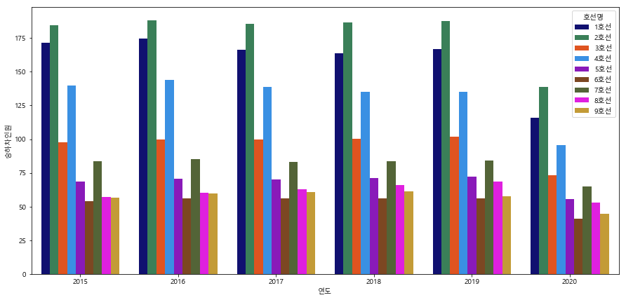


### 연도별 호선별  무임승하차인원


```python
plt.rcParams['font.family'] = 'Malgun Gothic'
pal = ['navy','seagreen','orangered','dodgerblue','darkviolet','saddlebrown','darkolivegreen','magenta','goldenrod']
plt.figure(figsize=(15,7))
sns.barplot(x='연도', y='무임승하차인원', hue='호선명', data=sub, palette=pal, ci=False)
```


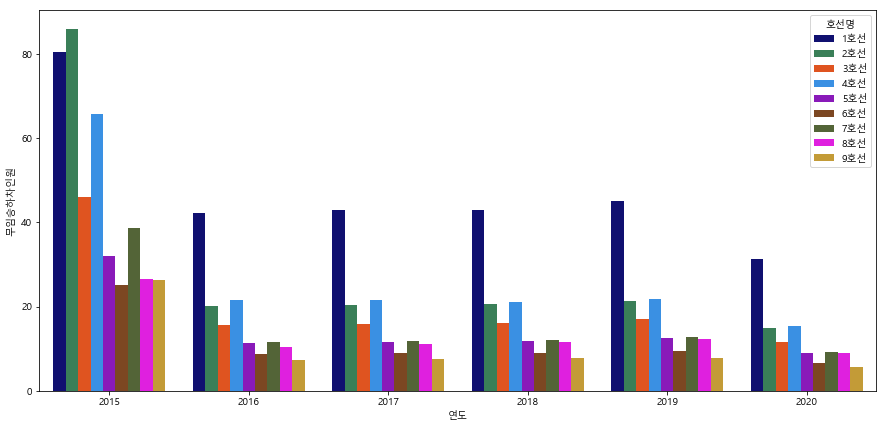


### 연도별 호선별  무임승하차율


```python
plt.rcParams['font.family'] = 'Malgun Gothic'
pal = ['navy','seagreen','orangered','dodgerblue','darkviolet','saddlebrown','darkolivegreen','magenta','goldenrod']
plt.figure(figsize=(15,7))
sns.barplot(x='연도', y='무임승하차율', hue='호선명', data=sub, palette=pal, ci=False)
```

    
    


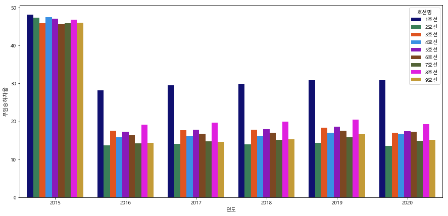


### 호선별 무임승하차인원


```python
plt.figure(figsize=(12,10))
plt.rcParams['font.family'] = 'Malgun Gothic'
plt.title('호선별 무임승하차인원', size=20, position=(0.5, 1.0+0.03))
pal = ['navy','seagreen','orangered','dodgerblue','darkviolet','saddlebrown','darkolivegreen','magenta','goldenrod']

sns.barplot(x='호선명', y='무임승하차인원', data=sub, ci=False, palette=pal);
```


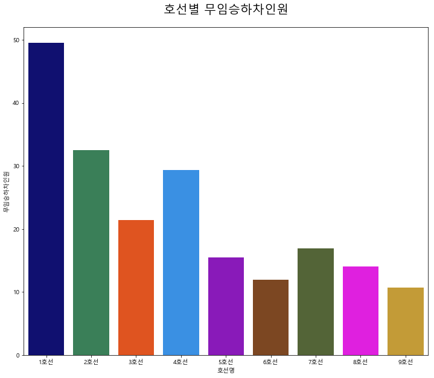


### 호선별 무임하차율


```python
plt.figure(figsize=(12,10))
plt.rcParams['font.family'] = 'Malgun Gothic'
plt.title('호선별 무임하차율', size=20, position=(0.5, 1.0+0.03))

# 호선별 색상 파레트 설정
pal = ['navy','seagreen','orangered','dodgerblue','darkviolet','saddlebrown','darkolivegreen','magenta','goldenrod']

sns.barplot(x='호선명', y='무임하차율', data=sub, ci=False, palette=pal)
```


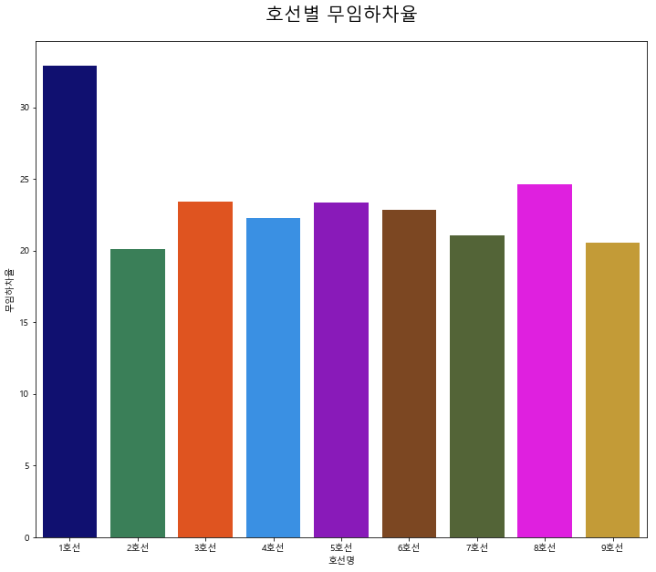


### 연도별 호선별 승하차인원 (line plot)


```python
plt.rcParams['font.family'] = 'Malgun Gothic'
plt.figure(figsize=(15,7))
pal = ['navy','seagreen','orangered','dodgerblue','darkviolet','saddlebrown','darkolivegreen','magenta','goldenrod']

sns.lineplot(x='연도', y="승하차인원", hue='호선명', palette=pal, data=sub)
```


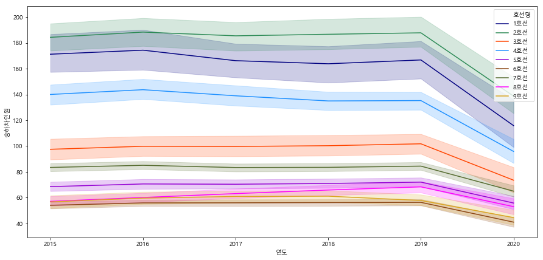


### 연도별 호선별  무임승하차율 (line plot)


```python
plt.rcParams['font.family'] = 'Malgun Gothic'
plt.figure(figsize=(15,7))
pal = ['navy','seagreen','orangered','dodgerblue','darkviolet','saddlebrown','darkolivegreen','magenta','goldenrod']

sns.lineplot(x='연도', y="무임승하차율", hue='호선명', palette=pal, data=sub)
```


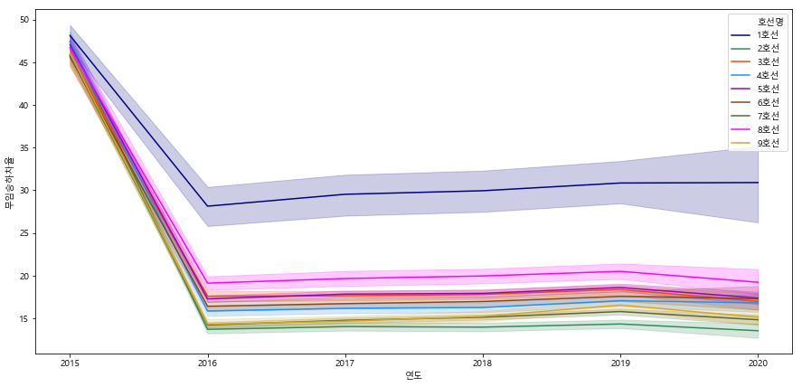


### 연도별 호선별  유임승하차율 (line plot)


```python
plt.rcParams['font.family'] = 'Malgun Gothic'
plt.figure(figsize=(15,7))
pal = ['navy','seagreen','orangered','dodgerblue','darkviolet','saddlebrown','darkolivegreen','magenta','goldenrod']

sns.lineplot(x='연도', y="유임승하차율", hue='호선명', palette=pal, data=sub)
```


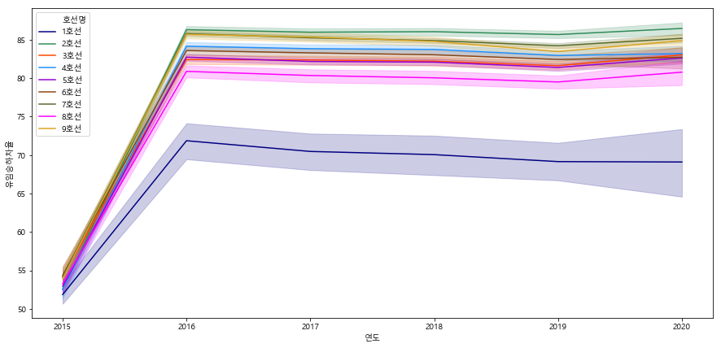


### 연도별 승하차인원 변동 추이 swarmplot


```python
plt.figure(figsize=(20,6))
plt.rcParams['font.family'] = 'Malgun Gothic'

plt.subplot(1,3,1)
plt.xticks(ticks=[0,1,2,3,4], labels=['2015','2016','2017','2018','2019'])
plt.title('연도별 승하차인원     (단위: 만 명)', size=15, position=(0.5, 1.0+0.03))
sns.swarmplot(x='연도', y='승하차인원', data=sub[sub['연도'] != '2020'], palette="Blues_d")

plt.subplot(1,3,2)
plt.xticks(ticks=[0,1,2,3,4], labels=['2015','2016','2017','2018','2019'])
plt.title('연도별 유임승하차인원     (단위: 만 명)', size=15, position=(0.5, 1.0+0.03))
sns.swarmplot(x='연도', y='유임승하차인원', data=sub[sub['연도'] != '2020'], palette="Blues_d")

plt.subplot(1,3,3)
plt.xticks(ticks=[0,1,2,3,4], labels=['2015','2016','2017','2018','2019'])
plt.title('연도별 무임승하차인원     (단위: 만 명)', size=15, position=(0.5, 1.0+0.03))
sns.swarmplot(x='연도', y='무임승하차인원', data=sub[sub['연도'] != '2020'], palette="Blues_d")
```


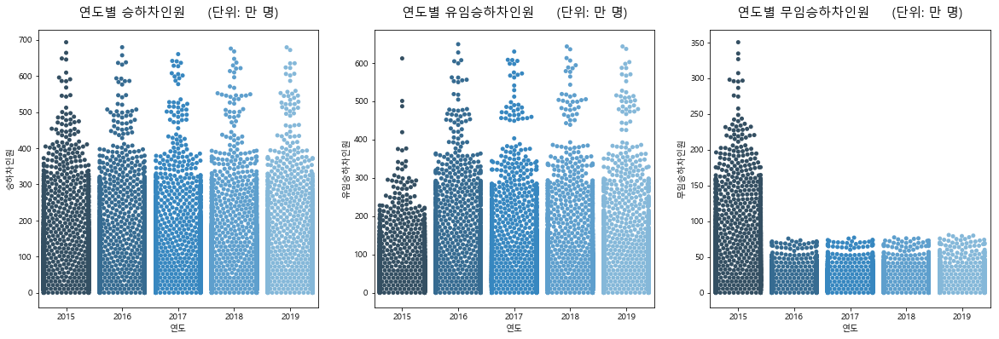


### 연도별 호선별  승하차인원 heatmap


```python
sub_h = sub[sub['연도'] != '2020']

plt.figure(figsize=(20,6))
plt.rcParams['font.family'] = 'Malgun Gothic'

plt.subplot(1,3,1)
plt.title('승하차인원', size=15, position=(0.55, 1.0+0.03))
pivot1 = sub_h.pivot_table(index='연도', columns='호선명', values='승하차인원')
sns.heatmap(pivot1, annot = True, annot_kws = {"size" : 11}, cmap=plt.cm.PuBu)

plt.subplot(1,3,2)
plt.title('유임승하차인원', size=15, position=(0.55, 1.0+0.03))
pivot2 = sub_h.pivot_table(index='연도', columns='호선명', values='유임승하차인원')
sns.heatmap(pivot2, annot = True, annot_kws = {"size" : 11}, cmap=plt.cm.PuBu)

plt.subplot(1,3,3)
plt.title('무임승하차인원', size=15, position=(0.55, 1.0+0.03))
pivot3 = sub_h.pivot_table(index='연도', columns='호선명', values='무임승하차인원')
sns.heatmap(pivot3, annot = True, annot_kws = {"size" : 11}, cmap=plt.cm.PuBu)
```


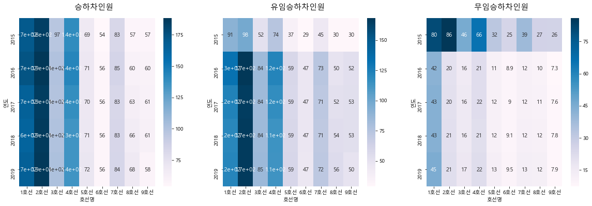


### 총 승하차인원, 유,무임 승하차인원의 누적분포


```python
f, ax = plt.subplots(figsize=(10, 6))

sns.distplot(sub['무임승하차인원'], hist=False, label="무임승하차인원")
sns.distplot(sub['유임승하차인원'], hist=False, label="유임승하차인원")
sns.distplot(sub['승하차인원'], hist=False, label="승하차인원")

ax.legend(ncol=1, loc="upper right", frameon=True)
ax.set_title('누적분포')
ax.set_xlabel("인원")
ax.set_ylabel("")
```


    Text(0, 0.5, '')


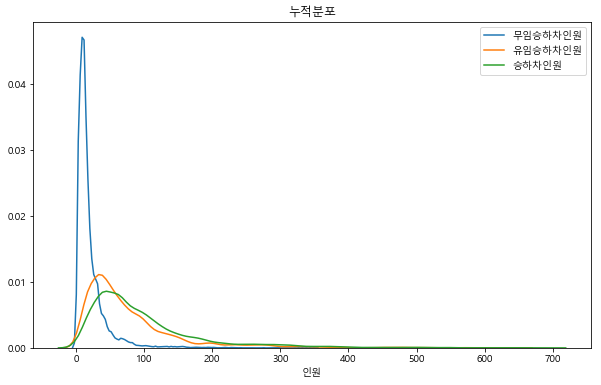


### 유임승하차인원, 무임승하차인원, 총 승하차인원 세 변수의 pairplot


```python
sns.pairplot(sub.iloc[:, [1,9,10,11]], hue='호선명', palette=pal);
```

   
    


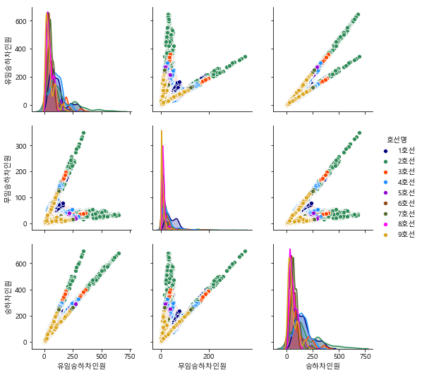


### 총 승하차인원 대비 무임승하차인원


```python
sub['연도'] = sub['연도'].astype('category')

f, ax = plt.subplots(figsize=(10, 6))
sns.set_color_codes("pastel")
sns.barplot(x="승하차인원", y='연도', data=sub, label="Total", color="b", ci=False)

sort = sub.sort_values("승하차인원", ascending=False)
sns.set_color_codes("muted")
sns.barplot(x="무임승하차인원", y="연도", data=sort, label="free", color="b", ci=False)
plt.title("총승하차대비 무임승하차인원")

ax.legend(ncol=2, loc="lower right", frameon=True)
sns.despine(left=True, bottom=True)
```


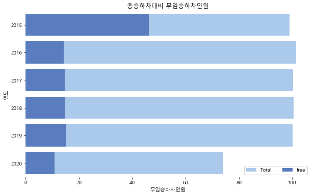


### 연도별 무임하차율 top10


```python
sub_15 = sub[sub.연도 == '2015'].reset_index(drop=True)
sub_16 = sub[sub.연도 == '2016'].reset_index(drop=True)
sub_17 = sub[sub.연도 == '2017'].reset_index(drop=True)
sub_18 = sub[sub.연도 == '2018'].reset_index(drop=True)
sub_19 = sub[sub.연도 == '2019'].reset_index(drop=True)

station = sub_15['지하철역'].unique()
get_off = []
for st in station:
    num = sub_15[sub_15['지하철역']==st]['무임하차인원'].sum()
    den = sub_15[sub_15['지하철역']==st]['하차인원'].sum()
    get_off.append(num/den*100)
    
sub_15_get_off = pd.DataFrame({'지하철역':station, '무임하차율':get_off})
sub_15_get_off = sub_15_get_off.sort_values(['무임하차율'], ascending=[False]).reset_index(drop=True)[:10]


station = sub_16['지하철역'].unique()
get_off = []
for st in station:
    num = sub_16[sub_16['지하철역']==st]['무임하차인원'].sum()
    den = sub_16[sub_16['지하철역']==st]['하차인원'].sum()
    get_off.append(num/den*100)
    
sub_16_get_off = pd.DataFrame({'지하철역':station, '무임하차율':get_off})
sub_16_get_off = sub_16_get_off.sort_values(['무임하차율'], ascending=[False]).reset_index(drop=True)[:10]


station = sub_17['지하철역'].unique()
get_off = []
for st in station:
    num = sub_17[sub_17['지하철역']==st]['무임하차인원'].sum()
    den = sub_17[sub_17['지하철역']==st]['하차인원'].sum()
    get_off.append(num/den*100)
    
sub_17_get_off = pd.DataFrame({'지하철역':station, '무임하차율':get_off})
sub_17_get_off = sub_17_get_off.sort_values(['무임하차율'], ascending=[False]).reset_index(drop=True)[:10]


station = sub_18['지하철역'].unique()
get_off = []
for st in station:
    num = sub_18[sub_18['지하철역']==st]['무임하차인원'].sum()
    den = sub_18[sub_18['지하철역']==st]['하차인원'].sum()
    get_off.append(num/den*100)
    
sub_18_get_off = pd.DataFrame({'지하철역':station, '무임하차율':get_off})
sub_18_get_off = sub_18_get_off.sort_values(['무임하차율'], ascending=[False]).reset_index(drop=True)[:10]


station = sub_19['지하철역'].unique()
get_off = []
for st in station:
    num = sub_19[sub_19['지하철역']==st]['무임하차인원'].sum()
    den = sub_19[sub_19['지하철역']==st]['하차인원'].sum()
    get_off.append(num/den*100)
    
sub_19_get_off = pd.DataFrame({'지하철역':station, '무임하차율':get_off})
sub_19_get_off = sub_19_get_off.sort_values(['무임하차율'], ascending=[False]).reset_index(drop=True)[:10]
```

   
    


```python
plt.figure(figsize=(15,25))
plt.rcParams['font.family'] = 'Malgun Gothic'

plt.subplot(3,2,1)
plt.xticks(rotation=50)
plt.title('2015년 지하철역별 무임하차율 top10', size=15, position=(0.5, 1.0+0.03))
sns.barplot(x='지하철역', y='무임하차율', data=sub_15_get_off, ci=False, palette="Blues_d")

plt.subplot(3,2,2)
plt.xticks(rotation=50)
plt.title('2016년 지하철역별 무임하차율 top10', size=15, position=(0.5, 1.0+0.03))
sns.barplot(x='지하철역', y='무임하차율', data=sub_16_get_off, ci=False, palette="Blues_d")

plt.subplot(3,2,3)
plt.xticks(rotation=50)
plt.title('2017년 지하철역별 무임하차율 top10', size=15, position=(0.5, 1.0+0.03))
sns.barplot(x='지하철역', y='무임하차율', data=sub_17_get_off, ci=False, palette="Blues_d")

plt.subplot(3,2,4)
plt.xticks(rotation=50)
plt.title('2018년 지하철역별 무임하차율 top10', size=15, position=(0.5, 1.0+0.03))
sns.barplot(x='지하철역', y='무임하차율', data=sub_18_get_off, ci=False, palette="Blues_d")

plt.subplot(3,2,5)
plt.xticks(rotation=50)
plt.title('2019년 지하철역 별 무임하차율 top10', size=15, position=(0.5, 1.0+0.03))
sns.barplot(x='지하철역', y='무임하차율', data=sub_19_get_off, ci=False, palette="Blues_d")

plt.subplots_adjust(hspace=0.45)
plt.show()
```


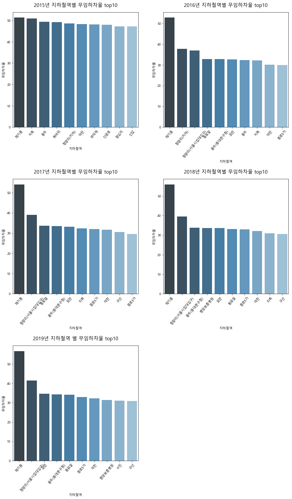


### 무임승하차율 상위 역사 top5


```python
grouped = sub['무임승하차율'].groupby(sub['지하철역']).mean()
grouped = pd.DataFrame(grouped)
grouped.sort_values(['무임승하차율'], ascending=[False])[:5]
```


<table border="1" class="dataframe">
  <thead>
    <tr style="text-align: right;">
      <th></th>
      <th>무임승하차율</th>
    </tr>
    <tr>
      <th>지하철역</th>
      <th></th>
    </tr>
  </thead>
  <tbody>
    <tr>
      <th>제기동</th>
      <td>53.192045</td>
    </tr>
    <tr>
      <th>왕십리</th>
      <td>50.594869</td>
    </tr>
    <tr>
      <th>청량리(지하)</th>
      <td>44.611483</td>
    </tr>
    <tr>
      <th>용두</th>
      <td>42.407449</td>
    </tr>
    <tr>
      <th>청량리(서울시립대입구)</th>
      <td>40.349353</td>
    </tr>
  </tbody>
</table>


### 무임승하차율 하위 역사 top5


```python
grouped = sub['무임승하차율'].groupby(sub['지하철역']).mean()
grouped = pd.DataFrame(grouped)
grouped.sort_values(['무임승하차율'], ascending=[True])[:5]
```


<table border="1" class="dataframe">
  <thead>
    <tr style="text-align: right;">
      <th></th>
      <th>무임승하차율</th>
    </tr>
    <tr>
      <th>지하철역</th>
      <th></th>
    </tr>
  </thead>
  <tbody>
    <tr>
      <th>삼성(무역센터)</th>
      <td>6.851828</td>
    </tr>
    <tr>
      <th>마곡나루(서울식물원)</th>
      <td>7.406416</td>
    </tr>
    <tr>
      <th>안암(고대병원앞)</th>
      <td>8.237770</td>
    </tr>
    <tr>
      <th>광화문(세종문화회관)</th>
      <td>8.242564</td>
    </tr>
    <tr>
      <th>어린이대공원(세종대)</th>
      <td>9.382923</td>
    </tr>
  </tbody>
</table>


### 1호선 제기동역의 총 승하차인원과 유,무임승하차인원
* 제기동 : 무임승하차율이 가장 높은 역


```python
plt.rcParams['font.family'] = 'Malgun Gothic'
station1 = sub[sub['지하철역']=="제기동"]
sta1 = station1[['유임승하차인원','무임승하차인원','승하차인원']]
sta1.plot()
```


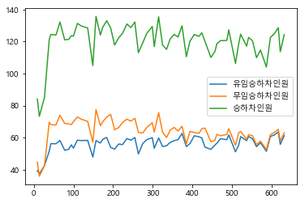


### 2호선 삼성역의 총 승하차인원과 유,무임승하차인원
* 삼성 : 무임승하차율이 가장 낮은 역


```python
plt.rcParams['font.family'] = 'Malgun Gothic'
station2 = sub[sub['지하철역']=="삼성"]
sta2 = station2[['유임승하차인원','무임승하차인원','승하차인원']]
sta2.plot()
```


    <matplotlib.axes._subplots.AxesSubplot at 0x2213eb6c2b0>


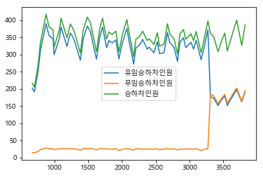


### 코로나 영향에 따른 지하철 이용객 수 변동 추이

2018년 12월 ~ 2019년 4월 데이터


```python
sub_1812_1904 = sub[(sub.사용월 == 201812) | (sub.사용월 == 201901) | 
                    (sub.사용월 == 201902) | (sub.사용월 == 201903) | (sub.사용월 == 201904)]
```

2019년 12월 ~ 2020년 4월 데이터


```python
sub_1912_2004 = sub[(sub.사용월 == 201912) | (sub.사용월 == 202001) | 
                    (sub.사용월 == 202002) | (sub.사용월 == 202003) | (sub.사용월 == 202004)]
```

2019년 1월 ~ 2019년 4월 데이터, 2019년 12월 ~ 2020년 4월 데이터 비교


```python
plt.figure(figsize=(15,25))
plt.rcParams['font.family'] = 'Malgun Gothic'

plt.subplot(3,2,1)
plt.ylim(0,120)
plt.title('월별 승하차인원 (2018.12 ~ 2019.04)     (단위: 만 명)', size=15, position=(0.5, 1.0+0.03))
sns.barplot(x='사용월', y='승하차인원', data=sub_1812_1904, ci=False, palette="Blues_d")

plt.subplot(3,2,2)
plt.ylim(0,120)
plt.title('월별 승하차인원 (2019.12 ~ 2020.04)     (단위: 만 명)', size=15, position=(0.5, 1.0+0.03))
sns.barplot(x='사용월', y='승하차인원', data=sub_1912_2004, ci=False, palette="Blues_d");

plt.subplot(3,2,3)
plt.ylim(0,110)
plt.title('월별 유임승하차인원 (2018.12 ~ 2019.04)     (단위: 만 명)', size=15, position=(0.5, 1.0+0.03))
sns.barplot(x='사용월', y='유임승하차인원', data=sub_1812_1904, ci=False, palette="Greens_r")

plt.subplot(3,2,4)
plt.ylim(0,110)
plt.title('월별 유임승하차인원 (2019.12 ~ 2020.04)     (단위: 만 명)', size=15, position=(0.5, 1.0+0.03))
sns.barplot(x='사용월', y='유임승하차인원', data=sub_1912_2004, ci=False, palette="Greens_r")

plt.subplot(3,2,5)
plt.ylim(0,20)
plt.title('월별 무임승하차인원 (2018.12 ~ 2019.04)     (단위: 만 명)', size=15, position=(0.5, 1.0+0.03))
sns.barplot(x='사용월', y='무임승하차인원', data=sub_1812_1904, ci=False, palette="Oranges_r")

plt.subplot(3,2,6)
plt.ylim(0,20)
plt.title('월별 무임승하차인원 (2019.12 ~ 2020.04)     (단위: 만 명)', size=15, position=(0.5, 1.0+0.03))
sns.barplot(x='사용월', y='무임승하차인원', data=sub_1912_2004, ci=False, palette="Oranges_r")

plt.subplots_adjust(hspace=0.35)   # 그래프 간 위아래 간격 조정
plt.show()
```

    
    


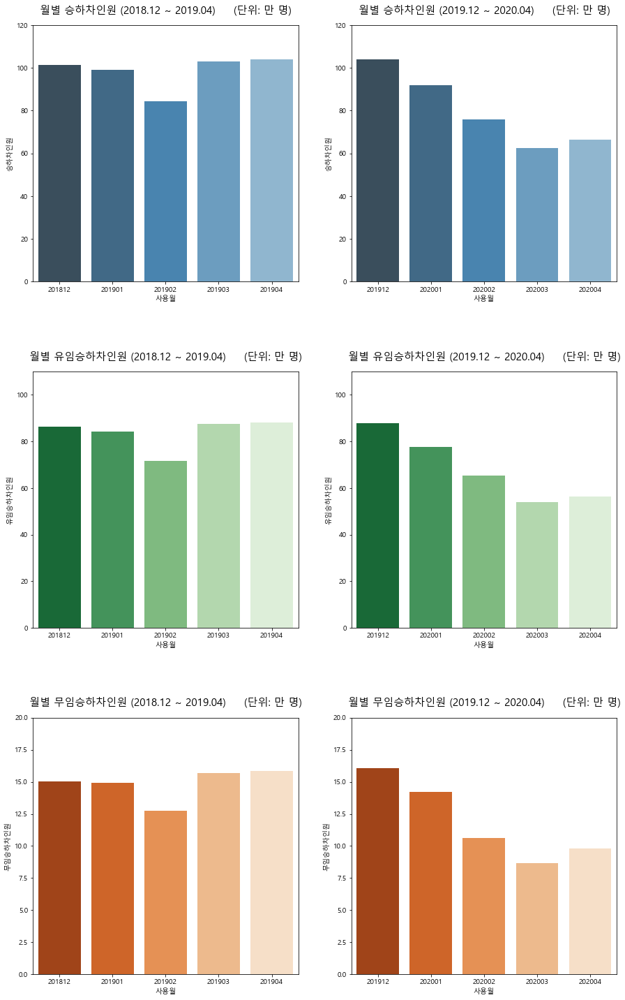


제기동
* 코로나 전 : 2018년 12월 ~ 2019년 4월 데이터
* 코로나 후 : 2019년 12월 ~ 2020년 4월 데이터


```python
station1_2019 = station1[(station1.사용월 == 201812) | (station1.사용월 == 201901) | 
                    (station1.사용월 == 201902) | (station1.사용월 == 201903) | (station1.사용월 == 201904)]
station1_2020 = station1[(station1.사용월 == 201912) | (station1.사용월 == 202001) | 
                    (station1.사용월 == 202002) | (station1.사용월 == 202003) | (station1.사용월 == 202004)]

jegi_2019 = station1_2019[['유임승하차인원','무임승하차인원','승하차인원']]
jegi_2020 = station1_2020[['유임승하차인원','무임승하차인원','승하차인원']]
```


```python
jegi_2019.plot()
```


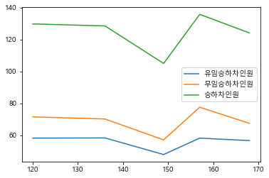


```python
jegi_2020.plot()
```


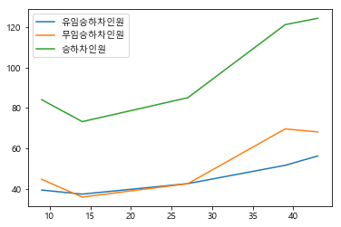


삼성
* 코로나 전 : 2018년 12월 ~ 2019년 4월 데이터
* 코로나 후 : 2019년 12월 ~ 2020년 4월 데이터


```python
station2_2019 = station2[(station2.사용월 == 201812) | (station2.사용월 == 201901) | 
                    (station2.사용월 == 201902) | (station2.사용월 == 201903) | (station2.사용월 == 201904)]
station2_2020 = station2[(station2.사용월 == 201912) | (station2.사용월 == 202001) | 
                    (station2.사용월 == 202002) | (station2.사용월 == 202003) | (station2.사용월 == 202004)]

samsung_2019 = station2_2019[['유임승하차인원','무임승하차인원','승하차인원']]
samsung_2020 = station2_2020[['유임승하차인원','무임승하차인원','승하차인원']]
```


```python
samsung_2019.plot()
```


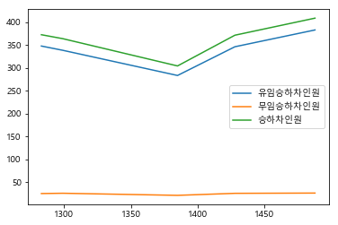


```python
samsung_2020.plot()
```


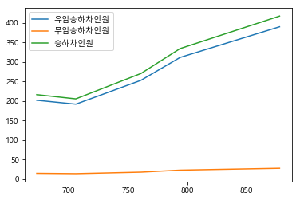


### 지하철역별 승하차인원


```python
# 15년도 지하철역별 승하차인원
grouped = sub_15['승하차인원'].groupby(sub['지하철역']).sum()
df_15 = pd.DataFrame({'지하철역':grouped.index,'승하차인원':grouped}).reset_index(drop=True)
top10_15 = df_15.sort_values(['승하차인원'], ascending=[False]).head(10).reset_index(drop=True)

# 16년도 지하철역별 승하차인원
grouped = sub_16['승하차인원'].groupby(sub['지하철역']).sum()
df_16 = pd.DataFrame({'지하철역':grouped.index,'승하차인원':grouped}).reset_index(drop=True)
top10_16 = df_16.sort_values(['승하차인원'], ascending=[False]).head(10).reset_index(drop=True)

# 17년도 지하철역별 승하차인원
grouped = sub_17['승하차인원'].groupby(sub['지하철역']).sum()
df_17 = pd.DataFrame({'지하철역':grouped.index,'승하차인원':grouped}).reset_index(drop=True)
top10_17 = df_17.sort_values(['승하차인원'], ascending=[False]).head(10).reset_index(drop=True)

# 18년도 지하철역별 승하차인원
grouped = sub_18['승하차인원'].groupby(sub['지하철역']).sum()
df_18 = pd.DataFrame({'지하철역':grouped.index,'승하차인원':grouped}).reset_index(drop=True)
top10_18 = df_18.sort_values(['승하차인원'], ascending=[False]).head(10).reset_index(drop=True)

# 19년도 지하철역별 승하차인원
grouped = sub_19['승하차인원'].groupby(sub['지하철역']).sum()
df_19 = pd.DataFrame({'지하철역':grouped.index,'승하차인원':grouped}).reset_index(drop=True)
top10_19 = df_19.sort_values(['승하차인원'], ascending=[False]).head(10).reset_index(drop=True)
```


```python
plt.figure(figsize=(15,25))
plt.rcParams['font.family'] = 'Malgun Gothic'

plt.subplot(3,2,1)
plt.ylim(0,18300)
plt.xticks(rotation=20)
plt.title('15년도 지하철역별 승하차인원     (단위: 만 명)', size=15, position=(0.5, 1.0+0.03))
sns.barplot(x='지하철역', y='승하차인원', data=top10_15, ci=False, palette="Blues_d")

plt.subplot(3,2,2)
plt.ylim(0,18300)
plt.xticks(rotation=20)
plt.title('16년도 지하철역별 승하차인원     (단위: 만 명)', size=15, position=(0.5, 1.0+0.03))
sns.barplot(x='지하철역', y='승하차인원', data=top10_16, ci=False, palette="Blues_d")

plt.subplot(3,2,3)
plt.ylim(0,18300)
plt.xticks(rotation=20)
plt.title('17년도 지하철역별 승하차인원     (단위: 만 명)', size=15, position=(0.5, 1.0+0.03))
sns.barplot(x='지하철역', y='승하차인원', data=top10_17, ci=False, palette="Blues_d")

plt.subplot(3,2,4)
plt.ylim(0,18300)
plt.xticks(rotation=20)
plt.title('18년도 지하철역별 승하차인원     (단위: 만 명)', size=15, position=(0.5, 1.0+0.03))
sns.barplot(x='지하철역', y='승하차인원', data=top10_18, ci=False, palette="Blues_d")

plt.subplot(3,2,5)
plt.ylim(0,18300)
plt.xticks(rotation=20)
plt.title('19년도 지하철역별 승하차인원     (단위: 만 명)', size=15, position=(0.5, 1.0+0.03))
sns.barplot(x='지하철역', y='승하차인원', data=top10_19, ci=False, palette="Blues_d")

plt.subplots_adjust(hspace=0.35)
plt.show()
```


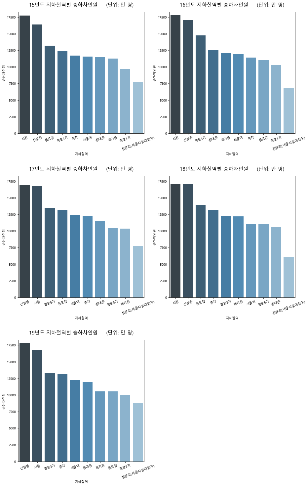


## 서울시 역코드로 지하철역 위치 조회.csv


### 전체승차인원 대비 무임승차인원을 지도에 시각화
* folium 사용


```python
# 지하철역 위치정보의 encoding 정보 찾기
import chardet
with open('location/서울시 역코드로 지하철역 위치 조회.csv', 'rb') as f:
    result = chardet.detect(f.read())  # or readline if the file is large
print(result)
```

    {'encoding': 'EUC-KR', 'confidence': 0.99, 'language': 'Korean'}
    


```python
import os

os.chdir("H:/빅데이터/TEAM PROJECT/데이터 시각화/location")

dfs = [pd.read_csv(f,encoding="EUC-KR",index_col=[0], parse_dates=[0], engine='python') for f in os.listdir(os.getcwd()) if f.endswith('csv')]
# # pre_subway_location = pd.concat(dfs, axis=1, join='inner').sort_index()
pre_subway_location = pd.concat(dfs,ignore_index=True)

pre_subway_location
```


<table border="1" class="dataframe">
  <thead>
    <tr style="text-align: right;">
      <th></th>
      <th>전철역명</th>
      <th>호선</th>
      <th>외부코드</th>
      <th>사이버스테이션</th>
      <th>X좌표</th>
      <th>Y좌표</th>
      <th>X좌표(WGS)</th>
      <th>Y좌표(WGS)</th>
    </tr>
  </thead>
  <tbody>
    <tr>
      <th>0</th>
      <td>가락시장</td>
      <td>8</td>
      <td>817</td>
      <td>2818</td>
      <td>525992.0</td>
      <td>1108579.0</td>
      <td>37.492522</td>
      <td>127.118234</td>
    </tr>
    <tr>
      <th>1</th>
      <td>가락시장</td>
      <td>3</td>
      <td>350</td>
      <td>2818</td>
      <td>525992.0</td>
      <td>1108579.0</td>
      <td>37.492522</td>
      <td>127.118234</td>
    </tr>
    <tr>
      <th>2</th>
      <td>종로3가</td>
      <td>5</td>
      <td>534</td>
      <td>153</td>
      <td>498060.0</td>
      <td>1130332.0</td>
      <td>37.571607</td>
      <td>126.991806</td>
    </tr>
    <tr>
      <th>3</th>
      <td>종로3가</td>
      <td>3</td>
      <td>329</td>
      <td>153</td>
      <td>498060.0</td>
      <td>1130332.0</td>
      <td>37.571607</td>
      <td>126.991806</td>
    </tr>
    <tr>
      <th>4</th>
      <td>종로3가</td>
      <td>1</td>
      <td>130</td>
      <td>153</td>
      <td>498060.0</td>
      <td>1130332.0</td>
      <td>37.571607</td>
      <td>126.991806</td>
    </tr>
    <tr>
      <th>...</th>
      <td>...</td>
      <td>...</td>
      <td>...</td>
      <td>...</td>
      <td>...</td>
      <td>...</td>
      <td>...</td>
      <td>...</td>
    </tr>
    <tr>
      <th>18575</th>
      <td>동백</td>
      <td>E</td>
      <td>Y114</td>
      <td>4505</td>
      <td>533700.0</td>
      <td>1046500.0</td>
      <td>37.269043</td>
      <td>127.152716</td>
    </tr>
    <tr>
      <th>18576</th>
      <td>초당</td>
      <td>E</td>
      <td>Y115</td>
      <td>4506</td>
      <td>535500.0</td>
      <td>1044100.0</td>
      <td>37.260752</td>
      <td>127.159443</td>
    </tr>
    <tr>
      <th>18577</th>
      <td>삼가</td>
      <td>E</td>
      <td>Y116</td>
      <td>4508</td>
      <td>537300.0</td>
      <td>1039000.0</td>
      <td>37.242115</td>
      <td>127.168075</td>
    </tr>
    <tr>
      <th>18578</th>
      <td>시청?용인대</td>
      <td>E</td>
      <td>Y117</td>
      <td>4509</td>
      <td>539500.0</td>
      <td>1038300.0</td>
      <td>37.239151</td>
      <td>127.178406</td>
    </tr>
    <tr>
      <th>18579</th>
      <td>명지대</td>
      <td>E</td>
      <td>Y118</td>
      <td>4510</td>
      <td>542100.0</td>
      <td>1037900.0</td>
      <td>37.237964</td>
      <td>127.190294</td>
    </tr>
  </tbody>
</table>
<p>18580 rows × 8 columns</p>


```python
len(pre_subway_location)
```


    18580


```python
# 역별 좌표 추출
subway_location = pre_subway_location[['X좌표(WGS)','Y좌표(WGS)']].groupby(pre_subway_location['전철역명']).mean()
subway_location
```


<table border="1" class="dataframe">
  <thead>
    <tr style="text-align: right;">
      <th></th>
      <th>X좌표(WGS)</th>
      <th>Y좌표(WGS)</th>
    </tr>
    <tr>
      <th>전철역명</th>
      <th></th>
      <th></th>
    </tr>
  </thead>
  <tbody>
    <tr>
      <th>419민주묘지</th>
      <td>NaN</td>
      <td>NaN</td>
    </tr>
    <tr>
      <th>가능</th>
      <td>37.748577</td>
      <td>127.044213</td>
    </tr>
    <tr>
      <th>가락시장</th>
      <td>37.492522</td>
      <td>127.118234</td>
    </tr>
    <tr>
      <th>가산디지털단지</th>
      <td>37.481072</td>
      <td>126.882343</td>
    </tr>
    <tr>
      <th>가양</th>
      <td>37.561391</td>
      <td>126.854456</td>
    </tr>
    <tr>
      <th>...</th>
      <td>...</td>
      <td>...</td>
    </tr>
    <tr>
      <th>회현</th>
      <td>37.558514</td>
      <td>126.978246</td>
    </tr>
    <tr>
      <th>효자</th>
      <td>37.754025</td>
      <td>127.076902</td>
    </tr>
    <tr>
      <th>효창공원앞</th>
      <td>37.539261</td>
      <td>126.961351</td>
    </tr>
    <tr>
      <th>흑석</th>
      <td>37.508770</td>
      <td>126.963708</td>
    </tr>
    <tr>
      <th>흥선</th>
      <td>37.743302</td>
      <td>127.037023</td>
    </tr>
  </tbody>
</table>
<p>591 rows × 2 columns</p>


```python
# 원데이터와 위도경도데이터의 결합
sub['전철역명'] = sub['지하철역'].str.split('(').str[0]
df = pd.merge(sub, subway_location,how='left',on='전철역명')
df
```


<table border="1" class="dataframe">
  <thead>
    <tr style="text-align: right;">
      <th></th>
      <th>사용월</th>
      <th>호선명</th>
      <th>지하철역</th>
      <th>유임승차인원</th>
      <th>무임승차인원</th>
      <th>유임하차인원</th>
      <th>무임하차인원</th>
      <th>연도</th>
      <th>월</th>
      <th>유임승하차인원</th>
      <th>...</th>
      <th>승하차인원</th>
      <th>승차인원</th>
      <th>하차인원</th>
      <th>유임하차율</th>
      <th>무임하차율</th>
      <th>유임승하차율</th>
      <th>무임승하차율</th>
      <th>전철역명</th>
      <th>X좌표(WGS)</th>
      <th>Y좌표(WGS)</th>
    </tr>
  </thead>
  <tbody>
    <tr>
      <th>0</th>
      <td>202004</td>
      <td>1호선</td>
      <td>서울역</td>
      <td>77.5859</td>
      <td>13.9595</td>
      <td>74.8330</td>
      <td>13.0554</td>
      <td>2020</td>
      <td>04</td>
      <td>152.4189</td>
      <td>...</td>
      <td>179.4338</td>
      <td>91.5454</td>
      <td>87.8884</td>
      <td>85.145480</td>
      <td>14.854520</td>
      <td>84.944364</td>
      <td>15.055636</td>
      <td>서울역</td>
      <td>NaN</td>
      <td>NaN</td>
    </tr>
    <tr>
      <th>1</th>
      <td>202004</td>
      <td>1호선</td>
      <td>종각</td>
      <td>70.6082</td>
      <td>9.6784</td>
      <td>68.7093</td>
      <td>9.0826</td>
      <td>2020</td>
      <td>04</td>
      <td>139.3175</td>
      <td>...</td>
      <td>158.0785</td>
      <td>80.2866</td>
      <td>77.7919</td>
      <td>88.324491</td>
      <td>11.675509</td>
      <td>88.131846</td>
      <td>11.868154</td>
      <td>종각</td>
      <td>37.570161</td>
      <td>126.982923</td>
    </tr>
    <tr>
      <th>2</th>
      <td>202004</td>
      <td>1호선</td>
      <td>종로3가</td>
      <td>38.8837</td>
      <td>23.1829</td>
      <td>36.8220</td>
      <td>22.0625</td>
      <td>2020</td>
      <td>04</td>
      <td>75.7057</td>
      <td>...</td>
      <td>120.9511</td>
      <td>62.0666</td>
      <td>58.8845</td>
      <td>62.532585</td>
      <td>37.467415</td>
      <td>62.591990</td>
      <td>37.408010</td>
      <td>종로3가</td>
      <td>37.571607</td>
      <td>126.991806</td>
    </tr>
    <tr>
      <th>3</th>
      <td>202004</td>
      <td>1호선</td>
      <td>신설동</td>
      <td>24.0865</td>
      <td>9.0729</td>
      <td>23.9399</td>
      <td>8.6446</td>
      <td>2020</td>
      <td>04</td>
      <td>48.0264</td>
      <td>...</td>
      <td>65.7439</td>
      <td>33.1594</td>
      <td>32.5845</td>
      <td>73.470208</td>
      <td>26.529792</td>
      <td>73.050732</td>
      <td>26.949268</td>
      <td>신설동</td>
      <td>37.575297</td>
      <td>127.025087</td>
    </tr>
    <tr>
      <th>4</th>
      <td>202004</td>
      <td>1호선</td>
      <td>시청</td>
      <td>38.1606</td>
      <td>5.2670</td>
      <td>38.4171</td>
      <td>5.0782</td>
      <td>2020</td>
      <td>04</td>
      <td>76.5777</td>
      <td>...</td>
      <td>86.9229</td>
      <td>43.4276</td>
      <td>43.4953</td>
      <td>88.324716</td>
      <td>11.675284</td>
      <td>88.098418</td>
      <td>11.901582</td>
      <td>시청</td>
      <td>37.564718</td>
      <td>126.977108</td>
    </tr>
    <tr>
      <th>...</th>
      <td>...</td>
      <td>...</td>
      <td>...</td>
      <td>...</td>
      <td>...</td>
      <td>...</td>
      <td>...</td>
      <td>...</td>
      <td>...</td>
      <td>...</td>
      <td>...</td>
      <td>...</td>
      <td>...</td>
      <td>...</td>
      <td>...</td>
      <td>...</td>
      <td>...</td>
      <td>...</td>
      <td>...</td>
      <td>...</td>
      <td>...</td>
    </tr>
    <tr>
      <th>19774</th>
      <td>201501</td>
      <td>9호선</td>
      <td>마곡나루</td>
      <td>4.9608</td>
      <td>4.5753</td>
      <td>0.7012</td>
      <td>0.7072</td>
      <td>2015</td>
      <td>01</td>
      <td>5.6620</td>
      <td>...</td>
      <td>10.9445</td>
      <td>9.5361</td>
      <td>1.4084</td>
      <td>49.786992</td>
      <td>50.213008</td>
      <td>51.733748</td>
      <td>48.266252</td>
      <td>마곡나루</td>
      <td>37.567336</td>
      <td>126.829497</td>
    </tr>
    <tr>
      <th>19775</th>
      <td>201501</td>
      <td>9호선</td>
      <td>신방화</td>
      <td>16.9119</td>
      <td>16.0054</td>
      <td>3.8500</td>
      <td>3.8259</td>
      <td>2015</td>
      <td>01</td>
      <td>20.7619</td>
      <td>...</td>
      <td>40.5932</td>
      <td>32.9173</td>
      <td>7.6759</td>
      <td>50.156985</td>
      <td>49.843015</td>
      <td>51.146251</td>
      <td>48.853749</td>
      <td>신방화</td>
      <td>37.567532</td>
      <td>126.816601</td>
    </tr>
    <tr>
      <th>19776</th>
      <td>201501</td>
      <td>9호선</td>
      <td>공항시장</td>
      <td>7.2585</td>
      <td>8.2551</td>
      <td>2.0927</td>
      <td>2.2899</td>
      <td>2015</td>
      <td>01</td>
      <td>9.3512</td>
      <td>...</td>
      <td>19.8962</td>
      <td>15.5136</td>
      <td>4.3826</td>
      <td>47.750194</td>
      <td>52.249806</td>
      <td>46.999930</td>
      <td>53.000070</td>
      <td>공항시장</td>
      <td>37.563726</td>
      <td>126.810678</td>
    </tr>
    <tr>
      <th>19777</th>
      <td>201501</td>
      <td>9호선</td>
      <td>김포공항</td>
      <td>24.6752</td>
      <td>28.7114</td>
      <td>2.0160</td>
      <td>2.0841</td>
      <td>2015</td>
      <td>01</td>
      <td>26.6912</td>
      <td>...</td>
      <td>57.4867</td>
      <td>53.3866</td>
      <td>4.1001</td>
      <td>49.169532</td>
      <td>50.830468</td>
      <td>46.430218</td>
      <td>53.569782</td>
      <td>김포공항</td>
      <td>37.562434</td>
      <td>126.801058</td>
    </tr>
    <tr>
      <th>19778</th>
      <td>201501</td>
      <td>9호선</td>
      <td>개화</td>
      <td>14.8155</td>
      <td>8.8699</td>
      <td>2.7453</td>
      <td>1.9874</td>
      <td>2015</td>
      <td>01</td>
      <td>17.5608</td>
      <td>...</td>
      <td>28.4181</td>
      <td>23.6854</td>
      <td>4.7327</td>
      <td>58.007057</td>
      <td>41.992943</td>
      <td>61.794420</td>
      <td>38.205580</td>
      <td>개화</td>
      <td>37.578608</td>
      <td>126.798153</td>
    </tr>
  </tbody>
</table>
<p>19779 rows × 21 columns</p>


```python
# pip install folium
# pip install geopy

import folium # 지도 관련 시각화
from folium.plugins import MarkerCluster #지도 관련 시각화
import geopy.distance #거리 계산해주는 패키지 사용
```


```python
#-*- coding:utf-8 -*-
df = df[['승차인원','무임승차인원','X좌표(WGS)','Y좌표(WGS)']].groupby(df['전철역명']).mean().sort_values(by=['무임승차인원'], axis=0, ascending=False).dropna().head(20)

map = folium.Map(location=[37.5502, 126.982], zoom_start=12)

for n in df.index:
  folium.CircleMarker([df['X좌표(WGS)'][n], df['Y좌표(WGS)'][n]],popup=n,tooltip=n, Encoding='utf-8',
                        radius = df['승차인원'][n]/3,
                        color='#fffggg', fill_color='#fffggg').add_to(map)
for n in df.index:
  folium.CircleMarker([df['X좌표(WGS)'][n], df['Y좌표(WGS)'][n]],popup=n,tooltip=n, Encoding='utf-8',
                        radius = df['무임승차인원'][n]/3,
                        color='#fffggg', fill_color='red').add_to(map)

map
```

```python
map.save('subway_map.html')
```


```python

```
